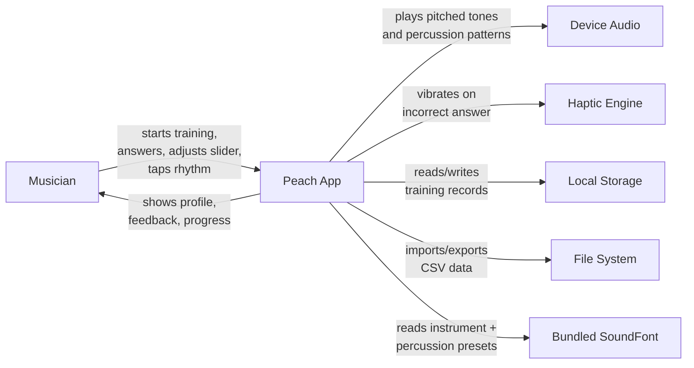
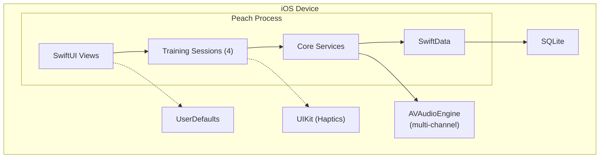
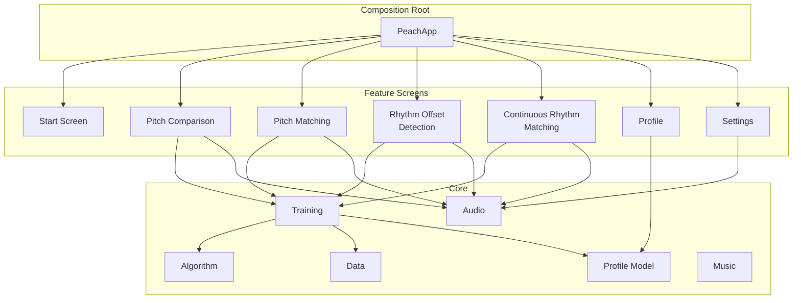
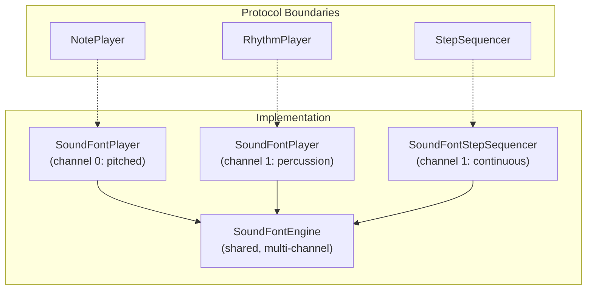
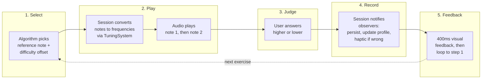
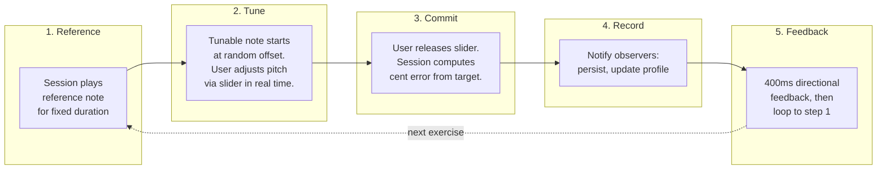
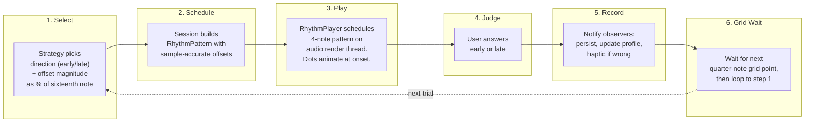
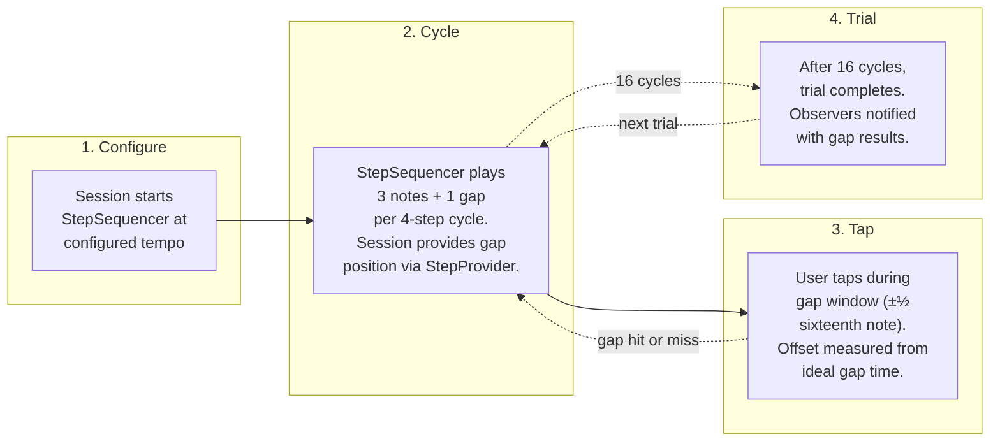
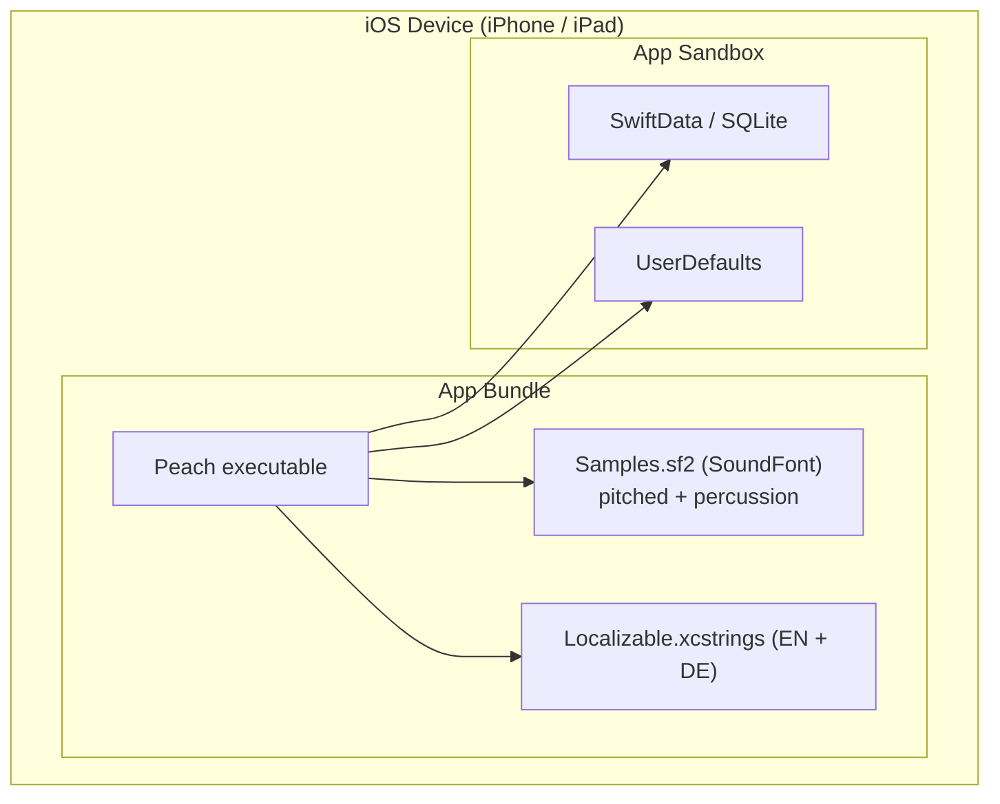
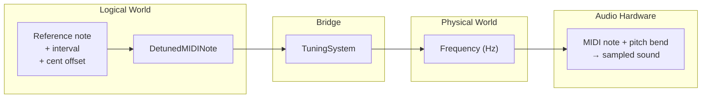

# Peach — arc42 Architecture Documentation

**Version:** 2.0
**Date:** 2026-03-23
**Status:** Current with codebase as of v0.4 (rhythm training)

---

## 1. Introduction and Goals

### 1.1 Requirements Overview

Peach is a pitch and rhythm ear training app for iOS. It trains musicians' perception through three complementary training paradigms — **Pitch Comparison**, **Pitch Matching**, and **Rhythm Training** — each with multiple variants. The app builds a perceptual profile of the user's abilities and adaptively adjusts difficulty.

**Training paradigms:**

| Paradigm | Discipline | Mechanic |
|----------|-----------|----------|
| **Pitch Comparison** | Unison, Interval | Two notes play in sequence; user judges higher or lower |
| **Pitch Matching** | Unison, Interval | A reference note plays; user tunes a second note to match via slider |
| **Rhythm Training** | Offset Detection, Continuous Matching | A rhythmic pattern plays; user judges timing (early/late) or taps into gaps |

**Design philosophy:** "Training, not testing." No scores, no gamification, no sessions. Every exercise makes the user better; no single answer matters.

**Key functional requirements:**

- Adaptive pitch comparison training with immediate feedback
- Psychoacoustic staircase algorithm with adaptive difficulty (pitch and rhythm)
- SoundFont-based audio with sub-10ms latency and 0.1-cent precision for pitch
- Sample-accurate percussion sequencing for rhythm training (±1 sample precision)
- Pitch matching with real-time frequency adjustment via slider
- Interval training generalizing both pitch modes to musical intervals
- Rhythm offset detection: judge whether a note is early or late relative to the beat
- Continuous rhythm matching: tap into gaps in a looping rhythmic pattern
- Perceptual profile visualization with progress timeline across all six disciplines
- Local persistence of all training data
- iPhone + iPad, portrait + landscape, English + German

### 1.2 Quality Goals

| Priority | Quality Goal | Scenario |
|----------|-------------|----------|
| 1 | **Audio precision** | A generated pitch tone deviates by less than 0.1 cent from the target frequency. Playback onset occurs within 10ms of the trigger. A rhythm pattern's timing offset is accurate to within 1 audio sample (≈23μs at 44.1kHz). |
| 2 | **Training feel** | A user completes 15 pitch comparisons in 40 seconds without perceiving UI delay between exercises. Rhythm patterns play grid-aligned with no perceptible drift. Navigation away discards incomplete exercises silently. |
| 3 | **Data integrity** | A force-quit during a training exercise loses at most the current incomplete exercise. All previously completed exercises are persisted atomically. |
| 4 | **Testability** | Every service is injectable via protocol. A new developer can run the full test suite and see all business logic covered without device-specific setup. |
| 5 | **Simplicity** | The codebase uses zero third-party dependencies. A solo developer learning iOS can understand any component in isolation. |

### 1.3 Stakeholders

| Role | Person | Expectations |
|------|--------|-------------|
| Developer, User, Product Owner | Michael | Functional ear training app; learning vehicle for iOS development and AI-assisted workflows |
| AI Development Agents | Claude Code, BMAD agents | Clear architectural boundaries, testable interfaces, documented patterns |

---

## 2. Architecture Constraints

| Constraint | Consequence |
|-----------|-------------|
| **iOS 26+ only** | Use latest APIs freely; no backward compatibility code |
| **Swift 6.2 with strict concurrency** | Default `@MainActor` isolation; `Sendable` enforced at compile time; `async/await` only |
| **Zero third-party dependencies** | All functionality built on Apple frameworks; no supply chain risk |
| **Entirely on-device** | No network layer, no backend, no authentication; all data local |
| **Solo developer learning iOS** | Architecture must be approachable; favor clarity over abstraction depth |
| **Test-first development** | All services behind protocols; all business logic unit-tested |
| **SwiftUI lifecycle** | No UIKit in views; UIKit only through protocol abstractions |
| **Single Xcode module** | No multi-module SPM; access control via `private`/`internal` |

---

## 3. System Scope and Context

### 3.1 Business Context

Peach is a standalone on-device app with no external system integrations at runtime. The user interacts directly with the app; the app interacts with device hardware (audio, haptics) and local storage.



| Neighbor | Purpose | Technology |
|----------|---------|------------|
| Device Audio | Pitched tone playback at precise frequencies; sample-accurate percussion pattern scheduling | AVAudioEngine + AVAudioUnitSampler (multi-channel) |
| Haptic Engine | Tactile feedback on incorrect pitch comparison and rhythm offset detection answers | UIKit (via protocol abstraction) |
| Local Storage | Persistent training records (every completed exercise across all six disciplines) | SwiftData (SQLite-backed) |
| File System | Backup and restore of training history | CSV with versioned format |
| Bundled SoundFont | Instrument sound samples (piano, cello, etc.) and percussion click sounds | SF2 file with RIFF/PHDR metadata |

### 3.2 Technical Context



---

## 4. Solution Strategy

| Quality Goal | Approach | Details in |
|-------------|----------|-----------|
| **Audio precision (pitch)** | SoundFont playback via MIDI noteOn + pitch bend; two-world architecture separating musical concepts from audio frequencies | Section 8.1 |
| **Audio precision (rhythm)** | Sample-accurate event scheduling via render-thread dispatch in `SoundFontEngine`; pre-allocated buffer with `OSAllocatedUnfairLock` for lock-free timing | Sections 5.2, 8.1 |
| **Training feel** | State machine sessions with guarded transitions; 400ms feedback phase; observer pattern for fire-and-forget result delivery; grid-aligned rhythm pattern sequencing | Sections 5.2, 6 |
| **Data integrity** | SwiftData atomic writes; single data store accessor; only completed exercises are persisted | Section 8.3 |
| **Testability** | Protocol-first design; composition root wires all dependencies; mocks with deterministic timing | Section 8.4 |
| **Simplicity** | Feature-based directory structure; zero dependencies; domain types replacing raw primitives; thin views with zero business logic; discipline registry for additive extensibility | Sections 5.1, 8.2, 8.7 |

**Key technology decisions:**

- **SwiftUI** with `@Observable` for reactive UI (not `ObservableObject`/Combine)
- **SwiftData** for persistence (not Core Data directly)
- **AVAudioEngine + AVAudioUnitSampler** for SoundFont playback (not AudioKit, not raw sine waves)
- **SoundFontEngine** as a shared, multi-channel audio engine for both pitched and percussive playback
- **Swift Testing** for tests (not XCTest)
- **Composition root** for dependency injection (not a DI framework)
- **Observer protocols with adapters** for session result propagation (not Combine, not NotificationCenter)
- **TrainingDiscipline registry** for additive discipline extensibility (not hardcoded switch statements)

---

## 5. Building Block View

### 5.1 Level 1 — Overview



**Dependency rules:**

- Feature screens depend on Core — never on each other
- Core has no UI framework imports (no SwiftUI, no UIKit, no Charts)
- SwiftData is encapsulated inside the Data component
- UIKit is used only for haptic feedback, behind a protocol

| Building Block | Responsibility |
|---------------|---------------|
| **Composition Root** | Creates all services, wires the dependency graph, injects everything via SwiftUI environment. The only place that knows the full object graph. Manages four sessions, two audio layers, and their respective adapters. |
| **Pitch Comparison** | Training loop where two notes play in sequence and the user judges higher/lower. Owns the `PitchDiscriminationSession` state machine. Works in both unison and interval modes via parameterization. |
| **Pitch Matching** | Training loop where a reference note plays and the user tunes a second note to match. Owns the `PitchMatchingSession` state machine, pitch slider interaction. Works in both unison and interval modes. |
| **Rhythm Offset Detection** | Training loop where a four-note rhythmic pattern plays with one note offset from the beat. User judges whether the offset note is early or late. Owns the `RhythmOffsetDetectionSession` state machine. Uses `RhythmPlayer` for sample-accurate pattern playback. |
| **Continuous Rhythm Matching** | Continuous training loop where a repeating four-step pattern plays with one gap per cycle. User taps to fill the gap. Timing accuracy is measured. Owns the `ContinuousRhythmMatchingSession` and acts as `StepProvider` for the `StepSequencer`. |
| **Profile** | Visualizes the user's perceptual abilities: piano keyboard heatmap, progress chart across all six training disciplines, spectrogram for rhythm, chart export. |
| **Settings** | User configuration: note range, note duration, reference pitch, sound source, interval selection, tuning system, tempo, gap position, data import/export. |
| **Audio** | Tone generation and percussion sequencing. Provides three protocol boundaries: `NotePlayer` (pitched playback), `RhythmPlayer` (pattern-based percussion), and `StepSequencer` (continuous cycle-based sequencing). `SoundFontEngine` is the shared multi-channel audio engine. Implements the two-world architecture (see Section 8.1). |
| **Algorithm** | Decides the next exercise based on the user's profile. `KazezNoteStrategy` implements the staircase for pitch comparison (see ADR-4). `AdaptiveRhythmOffsetDetectionStrategy` adapts the same staircase for rhythm timing. Both strategies conform to their respective protocol (`NextPitchDiscriminationStrategy`, `NextRhythmOffsetDetectionStrategy`). |
| **Training** | Shared training infrastructure: `TrainingSession` protocol, `TrainingDiscipline` protocol, `TrainingDisciplineRegistry` (see Section 8.7), `TrainingDisciplineConfig`, `TrainingDisciplineID` (six cases), `StatisticsKey`, observer protocols, session-specific settings snapshots, `Resettable`, `ProfileUpdating`. |
| **Data** | Sole accessor to SwiftData persistence. Stores every completed exercise across four record types. Handles CSV import/export with discipline-driven column ownership. |
| **Profile Model** | In-memory perceptual profile rebuilt from training records on startup. Keyed by `StatisticsKey` — either `.pitch(TrainingDisciplineID)` or `.rhythm(TrainingDisciplineID, TempoRange, RhythmDirection)`. Uses Welford's algorithm for running statistics. Builder pattern for initialization. Progress timeline with EWMA smoothing and adaptive time bucketing. |
| **Music** | Domain value types for the logical world: `MIDINote`, `Cents`, `Frequency`, `Interval`, `DetunedMIDINote`, `TuningSystem`, `NoteDuration`, `AmplitudeDB`, `MIDIVelocity`, `SoundSourceID`, `TempoBPM`, `TempoRange`, `RhythmOffset`, `RhythmDirection`, `SampleRate`, `PitchBendValue`, `StepPosition`. |

### 5.2 Level 2 — Training Sessions

The four training sessions are the central orchestrators. Each is a state machine (or continuous loop) that coordinates audio playback, difficulty selection, result recording, and observer notification.

**Pitch Comparison:**

```
idle → playingReferenceNote → playingTargetNote → awaitingAnswer → showingFeedback → (loop)
```

**Pitch Matching:**

```
idle → playingReference → awaitingSliderTouch → playingTunable → showingFeedback → (loop)
```

**Rhythm Offset Detection:**

```
idle → playingPattern → awaitingAnswer → showingFeedback → waitingForGrid → (loop)
```

The `waitingForGrid` state ensures the next pattern starts grid-aligned with the musical pulse, preventing timing drift between trials.

**Continuous Rhythm Matching:**

Unlike the discrete state machines above, this session runs as a continuous loop. A `StepSequencer` plays an endless stream of four-step cycles (three notes + one gap). The session acts as `StepProvider`, deciding where the gap falls in each cycle. The user taps during gap windows; after 16 cycles, a trial completes and observers are notified. There is no state enum — the session uses an `isRunning` flag and real-time position tracking at ~120Hz.

All sessions share these architectural properties:

- **Error boundaries** — they catch all service errors, log them, and continue gracefully. The user never sees an error screen during training.
- **Observer notification** — after each completed exercise or trial, the session notifies all injected observers via adapter types. Adding an observer requires zero session changes.
- **Settings snapshots** — settings are captured at `start()` time as immutable value types, decoupling the session from live user preferences.
- **Exclusive activation** — the composition root ensures only one session runs at a time via `activeSession` tracking.
- **Graceful interruption** — navigation away, app backgrounding, or audio interruption stops the active session and discards the current exercise.

### 5.3 Level 2 — Audio Layer

The audio subsystem has been refactored around a shared engine:



- **`SoundFontEngine`** owns the single `AVAudioEngine` and manages multiple MIDI channels via `AVAudioUnitSampler` nodes. It provides sample-accurate event scheduling through a render-thread callback with a pre-allocated event buffer and `OSAllocatedUnfairLock` for lock-free synchronization.
- **`SoundFontPlayer`** conforms to both `NotePlayer` (for pitched playback with pitch bend) and `RhythmPlayer` (for pattern-based percussion). Two instances exist: one on channel 0 (pitched instruments) and one on channel 1 (percussion).
- **`SoundFontStepSequencer`** drives continuous rhythm playback for Continuous Rhythm Matching. It pre-schedules batches of 500 cycles and tracks playback position via sample-position polling at ~120Hz.

---

## 6. Runtime View

### 6.1 Pitch Comparison Training Loop

The most important pitch training scenario: a single pitch comparison exercise.



The algorithm adjusts difficulty based on the answer: narrowing the cent offset on correct, widening on incorrect. The loop runs continuously until the user navigates away.

### 6.2 Pitch Matching Exercise



Real-time frequency adjustment during step 2 is the key technical challenge — see Section 8.1 for how the audio layer handles this.

### 6.3 Rhythm Offset Detection Exercise



The offset magnitude is expressed as a percentage of one sixteenth note at the current tempo, then converted to sample-accurate duration for scheduling. The grid-wait ensures trials stay musically aligned.

### 6.4 Continuous Rhythm Matching Loop



The step sequencer pre-schedules batches of 500 cycles for seamless audio. The session tracks playback position at ~120Hz, evaluating missed gaps and advancing the trial counter. Gap hits produce immediate audible feedback (the gap note plays) and a 200ms visual indicator.

---

## 7. Deployment View

Peach is a standalone iOS app with no server infrastructure.



| Aspect | Detail |
|--------|--------|
| **Devices** | iPhone + iPad, iOS 26.0+, portrait + landscape |
| **Storage** | SwiftData/SQLite for training records (4 record types); UserDefaults for settings |
| **Audio** | AVAudioEngine with bundled GM SoundFont (~25MB); channel 0 for pitched instruments, channel 1 for percussion |
| **Distribution** | App Store / TestFlight (not yet submitted) |
| **CI/CD** | Local `xcodebuild test` before each commit; no pipeline yet |

---

## 8. Crosscutting Concepts

### 8.1 Two-World Architecture

The most fundamental design pattern in Peach: strict separation between the **logical world** (musical concepts) and the **physical world** (audio frequencies and sample offsets). Getting this right was a significant design effort — it determines where each type lives, which components know about music theory, and which know about audio hardware.

#### The Two Worlds

| Logical World | Physical World |
|--------------|---------------|
| `MIDINote` (0-127) — discrete pitch | `Frequency` (Hz) — what the speaker produces |
| `Interval` (prime through octave) — musical distance | |
| `DetunedMIDINote` (MIDI note + cent offset) — a precise pitch identity | |
| `Cents` — microtonal offset, universal across tuning systems | |
| `TempoBPM` — musical tempo | `SampleRate` — audio samples per second |
| `RhythmOffset` — signed timing deviation from the beat | Sample offsets — integer positions in the audio buffer |

`TuningSystem` is the **pitch bridge** between the two worlds. It is the *only* path from logical pitch to physical frequency.

For rhythm, the bridge is simpler: `TempoBPM.sixteenthNoteDuration` converts musical time to `Duration`, which is then multiplied by `SampleRate` to yield sample-accurate offsets for the audio engine.

#### Who Lives Where

Sessions, the algorithm, profiles, data stores, and observers work **exclusively in the logical world**. They reason about MIDI notes, intervals, cents, tempos, and rhythm offsets. They never see or produce a frequency or sample offset.

Only the audio layer touches the physical world — and it does so through explicit conversions:
1. **Pitch (logical → physical):** `TuningSystem.frequency(for:referencePitch:)` — used by sessions before calling the audio layer
2. **Pitch (physical → MIDI hardware):** internal to the SoundFont player, invisible to the rest of the app
3. **Rhythm (logical → physical):** `SampleRate × Duration` — used inside `RhythmOffsetDetectionSession.buildPattern()` and `SoundFontStepSequencer`

The `NotePlayer` protocol sits at the pitch boundary: it accepts frequencies. The `RhythmPlayer` protocol sits at the rhythm boundary: it accepts `RhythmPattern` (pre-computed sample offsets). The `StepSequencer` protocol accepts `TempoBPM` and a `StepProvider`.

#### Forward Path: From Musical Intent to Sound (Pitch)

This is the path every pitch training exercise follows.



**Worked example** — playing E4 detuned by +15 cents (as part of a major-third interval from C4):

1. **Session constructs the logical pitch.** The algorithm selects C4 as the reference note and applies the configured interval (major third = 4 semitones up) to get E4. It then adds a 15-cent offset for difficulty, producing a `DetunedMIDINote`.

2. **TuningSystem converts to frequency.** It computes a total cent offset from A4 (the standard reference). For E4+15¢, that's -485 cents from A4. Different tuning systems produce different cent values for the same interval — this is where equal temperament and just intonation diverge. The final frequency: `440 × 2^(-485/1200)` ≈ 332.6 Hz.

3. **Session calls the audio layer** with the computed frequency. The NotePlayer protocol speaks only Hz — it knows nothing about music theory.

4. **The SoundFont player decomposes Hz back to MIDI.** Since AVAudioUnitSampler is a MIDI instrument, it needs a MIDI note number (to select the right sample) and a pitch bend (to fine-tune it). The player computes: `69 + 12 × log₂(332.6/440)` ≈ 64.15, rounds to MIDI note 64, and applies +15 cents of pitch bend. This decomposition always uses 12-TET at A4=440 Hz regardless of the active tuning system — it's a MIDI hardware detail, not a musical choice. The tuning system's intent is already baked into the Hz value from step 2.

#### Pitch Bend Mechanics

The pitch bend range is ±2 semitones (±200 cents), configured at startup via MIDI RPN. This gives 14-bit resolution (16,384 positions) over a 400-cent range — roughly 0.024 cents per step, far exceeding the 0.1-cent precision requirement. The ±200 cent range is always sufficient because the decomposition rounds to the nearest MIDI note, so the remainder never exceeds ±50 cents.

#### Real-Time Frequency Adjustment (Pitch Matching)

During pitch matching, the user adjusts a slider that changes the playing note's frequency in real time. The audio layer's `PlaybackHandle` concept makes this possible without restarting the note: the session computes a new frequency via `TuningSystem`, and the handle sends an updated pitch bend to the already-playing MIDI note. The constraint is that adjustments must stay within ±200 cents of the original note — which is always satisfied for the pitch offsets used in training.

#### Sample-Accurate Rhythm Scheduling

For rhythm training, timing precision is achieved at the audio engine level. `SoundFontEngine` uses a render-thread tap on the audio output node. MIDI events are pre-scheduled into a fixed-capacity buffer (`ScheduledMIDIEvent`) with sample-accurate offsets. The render callback dispatches events when the running sample position crosses their scheduled offset. This buffer is synchronized between the main thread and the render thread via `OSAllocatedUnfairLock`.

The `SoundFontStepSequencer` builds on this by pre-scheduling batches of 500 four-step cycles (≈8+ minutes at 60 BPM), each cycle producing at most 6 MIDI events (3 note-on + 3 note-off). This batch approach avoids per-cycle scheduling overhead while staying well within the engine's 4096-event buffer capacity.

#### Why This Architecture Matters

The two-world separation has concrete consequences:

- **Adding a tuning system** (e.g., just intonation) requires only adding its interval-to-cents table. No changes to sessions, the algorithm, profiles, data stores, or the audio layer.
- **Replacing the audio engine** requires only new `NotePlayer`/`RhythmPlayer`/`StepSequencer` conformances. No changes to the logical world.
- **All training data is stored in logical types** (MIDI notes, cent offsets, tuning system label, tempo BPM, offset milliseconds). The data remains meaningful regardless of which audio engine plays it back.

### 8.2 Domain Types

Raw `Double`, `Int`, and `String` are forbidden where a domain type exists. A constant like `36` is meaningless; `MIDINote(36)` communicates intent. This applies everywhere: constants, defaults, parameters, return types, local variables.

**Pitch domain types:** `MIDINote`, `Cents`, `Frequency`, `Interval`, `DirectedInterval`, `Direction`, `DetunedMIDINote`, `TuningSystem`, `NoteDuration`, `AmplitudeDB`, `MIDIVelocity`, `SoundSourceID`, `PitchBendValue`.

**Rhythm domain types:** `TempoBPM`, `TempoRange`, `RhythmOffset`, `RhythmDirection`, `SampleRate`, `StepPosition`.

**Shared types:** `Duration` (Swift standard library) for all timing values.

Raw values are unwrapped only at system boundaries: UserDefaults, SwiftData `@Model` properties, and display formatting.

### 8.3 Persistence Strategy

- **Single accessor:** One `TrainingDataStore` component is the sole entry point for all database operations. No other component touches the persistence context.
- **Four record types:** `PitchDiscriminationRecord` (reference/target notes, cent offset, isCorrect, interval, tuning system), `PitchMatchingRecord` (reference/target notes, initial offset, user cent error, interval, tuning system), `RhythmOffsetDetectionRecord` (tempo BPM, signed offset ms, isCorrect), `ContinuousRhythmMatchingRecord` (tempo BPM, mean offset ms, per-position offset ms).
- **Atomic writes:** SwiftData (SQLite-backed) provides atomic transactions. Bulk operations (e.g., CSV import with replace) use explicit transactions.
- **In-memory profile:** The perceptual profile is never persisted directly — it is rebuilt from training records on startup and updated incrementally during training. This means the profile is always consistent with the underlying data and requires no schema migration when profile logic changes.
- **CSV import/export:** Discipline-driven column ownership. Each `TrainingDiscipline` declares its `csvColumns`, `csvKeyValuePairs(for:)`, and `parseCSVRow(...)`. The `TrainingDisciplineRegistry` aggregates all columns and dispatches row parsing by training type string. A chain-of-responsibility parser handles version compatibility. New format versions are additive — existing parsers are never modified.

### 8.4 Testing Strategy

- **Protocol-first:** Every service is behind a protocol. Tests inject mocks that conform to the same protocol, with deterministic timing and call tracking.
- **Async-native:** All tests are async. State machine transitions are verified through a dedicated helper that awaits the expected state, avoiding race conditions.
- **In-memory persistence:** Tests use an in-memory SwiftData container — no file system, no cleanup.
- **Framework:** Swift Testing exclusively. No XCTest.

### 8.5 Observer Pattern with Adapters

Sessions decouple result delivery from result consumers. After each completed exercise, the session iterates its injected observer array and notifies each one.

Each training paradigm defines its own observer protocol (`PitchDiscriminationObserver`, `PitchMatchingObserver`, `RhythmOffsetDetectionObserver`, `ContinuousRhythmMatchingObserver`). Shared infrastructure (`PerceptualProfile`, `TrainingDataStore`) does not conform to these protocols directly. Instead, dedicated **adapter types** bridge discipline-specific observers to shared infrastructure:

- `PitchDiscriminationProfileAdapter` / `PitchDiscriminationStoreAdapter`
- `PitchMatchingProfileAdapter` / `PitchMatchingStoreAdapter`
- `RhythmOffsetDetectionProfileAdapter` / `RhythmOffsetDetectionStoreAdapter`
- `ContinuousRhythmMatchingProfileAdapter` / `ContinuousRhythmMatchingStoreAdapter`

This adapter layer keeps the shared infrastructure free of discipline-specific knowledge while allowing each discipline's observer protocol to use discipline-appropriate types (e.g., `CompletedRhythmOffsetDetectionTrial` rather than a generic result).

Adding a new observer (e.g., analytics, achievements) requires zero session changes — just add the new conformer to the observer array in the composition root.

### 8.6 Composition Root

All service instantiation happens in one place: the app entry point. This is the single dependency graph source of truth. Services are injected into views via SwiftUI environment.

**Rules:**
- Never create service instances outside the composition root
- Views that need to coordinate multiple services receive a closure from the root, not direct service references — this keeps each view's dependency surface minimal

The composition root wires:
- Four training sessions (pitch comparison, pitch matching, rhythm offset detection, continuous rhythm matching)
- Two `SoundFontPlayer` instances (pitched on channel 0, percussion on channel 1) sharing one `SoundFontEngine`
- One `SoundFontStepSequencer` (also on channel 1, sharing the percussion preset)
- Adapter-based observer arrays for each session
- Profile, progress timeline, data store, and transfer service

### 8.7 Training Discipline Registry

The `TrainingDiscipline` protocol + `TrainingDisciplineRegistry` is the extensibility pattern for training modes. Each discipline self-describes via a single struct conformance:

- **Identity:** `TrainingDisciplineID` (stable string-backed enum with six cases)
- **Display:** `TrainingDisciplineConfig` (localized name, unit label, optimal baseline, statistics parameters)
- **Statistics:** `statisticsKeys` — the set of `StatisticsKey` values this discipline contributes to the profile. Pitch disciplines return one key; rhythm disciplines return `tempoRange × direction` permutations.
- **Persistence:** `recordType` (the SwiftData `@Model` type), `feedRecords(from:into:)` (populates profile at startup)
- **CSV:** `csvTrainingType`, `csvColumns`, `csvKeyValuePairs(for:)`, `parseCSVRow(...)`, `fetchExportRecords(from:)`, `parsedRecords(from:)`, `mergeImportRecords(from:into:)`

The `TrainingDisciplineRegistry` is a singleton initialized at app startup. It registers all six disciplines, aggregates CSV columns, builds the parser dispatch table, and provides the `feedAllRecords(from:into:)` entry point for profile construction.

**Adding a new discipline** requires:
1. Create the discipline struct conformance in its feature directory
2. Register it in `TrainingDisciplineRegistry.init()`
3. Create the SwiftData `@Model` record type
4. Create the session, screen, observer protocol, and adapters

No changes to existing disciplines, the profile, the data store, or the CSV infrastructure.

---

## 9. Architecture Decisions

### ADR-1: SoundFont Playback via AVAudioUnitSampler

**Context:** The app needs tone generation with sub-10ms latency and 0.1-cent frequency precision. The MVP used sine wave generation. Rich instrument timbres were requested to make training more engaging.

**Decision:** Replace sine wave generation with SoundFont (SF2) playback using AVAudioEngine + AVAudioUnitSampler. Bundle a General MIDI SoundFont. Use MIDI noteOn + pitch bend for frequency accuracy.

**Status:** Implemented.

**Consequences:**
- (+) Rich instrument timbres from a single bundled file
- (+) Multiple sound sources selectable by user
- (+) MIDI pitch bend provides the required sub-cent accuracy
- (+) The same SF2 file serves both pitched instruments (channel 0) and percussion (channel 1)
- (-) Bundled SF2 file adds ~25MB to app size
- (-) Unpitched percussion presets must be filtered out for pitched playback

### ADR-2: Protocol-Based Services with Composition Root

**Context:** Test-first development requires injectable dependencies. Need to balance testability with simplicity for a solo developer.

**Decision:** Define protocols for all services. Wire all dependencies in the composition root. Inject via SwiftUI environment.

**Status:** Implemented.

**Consequences:**
- (+) Every service testable in isolation with mocks
- (+) Single place to understand the full dependency graph
- (+) SwiftUI environment is the native injection mechanism
- (-) The composition root is the largest single method in the codebase (now wiring four sessions and their adapter stacks)

### ADR-3: Observer Pattern Over Combine

**Context:** Completed training exercises need to be delivered to multiple consumers (persistence, profile, haptics, progress). Need a decoupled delivery mechanism.

**Decision:** Use simple observer protocols with arrays of conformers injected into sessions. Adapter types bridge discipline-specific protocols to shared infrastructure. No Combine, no NotificationCenter.

**Status:** Implemented.

**Consequences:**
- (+) Zero framework dependency for event delivery
- (+) Synchronous, deterministic, testable
- (+) Adding observers requires no session changes
- (+) Adapters keep shared infrastructure free of discipline-specific knowledge
- (-) No built-in backpressure or buffering (unnecessary at current scale)

### ADR-4: Kazez Staircase Algorithm for Adaptive Difficulty

**Context:** The core differentiator of Peach is adaptive difficulty adjustment. Need an algorithm that converges on each note's detection threshold.

**Decision:** Implement an adaptive difficulty adjustment algorithm based on:

> Kazez, D., Kazez, B., Zembar, M. J., & Andrews, D. (2001). *A Computer Program for Testing (and Improving?) Pitch Perception.* College Music Society National Conference.

The algorithm uses the formula `p * (1 ± k * sqrt(p))`, where `p` is the current cent difference and `k` is a coefficient. The square root produces larger absolute changes at high difficulty (wide intervals) and gentler changes near the perceptual threshold. Asymmetric coefficients: narrowing 0.05 on correct, widening 0.09 on incorrect.

**Status:** Implemented for pitch comparison; adapted for rhythm offset detection.

**Consequences:**
- (+) Converges on perceptual thresholds without frustrating the user
- (+) Coefficients are tunable
- (+) Cold start handled gracefully (untrained notes start at maximum difficulty)
- (+) Algorithm generalized to rhythm: `AdaptiveRhythmOffsetDetectionStrategy` uses the same formula with offset percentage as the difficulty parameter
- (-) No adaptive algorithm for pitch matching yet (random note selection)

### ADR-5: In-Memory Profile Rebuilt on Startup

**Context:** Need per-note and per-tempo-range statistics for adaptive difficulty. Could persist the profile or recompute from records.

**Decision:** The perceptual profile is in-memory only. Rebuilt from all training records on app startup using Welford's online algorithm. Updated incrementally during training. Keyed by `StatisticsKey` to support both pitch and rhythm dimensions.

**Status:** Implemented.

**Consequences:**
- (+) Profile is always consistent with the underlying data
- (+) No schema migration when profile logic changes
- (+) Welford's algorithm makes startup O(n) with minimal memory
- (+) `StatisticsKey` enum scales cleanly to new discipline × context permutations
- (-) Startup time grows linearly with record count (currently sub-millisecond for hundreds of records)

### ADR-6: Unison as Prime Case of Interval Training

**Context:** Adding interval training could duplicate sessions, screens, and data models for "interval" and "non-interval" variants.

**Decision:** Unison (prime) is treated as the interval "prime" — not a separate concept. Existing sessions are parameterized with an interval set. Four pitch training modes map to two session types × interval configuration.

**Status:** Implemented.

**Consequences:**
- (+) No code duplication between unison and interval modes
- (+) Data model stores interval implicitly (derived from reference and target notes)
- (-) Session code must handle MIDI range edge cases when interval > prime

### ADR-7: CSV Import/Export with Discipline-Driven Column Ownership

**Context:** Users need to back up and restore training data. The export format will evolve over time as new disciplines are added.

**Decision:** CSV format with a metadata header identifying the version. Each `TrainingDiscipline` owns its CSV column definitions, key-value pair generation, and row parsing. The `TrainingDisciplineRegistry` aggregates columns and dispatches parsing by training type. New disciplines are additive — existing disciplines are never modified.

**Status:** Implemented.

**Consequences:**
- (+) Forward-compatible: old exports are always importable
- (+) New disciplines are purely additive (add columns, register parser)
- (+) Human-readable format for debugging
- (-) CSV has no schema enforcement (validation in parser)

### ADR-8: Shared Audio Engine with Multi-Channel MIDI

**Context:** Rhythm training requires percussion playback alongside existing pitched playback. Running two `AVAudioEngine` instances is unreliable and resource-wasteful.

**Decision:** Extract `SoundFontEngine` as a shared multi-channel audio engine. It manages a single `AVAudioEngine` with multiple `AVAudioUnitSampler` nodes (one per MIDI channel). `SoundFontPlayer` instances and `SoundFontStepSequencer` share the same engine, each operating on their assigned channel.

**Status:** Implemented.

**Consequences:**
- (+) Single audio engine — no resource contention or configuration conflicts
- (+) Sample-accurate event scheduling via render-thread dispatch
- (+) Channels are isolated — pitched and percussion playback don't interfere
- (-) `SoundFontEngine` is the most complex low-level component in the codebase; the render-thread callback with pre-allocated buffer and lock-free synchronization is difficult to debug

---

## 10. Quality Requirements

### 10.1 Quality Tree

```
Quality
├── Audio Quality
│   ├── Pitch Precision (0.1-cent frequency accuracy)
│   ├── Pitch Latency (< 10ms onset)
│   └── Rhythm Precision (±1 sample timing accuracy)
├── Usability
│   ├── Training Feel (reflexive pace, no UI bottlenecks, grid-aligned rhythm)
│   ├── Responsiveness (portrait + landscape, iPhone + iPad)
│   └── Accessibility (VoiceOver, 44x44pt tap targets)
├── Reliability
│   ├── Data Integrity (atomic writes, crash resilience)
│   └── Error Resilience (sessions as error boundaries)
├── Maintainability
│   ├── Testability (protocol-first, comprehensive coverage)
│   ├── Simplicity (zero dependencies, approachable architecture)
│   └── Extensibility (discipline registry for additive growth)
└── Portability
    └── Localization (English + German)
```

### 10.2 Quality Scenarios

| ID | Quality Attribute | Scenario | Measure |
|----|------------------|----------|---------|
| QS-1 | Audio Precision (Pitch) | A tone targeting 441 Hz is played | Measured frequency deviates < 0.1 cent from target |
| QS-2 | Audio Latency | User taps "Start Training" | First note onset within 10ms of state transition |
| QS-3 | Audio Precision (Rhythm) | A rhythm pattern with 15ms early offset is scheduled | Offset accurate to within 1 audio sample (≈23μs at 44.1kHz) |
| QS-4 | Training Feel | User completes 15 comparisons | Total elapsed < 45 seconds (reflexive pace) |
| QS-5 | Data Integrity | Force-quit during feedback phase | All previously completed exercises persisted; current exercise lost |
| QS-6 | Data Integrity | CSV import with replace mode | Atomic: all replaced or nothing changes |
| QS-7 | Error Resilience | Audio engine fails during playback | Session stops gracefully, returns to idle; no crash |
| QS-8 | Testability | New developer adds a service | Can write a test with mock dependencies in < 30 minutes |
| QS-9 | Startup Performance | App launch with 10,000 records | Profile loaded and app interactive within 2 seconds |
| QS-10 | Responsiveness | Rotate device during training | Layout adapts; no data loss; training continues |
| QS-11 | Localization | Switch device language to German | All user-facing strings display in German |
| QS-12 | Extensibility | Developer adds a new training discipline | Only new files created; no changes to existing disciplines, profile, or data store |

---

## 11. Risks and Technical Debt

### Risks

| Risk | Severity | Mitigation |
|------|---------|-----------|
| **Startup time with large datasets** | Medium | Welford's algorithm is O(n), currently sub-millisecond for hundreds of records. Monitor as dataset grows; could add background loading or profile caching. |
| **Sample-accurate scheduling complexity** | Medium | `SoundFontEngine` uses a render-thread callback with a pre-allocated buffer and `OSAllocatedUnfairLock` for lock-free event dispatch. This is the most complex low-level code in the app and is difficult to debug. Mitigation: comprehensive unit tests with deterministic mock engines. |
| **Composition root complexity** | Medium | The `PeachApp.init()` method wires four sessions, two `SoundFontPlayer` instances, one `SoundFontStepSequencer`, and their respective adapter stacks. Could extract to a factory if it grows further. |
| **Single SoundFont quality** | Low | Bundled GM SoundFont covers common instruments and percussion. User-provided SF2 import is a future feature. |
| **No adaptive algorithm for pitch matching** | Low | Random note selection is acceptable for current usage. Extract to a strategy when data shows meaningful patterns. |

### Technical Debt

| Item | Severity | Notes |
|------|---------|-------|
| **Original architecture document partially outdated** | Low | `docs/planning-artifacts/architecture.md` predates implementation and uses some names/types that have since evolved. This arc42 document is the current source of truth. |
| **No CI/CD pipeline** | Low | Pre-commit gate is local `xcodebuild test`. Acceptable for solo developer; would need automation before team collaboration. |

---

## 12. Glossary

| Term | Definition |
|------|-----------|
| **Adapter** | A lightweight struct that bridges a discipline-specific observer protocol to shared infrastructure (profile or data store), keeping the shared code free of discipline-specific knowledge. |
| **Cent** | Unit of pitch difference. 100 cents = 1 semitone, 1200 cents = 1 octave. |
| **Cold Start** | Initial state when no training data exists for a note or tempo range. The algorithm starts at maximum difficulty. |
| **Composition Root** | The single location (app entry point) where all services are created and wired. |
| **Continuous Rhythm Matching** | Training mode: a repeating rhythmic pattern plays with one gap per cycle; user taps to fill the gap. Timing accuracy is measured. |
| **CycleDefinition** | A single four-step cycle in continuous rhythm matching, specifying which step position is the gap. |
| **DetunedMIDINote** | A MIDI note with a cent offset — a precise pitch identity in the logical world. |
| **EWMA** | Exponentially Weighted Moving Average. Used for smoothing progress trends over time. |
| **Interval** | Musical distance from prime (unison, 0 semitones) through octave (12 semitones). |
| **Kazez Algorithm** | Psychoacoustic staircase that adjusts difficulty via `p * (1 ± k * sqrt(p))`. Coefficients: narrowing 0.05, widening 0.09. Used for both pitch comparison and rhythm offset detection. |
| **MIDI Note** | Standardized pitch number (0-127). 60 = middle C, 69 = A4. |
| **Perceptual Profile** | In-memory model of the user's pitch and rhythm perception, rebuilt from training records on startup. Keyed by `StatisticsKey`. |
| **Pitch Comparison** | Training mode: two notes in sequence, user judges higher or lower. |
| **Pitch Matching** | Training mode: user tunes a note to match a reference pitch via slider. |
| **Reference Note** | The anchor note in a training exercise. Always an exact MIDI note. |
| **RhythmDirection** | Whether a timing offset is early (before the beat) or late (after the beat). |
| **RhythmOffset** | A signed duration representing the timing deviation from the beat. Negative = early, positive = late. |
| **Rhythm Offset Detection** | Training mode: a four-note pattern plays with one note offset from the beat; user judges early or late. |
| **SampleRate** | Audio samples per second (e.g., 44,100 Hz or 48,000 Hz). Used for sample-accurate scheduling. |
| **SoundFont (SF2)** | File format containing sampled instrument sounds. Peach bundles one GM SoundFont for both pitched and percussion playback. |
| **SoundFontEngine** | Shared multi-channel audio engine managing a single `AVAudioEngine` with multiple `AVAudioUnitSampler` nodes. Provides sample-accurate event scheduling via render-thread dispatch. |
| **StatisticsKey** | Uniform key for profile lookups. Either `.pitch(TrainingDisciplineID)` or `.rhythm(TrainingDisciplineID, TempoRange, RhythmDirection)`. |
| **StepPosition** | One of four positions in a rhythmic cycle (first through fourth). |
| **StepSequencer** | Protocol for continuous cycle-based audio playback. The session provides cycle definitions via `StepProvider`; the sequencer handles scheduling and playback. |
| **Target Note** | The note the user judges against or tunes toward. May differ from reference by an interval and a cent offset. |
| **TempoBPM** | Musical tempo in beats per minute. Derives sixteenth note and quarter note durations. |
| **TempoRange** | A band of tempos (slow: 40-79, medium: 80-119, fast: 120-200 BPM) used to group rhythm statistics. |
| **Training Discipline** | A self-describing unit of training functionality. Six disciplines exist: unison/interval pitch comparison, unison/interval pitch matching, rhythm offset detection, continuous rhythm matching. |
| **TrainingDisciplineRegistry** | Singleton that registers all active disciplines and provides aggregate operations (profile feeding, CSV column aggregation, parser dispatch). |
| **Training Mode** | One of six activities: unison comparison, interval comparison, unison matching, interval matching, rhythm offset detection, continuous rhythm matching. |
| **Tuning System** | Defines how intervals map to cent offsets (and thus frequencies). Currently: 12-TET and just intonation. |
| **Two-World Architecture** | Separation of logical types (MIDI notes, intervals, cents, tempos) from physical types (frequencies, sample offsets). Bridged by TuningSystem (pitch) and SampleRate × Duration (rhythm). |
| **Welford's Algorithm** | Incremental method for computing running mean and variance without storing all historical data. |
