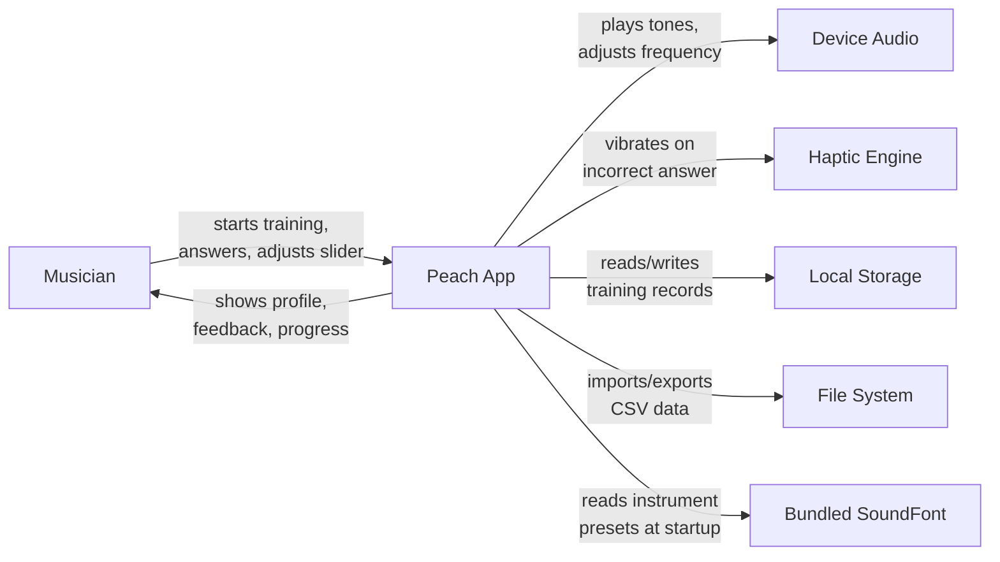
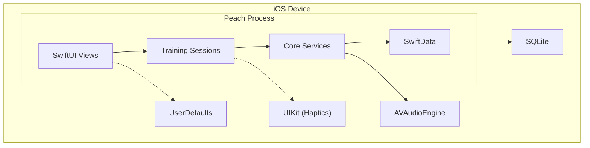
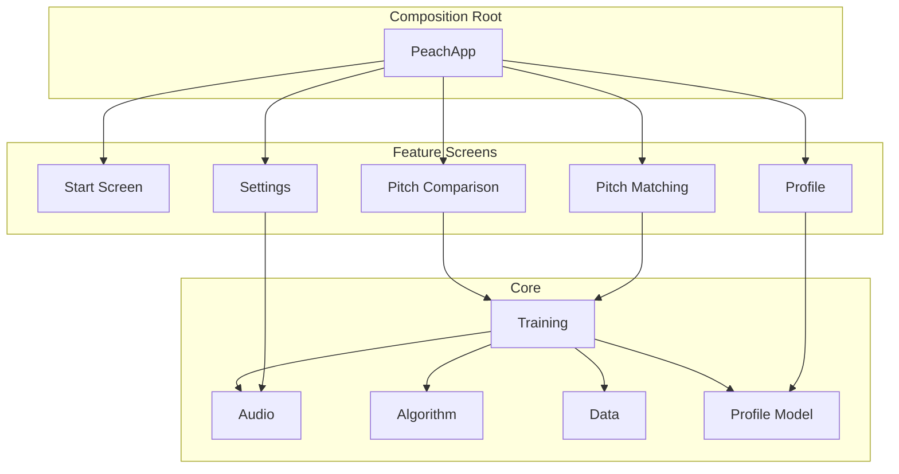
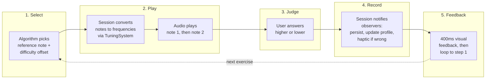
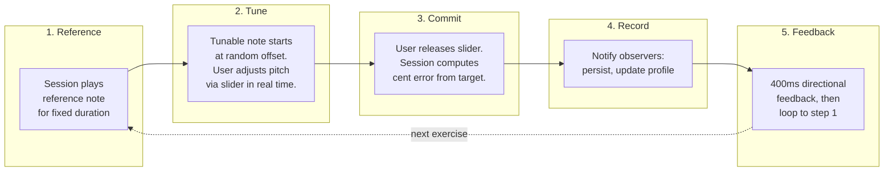
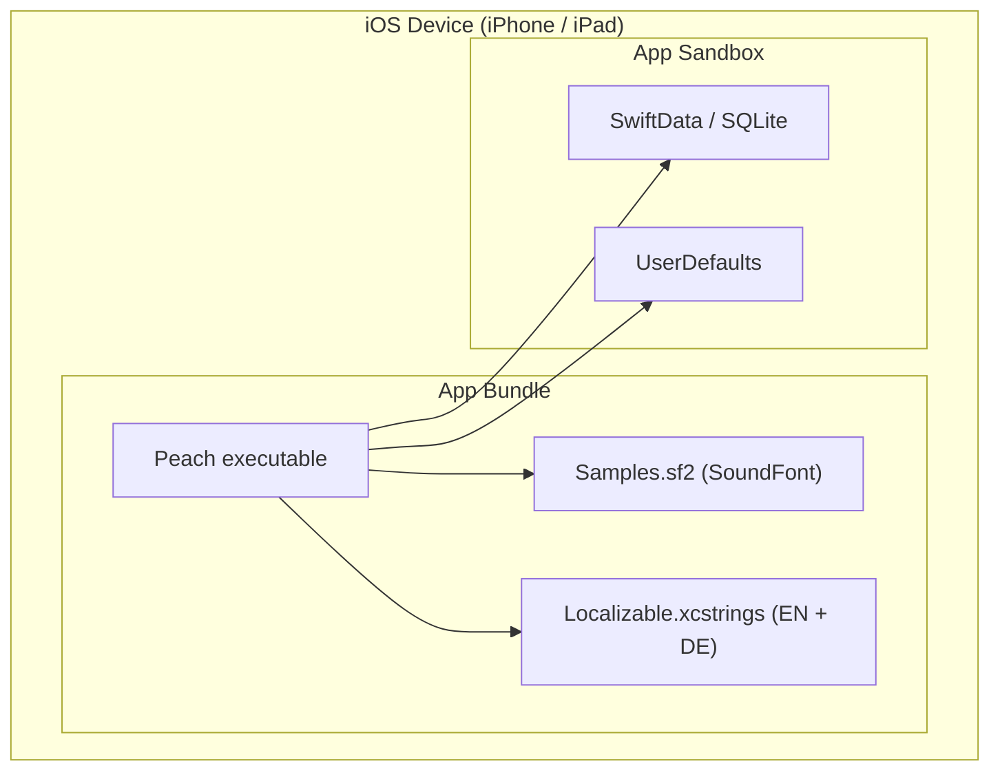
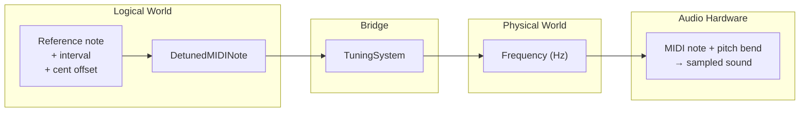

# Peach — arc42 Architecture Documentation

**Version:** 1.0
**Date:** 2026-03-17
**Status:** Current with codebase as of v0.3 (interval training)

---

## 1. Introduction and Goals

### 1.1 Requirements Overview

Peach is a pitch ear training app for iOS. It trains musicians' pitch perception through two complementary paradigms — **Pitch Comparison** (judge whether the second note is higher or lower) and **Pitch Matching** (tune a note to match a target pitch) — each in **unison** and **interval** variants. The app builds a perceptual profile of the user's hearing and adaptively adjusts difficulty.

**Design philosophy:** "Training, not testing." No scores, no gamification, no sessions. Every exercise makes the user better; no single answer matters.

**Key functional requirements:**

- Adaptive pitch comparison training with immediate feedback
- Psychoacoustic staircase algorithm with adaptive difficulty
- SoundFont-based audio with sub-10ms latency and 0.1-cent precision
- Pitch matching with real-time frequency adjustment via slider
- Interval training generalizing both modes to musical intervals
- Perceptual profile visualization with progress timeline
- Local persistence of all training data
- iPhone + iPad, portrait + landscape, English + German

### 1.2 Quality Goals

| Priority | Quality Goal | Scenario |
|----------|-------------|----------|
| 1 | **Audio precision** | A generated tone deviates by less than 0.1 cent from the target frequency. Playback onset occurs within 10ms of the trigger. |
| 2 | **Training feel** | A user completes 15 pitch comparisons in 40 seconds without perceiving UI delay between exercises. Navigation away discards incomplete exercises silently. |
| 3 | **Data integrity** | A force-quit during a training exercise loses at most the current incomplete exercise. All previously completed exercises are persisted atomically. |
| 4 | **Testability** | Every service is injectable via protocol. A new developer can run the full test suite and see all business logic covered without device-specific setup. |
| 5 | **Simplicity** | The codebase uses zero third-party dependencies. A solo developer learning iOS can understand any component in isolation. |

### 1.3 Stakeholders

| Role | Person | Expectations |
|------|--------|-------------|
| Developer, User, Product Owner | Michael | Functional ear training app; learning vehicle for iOS development and AI-assisted workflows |
| AI Development Agents | Claude Code, BMAD agents | Clear architectural boundaries, testable interfaces, documented patterns |

---

## 2. Architecture Constraints

| Constraint | Consequence |
|-----------|-------------|
| **iOS 26+ only** | Use latest APIs freely; no backward compatibility code |
| **Swift 6.2 with strict concurrency** | Default `@MainActor` isolation; `Sendable` enforced at compile time; `async/await` only |
| **Zero third-party dependencies** | All functionality built on Apple frameworks; no supply chain risk |
| **Entirely on-device** | No network layer, no backend, no authentication; all data local |
| **Solo developer learning iOS** | Architecture must be approachable; favor clarity over abstraction depth |
| **Test-first development** | All services behind protocols; all business logic unit-tested |
| **SwiftUI lifecycle** | No UIKit in views; UIKit only through protocol abstractions |
| **Single Xcode module** | No multi-module SPM; access control via `private`/`internal` |

---

## 3. System Scope and Context

### 3.1 Business Context

Peach is a standalone on-device app with no external system integrations at runtime. The user interacts directly with the app; the app interacts with device hardware (audio, haptics) and local storage.



| Neighbor | Purpose | Technology |
|----------|---------|------------|
| Device Audio | Tone playback at precise frequencies; real-time pitch adjustment | AVAudioEngine + AVAudioUnitSampler |
| Haptic Engine | Tactile feedback on incorrect pitch comparison answers | UIKit (via protocol abstraction) |
| Local Storage | Persistent training records (every completed exercise) | SwiftData (SQLite-backed) |
| File System | Backup and restore of training history | CSV with versioned format |
| Bundled SoundFont | Instrument sound samples (piano, cello, etc.) | SF2 file with RIFF/PHDR metadata |

### 3.2 Technical Context



---

## 4. Solution Strategy

| Quality Goal | Approach | Details in |
|-------------|----------|-----------|
| **Audio precision** | SoundFont playback via MIDI noteOn + pitch bend; two-world architecture separating musical concepts from audio frequencies | Section 8.1 |
| **Training feel** | State machine sessions with guarded transitions; 400ms feedback phase; observer pattern for fire-and-forget result delivery | Sections 5.2, 6 |
| **Data integrity** | SwiftData atomic writes; single data store accessor; only completed exercises are persisted | Section 8.3 |
| **Testability** | Protocol-first design; composition root wires all dependencies; mocks with deterministic timing | Section 8.4 |
| **Simplicity** | Feature-based directory structure; zero dependencies; domain types replacing raw primitives; thin views with zero business logic | Sections 5.1, 8.2 |

**Key technology decisions:**

- **SwiftUI** with `@Observable` for reactive UI (not `ObservableObject`/Combine)
- **SwiftData** for persistence (not Core Data directly)
- **AVAudioEngine + AVAudioUnitSampler** for SoundFont playback (not AudioKit, not raw sine waves)
- **Swift Testing** for tests (not XCTest)
- **Composition root** for dependency injection (not a DI framework)
- **Observer protocols** for session result propagation (not Combine, not NotificationCenter)

---

## 5. Building Block View

### 5.1 Level 1 — Overview



**Dependency rules:**

- Feature screens depend on Core — never on each other
- Core has no UI framework imports (no SwiftUI, no UIKit, no Charts)
- SwiftData is encapsulated inside the Data component
- UIKit is used only for haptic feedback, behind a protocol

| Building Block | Responsibility |
|---------------|---------------|
| **Composition Root** | Creates all services, wires the dependency graph, injects everything via SwiftUI environment. The only place that knows the full object graph. |
| **Pitch Comparison** | Training loop where two notes play in sequence and the user judges higher/lower. Owns the session state machine for this mode. |
| **Pitch Matching** | Training loop where a reference note plays and the user tunes a second note to match. Owns the session state machine, pitch slider interaction. |
| **Profile** | Visualizes the user's perceptual abilities: piano keyboard heatmap, progress chart across four training modes, chart export. |
| **Settings** | User configuration: note range, note duration, reference pitch, sound source, interval selection, tuning system, data import/export. |
| **Audio** | Tone generation and the two-world architecture (see Section 8.1). Provides the `NotePlayer` protocol boundary. Owns all domain value types (MIDINote, Cents, Frequency, Interval, TuningSystem, etc.). |
| **Algorithm** | Decides the next pitch comparison exercise based on the user's profile and the last result. Currently implements the Kazez staircase (see ADR-4). |
| **Training** | Shared training concepts: exercise value types, observer protocols, session-specific settings snapshots, the `TrainingSession` protocol. |
| **Data** | Sole accessor to SwiftData persistence. Stores every completed exercise. Handles CSV import/export with versioned format parsing. |
| **Profile Model** | In-memory perceptual profile rebuilt from training records on startup. Per-note statistics via Welford's algorithm. Progress timeline with EWMA smoothing. |

### 5.2 Level 2 — Training Sessions

The two training sessions are the central orchestrators. Each is a state machine that coordinates audio playback, difficulty selection, result recording, and observer notification.

**Pitch Comparison:**

```
idle → playingNote1 → playingNote2 → awaitingAnswer → showingFeedback → (loop)
```

**Pitch Matching:**

```
idle → playingReference → awaitingSliderTouch → playingTunable → showingFeedback → (loop)
```

Both sessions share these architectural properties:

- **Error boundaries** — they catch all service errors, log them, and continue gracefully. The user never sees an error screen during training.
- **Observer notification** — after each completed exercise, the session notifies all injected observers (persistence, profile, haptics, progress tracking). Adding an observer requires zero session changes.
- **Settings snapshots** — settings are captured at `start()` time as immutable value types, decoupling the session from live user preferences.
- **Exclusive activation** — the composition root ensures only one session runs at a time.
- **Graceful interruption** — navigation away, app backgrounding, or audio interruption stops the active session and discards the current exercise.

---

## 6. Runtime View

### 6.1 Pitch Comparison Training Loop

The most important runtime scenario: a single pitch comparison exercise.



The algorithm adjusts difficulty based on the answer: narrowing the cent offset on correct, widening on incorrect. The loop runs continuously until the user navigates away.

### 6.2 Pitch Matching Exercise



Real-time frequency adjustment during step 2 is the key technical challenge — see Section 8.1 for how the audio layer handles this.

---

## 7. Deployment View

Peach is a standalone iOS app with no server infrastructure.



| Aspect | Detail |
|--------|--------|
| **Devices** | iPhone + iPad, iOS 26.0+, portrait + landscape |
| **Storage** | SwiftData/SQLite for training records; UserDefaults for settings |
| **Audio** | AVAudioEngine with bundled GM SoundFont (~25MB) |
| **Distribution** | App Store / TestFlight (not yet submitted) |
| **CI/CD** | Local `xcodebuild test` before each commit; no pipeline yet |

---

## 8. Crosscutting Concepts

### 8.1 Two-World Architecture

The most fundamental design pattern in Peach: strict separation between the **logical world** (musical concepts) and the **physical world** (audio frequencies). Getting this right was a significant design effort — it determines where each type lives, which components know about music theory, and which know about audio hardware.

#### The Two Worlds

| Logical World | Physical World |
|--------------|---------------|
| `MIDINote` (0-127) — discrete pitch | `Frequency` (Hz) — what the speaker produces |
| `Interval` (prime through octave) — musical distance | |
| `DetunedMIDINote` (MIDI note + cent offset) — a precise pitch identity | |
| `Cents` — microtonal offset, universal across tuning systems | |

`TuningSystem` is the **bridge** between the two worlds. It is the *only* path from logical to physical.

#### Who Lives Where

Sessions, the algorithm, profiles, data stores, and observers work **exclusively in the logical world**. They reason about MIDI notes, intervals, and cents. They never see or produce a frequency.

Only the audio layer touches the physical world — and it does so through two conversions:
1. **Forward (logical → physical):** `TuningSystem.frequency(for:referencePitch:)` — used by sessions before calling the audio layer
2. **Inverse (physical → MIDI hardware):** internal to the SoundFont player, invisible to the rest of the app

The `NotePlayer` protocol sits at the boundary: it accepts frequencies, making it implementation-agnostic. A hypothetical sine-wave player would use the Hz directly; the SoundFont player decomposes them back to MIDI commands.

#### Forward Path: From Musical Intent to Sound

This is the path every training exercise follows.



**Worked example** — playing E4 detuned by +15 cents (as part of a major-third interval from C4):

1. **Session constructs the logical pitch.** The algorithm selects C4 as the reference note and applies the configured interval (major third = 4 semitones up) to get E4. It then adds a 15-cent offset for difficulty, producing a `DetunedMIDINote`.

2. **TuningSystem converts to frequency.** It computes a total cent offset from A4 (the standard reference). For E4+15¢, that's -485 cents from A4. Different tuning systems produce different cent values for the same interval — this is where equal temperament and just intonation diverge. The final frequency: `440 × 2^(-485/1200)` ≈ 332.6 Hz.

3. **Session calls the audio layer** with the computed frequency. The NotePlayer protocol speaks only Hz — it knows nothing about music theory.

4. **The SoundFont player decomposes Hz back to MIDI.** Since AVAudioUnitSampler is a MIDI instrument, it needs a MIDI note number (to select the right sample) and a pitch bend (to fine-tune it). The player computes: `69 + 12 × log₂(332.6/440)` ≈ 64.15, rounds to MIDI note 64, and applies +15 cents of pitch bend. This decomposition always uses 12-TET at A4=440 Hz regardless of the active tuning system — it's a MIDI hardware detail, not a musical choice. The tuning system's intent is already baked into the Hz value from step 2.

#### Pitch Bend Mechanics

The pitch bend range is ±2 semitones (±200 cents), configured at startup via MIDI RPN. This gives 14-bit resolution (16,384 positions) over a 400-cent range — roughly 0.024 cents per step, far exceeding the 0.1-cent precision requirement. The ±200 cent range is always sufficient because the decomposition rounds to the nearest MIDI note, so the remainder never exceeds ±50 cents.

#### Real-Time Frequency Adjustment (Pitch Matching)

During pitch matching, the user adjusts a slider that changes the playing note's frequency in real time. The audio layer's `PlaybackHandle` concept makes this possible without restarting the note: the session computes a new frequency via `TuningSystem`, and the handle sends an updated pitch bend to the already-playing MIDI note. The constraint is that adjustments must stay within ±200 cents of the original note — which is always satisfied for the pitch offsets used in training.

#### Why This Architecture Matters

The two-world separation has concrete consequences:

- **Adding a tuning system** (e.g., just intonation) requires only adding its interval-to-cents table. No changes to sessions, the algorithm, profiles, data stores, or the audio layer.
- **Replacing the audio engine** requires only a new NotePlayer conformance. No changes to the logical world.
- **All training data is stored in logical types** (MIDI notes, cent offsets, tuning system label). The data remains meaningful regardless of which audio engine plays it back.

### 8.2 Domain Types

Raw `Double`, `Int`, and `String` are forbidden where a domain type exists. A constant like `36` is meaningless; `MIDINote(36)` communicates intent. This applies everywhere: constants, defaults, parameters, return types, local variables.

The key domain types: `MIDINote`, `Cents`, `Frequency`, `Interval`, `DetunedMIDINote`, `TuningSystem`, `NoteDuration`, `AmplitudeDB`, `MIDIVelocity`, `SoundSourceID`. Raw values are unwrapped only at system boundaries: UserDefaults, SwiftData `@Model` properties, and display formatting.

### 8.3 Persistence Strategy

- **Single accessor:** One data store component is the sole entry point for all database operations. No other component touches the persistence context.
- **Atomic writes:** SwiftData (SQLite-backed) provides atomic transactions. Bulk operations (e.g., CSV import with replace) use explicit transactions.
- **In-memory profile:** The perceptual profile is never persisted directly — it is rebuilt from training records on startup and updated incrementally during training. This means the profile is always consistent with the underlying data and requires no schema migration when profile logic changes.
- **CSV import/export:** Versioned format with a metadata header. A chain-of-responsibility parser dispatches to version-specific parsers. New format versions are additive — existing parsers are never modified.

### 8.4 Testing Strategy

- **Protocol-first:** Every service is behind a protocol. Tests inject mocks that conform to the same protocol, with deterministic timing and call tracking.
- **Async-native:** All tests are async. State machine transitions are verified through a dedicated helper that awaits the expected state, avoiding race conditions.
- **In-memory persistence:** Tests use an in-memory SwiftData container — no file system, no cleanup.
- **Framework:** Swift Testing exclusively. No XCTest.

### 8.5 Observer Pattern

Sessions decouple result delivery from result consumers. After each completed exercise, the session iterates its injected observer array and notifies each one. Current observers handle persistence, profile updates, haptic feedback, and progress tracking.

Adding a new observer (e.g., analytics, achievements) requires zero changes to session code — just add the new conformer to the observer array in the composition root.

### 8.6 Composition Root

All service instantiation happens in one place: the app entry point. This is the single dependency graph source of truth. Services are injected into views via SwiftUI environment.

**Rules:**
- Never create service instances outside the composition root
- Views that need to coordinate multiple services receive a closure from the root, not direct service references — this keeps each view's dependency surface minimal

---

## 9. Architecture Decisions

### ADR-1: SoundFont Playback via AVAudioUnitSampler

**Context:** The app needs tone generation with sub-10ms latency and 0.1-cent frequency precision. The MVP used sine wave generation. Rich instrument timbres were requested to make training more engaging.

**Decision:** Replace sine wave generation with SoundFont (SF2) playback using AVAudioEngine + AVAudioUnitSampler. Bundle a General MIDI SoundFont. Use MIDI noteOn + pitch bend for frequency accuracy.

**Status:** Implemented.

**Consequences:**
- (+) Rich instrument timbres from a single bundled file
- (+) Multiple sound sources selectable by user
- (+) MIDI pitch bend provides the required sub-cent accuracy
- (-) Bundled SF2 file adds ~25MB to app size
- (-) Unpitched percussion presets must be filtered out

### ADR-2: Protocol-Based Services with Composition Root

**Context:** Test-first development requires injectable dependencies. Need to balance testability with simplicity for a solo developer.

**Decision:** Define protocols for all services. Wire all dependencies in the composition root. Inject via SwiftUI environment.

**Status:** Implemented.

**Consequences:**
- (+) Every service testable in isolation with mocks
- (+) Single place to understand the full dependency graph
- (+) SwiftUI environment is the native injection mechanism
- (-) The composition root is the largest single method in the codebase

### ADR-3: Observer Pattern Over Combine

**Context:** Completed training exercises need to be delivered to multiple consumers (persistence, profile, haptics, progress). Need a decoupled delivery mechanism.

**Decision:** Use simple observer protocols with arrays of conformers injected into sessions. No Combine, no NotificationCenter.

**Status:** Implemented.

**Consequences:**
- (+) Zero framework dependency for event delivery
- (+) Synchronous, deterministic, testable
- (+) Adding observers requires no session changes
- (-) No built-in backpressure or buffering (unnecessary at current scale)

### ADR-4: Kazez Staircase Algorithm for Adaptive Difficulty

**Context:** The core differentiator of Peach is adaptive difficulty adjustment. Need an algorithm that converges on each note's detection threshold.

**Decision:** Implement an adaptive difficulty adjustment algorithm based on:

> Kazez, D., Kazez, B., Zembar, M. J., & Andrews, D. (2001). *A Computer Program for Testing (and Improving?) Pitch Perception.* College Music Society National Conference.

The algorithm uses the formula `p * (1 ± k * sqrt(p))`, where `p` is the current cent difference and `k` is a coefficient. The square root produces larger absolute changes at high difficulty (wide intervals) and gentler changes near the perceptual threshold. Asymmetric coefficients: narrowing 0.05 on correct, widening 0.09 on incorrect.

**Status:** Implemented.

**Consequences:**
- (+) Converges on perceptual thresholds without frustrating the user
- (+) Coefficients are tunable
- (+) Cold start handled gracefully (untrained notes start at maximum difficulty)
- (-) No adaptive algorithm for pitch matching yet (random note selection)

### ADR-5: In-Memory Profile Rebuilt on Startup

**Context:** Need per-note statistics for adaptive difficulty. Could persist the profile or recompute from records.

**Decision:** The perceptual profile is in-memory only. Rebuilt from all training records on app startup using Welford's online algorithm. Updated incrementally during training.

**Status:** Implemented.

**Consequences:**
- (+) Profile is always consistent with the underlying data
- (+) No schema migration when profile logic changes
- (+) Welford's algorithm makes startup O(n) with minimal memory
- (-) Startup time grows linearly with record count (currently sub-millisecond for hundreds of records)

### ADR-6: Unison as Prime Case of Interval Training

**Context:** Adding interval training could duplicate sessions, screens, and data models for "interval" and "non-interval" variants.

**Decision:** Unison (prime) is treated as the interval "prime" — not a separate concept. Existing sessions are parameterized with an interval set. Four training modes map to two session types × interval configuration.

**Status:** Implemented.

**Consequences:**
- (+) No code duplication between unison and interval modes
- (+) Data model stores interval implicitly (derived from reference and target notes)
- (-) Session code must handle MIDI range edge cases when interval > prime

### ADR-7: CSV Import/Export with Versioned Parser Chain

**Context:** Users need to back up and restore training data. The export format will evolve over time.

**Decision:** CSV format with a metadata header identifying the version. A chain-of-responsibility dispatcher routes to version-specific parsers. New format versions require only a new parser — existing parsers are never modified.

**Status:** Implemented.

**Consequences:**
- (+) Forward-compatible: old exports are always importable
- (+) New versions are additive
- (+) Human-readable format for debugging
- (-) CSV has no schema enforcement (validation in parser)

---

## 10. Quality Requirements

### 10.1 Quality Tree

```
Quality
├── Audio Quality
│   ├── Precision (0.1-cent frequency accuracy)
│   └── Latency (< 10ms onset)
├── Usability
│   ├── Training Feel (reflexive pace, no UI bottlenecks)
│   ├── Responsiveness (portrait + landscape, iPhone + iPad)
│   └── Accessibility (VoiceOver, 44x44pt tap targets)
├── Reliability
│   ├── Data Integrity (atomic writes, crash resilience)
│   └── Error Resilience (sessions as error boundaries)
├── Maintainability
│   ├── Testability (protocol-first, comprehensive coverage)
│   └── Simplicity (zero dependencies, approachable architecture)
└── Portability
    └── Localization (English + German)
```

### 10.2 Quality Scenarios

| ID | Quality Attribute | Scenario | Measure |
|----|------------------|----------|---------|
| QS-1 | Audio Precision | A tone targeting 441 Hz is played | Measured frequency deviates < 0.1 cent from target |
| QS-2 | Audio Latency | User taps "Start Training" | First note onset within 10ms of state transition |
| QS-3 | Training Feel | User completes 15 comparisons | Total elapsed < 45 seconds (reflexive pace) |
| QS-4 | Data Integrity | Force-quit during feedback phase | All previously completed exercises persisted; current exercise lost |
| QS-5 | Data Integrity | CSV import with replace mode | Atomic: all replaced or nothing changes |
| QS-6 | Error Resilience | Audio engine fails during playback | Session stops gracefully, returns to idle; no crash |
| QS-7 | Testability | New developer adds a service | Can write a test with mock dependencies in < 30 minutes |
| QS-8 | Startup Performance | App launch with 10,000 records | Profile loaded and app interactive within 2 seconds |
| QS-9 | Responsiveness | Rotate device during training | Layout adapts; no data loss; training continues |
| QS-10 | Localization | Switch device language to German | All user-facing strings display in German |

---

## 11. Risks and Technical Debt

### Risks

| Risk | Severity | Mitigation |
|------|---------|-----------|
| **Startup time with large datasets** | Medium | Welford's algorithm is O(n), currently sub-millisecond for hundreds of records. Monitor as dataset grows; could add background loading or profile caching. |
| **Single SoundFont quality** | Low | Bundled GM SoundFont covers common instruments. User-provided SF2 import is a future feature. |
| **No adaptive algorithm for pitch matching** | Low | Random note selection is acceptable for current usage. Extract to a strategy when data shows meaningful patterns. |
| **Composition root complexity** | Low | The largest single method, but straightforward wiring. Could extract to a factory if it grows further. |

### Technical Debt

| Item | Severity | Notes |
|------|---------|-------|
| **Original architecture document partially outdated** | Low | `docs/planning-artifacts/architecture.md` predates implementation and uses some names/types that have since evolved. This arc42 document is the current source of truth. |
| **No CI/CD pipeline** | Low | Pre-commit gate is local `xcodebuild test`. Acceptable for solo developer; would need automation before team collaboration. |

---

## 12. Glossary

| Term | Definition |
|------|-----------|
| **Cent** | Unit of pitch difference. 100 cents = 1 semitone, 1200 cents = 1 octave. |
| **Cold Start** | Initial state when no training data exists for a note. The algorithm starts at maximum cent difference. |
| **Composition Root** | The single location (app entry point) where all services are created and wired. |
| **DetunedMIDINote** | A MIDI note with a cent offset — a precise pitch identity in the logical world. |
| **EWMA** | Exponentially Weighted Moving Average. Used for smoothing progress trends over time. |
| **Interval** | Musical distance from prime (unison, 0 semitones) through octave (12 semitones). |
| **Kazez Algorithm** | Psychoacoustic staircase that adjusts difficulty via `p * (1 ± k * sqrt(p))`. Coefficients: narrowing 0.05, widening 0.09. |
| **MIDI Note** | Standardized pitch number (0-127). 60 = middle C, 69 = A4. |
| **Perceptual Profile** | In-memory model of the user's pitch perception, rebuilt from training records on startup. |
| **Pitch Comparison** | Training mode: two notes in sequence, user judges higher or lower. |
| **Pitch Matching** | Training mode: user tunes a note to match a reference pitch via slider. |
| **Reference Note** | The anchor note in a training exercise. Always an exact MIDI note. |
| **SoundFont (SF2)** | File format containing sampled instrument sounds. Peach bundles one GM SoundFont. |
| **Target Note** | The note the user judges against or tunes toward. May differ from reference by an interval and a cent offset. |
| **Training Mode** | One of four activities: unison comparison, interval comparison, unison matching, interval matching. |
| **Tuning System** | Defines how intervals map to cent offsets (and thus frequencies). Currently: 12-TET and just intonation. |
| **Two-World Architecture** | Separation of logical types (MIDI notes, intervals, cents) from physical types (frequencies). Bridged exclusively by TuningSystem. |
| **Welford's Algorithm** | Incremental method for computing running mean and variance without storing all historical data. |
