# Peach — arc42 Architecture Documentation

**Version:** 1.0
**Date:** 2026-03-17
**Status:** Current with codebase as of v0.3 (interval training)

---

## 1. Introduction and Goals

### 1.1 Requirements Overview

Peach is a pitch ear training app for iOS. It trains musicians' pitch perception through two complementary paradigms — **Pitch Comparison** (judge whether the second note is higher or lower) and **Pitch Matching** (tune a note to match a target pitch) — each in **unison** and **interval** variants. The app builds a perceptual profile of the user's hearing and adaptively targets weak spots.

**Design philosophy:** "Training, not testing." No scores, no gamification, no sessions. Every exercise makes the user better; no single answer matters.

**Key functional requirements:**

- Adaptive pitch comparison training loop with immediate feedback (FR1-FR8)
- Psychoacoustic staircase algorithm targeting weak spots (FR9-FR15)
- SoundFont-based audio with sub-10ms latency and 0.1-cent precision (FR16-FR20)
- Pitch matching with real-time frequency adjustment via slider (FR44-FR52)
- Interval training generalizing both modes to musical intervals (FR53-FR67)
- Perceptual profile visualization with progress timeline (FR21-FR26)
- Local persistence of all training data (FR27-FR29)
- iPhone + iPad, portrait + landscape, English + German (FR37-FR42)

### 1.2 Quality Goals

| Priority | Quality Goal | Scenario |
|----------|-------------|----------|
| 1 | **Audio precision** | A generated tone at 441 Hz deviates by less than 0.1 cent from the target frequency. Playback onset occurs within 10ms of the trigger. |
| 2 | **Training feel** | A user completes 15 pitch comparisons in 40 seconds without perceiving UI delay between exercises. Navigation away discards incomplete exercises silently. |
| 3 | **Data integrity** | A force-quit during a training exercise loses at most the current incomplete exercise. All previously completed exercises are persisted atomically. |
| 4 | **Testability** | Every service is injectable via protocol. A new developer can run the full test suite and see 100% of business logic covered without device-specific setup. |
| 5 | **Simplicity** | The codebase uses zero third-party dependencies. A solo developer learning iOS can understand any component in isolation. |

### 1.3 Stakeholders

| Role | Person | Expectations |
|------|--------|-------------|
| Developer, User, Product Owner | Michael | Functional ear training app; learning vehicle for iOS development and AI-assisted workflows |
| AI Development Agents | Claude Code, BMAD agents | Clear architectural boundaries, testable interfaces, documented patterns |

---

## 2. Architecture Constraints

| Constraint | Consequence |
|-----------|-------------|
| **iOS 26+ only** | Use latest APIs freely; no backward compatibility code |
| **Swift 6.2 with strict concurrency** | Default `@MainActor` isolation; `Sendable` enforced at compile time; `async/await` only |
| **Zero third-party dependencies** | All functionality built on Apple frameworks; no supply chain risk |
| **Entirely on-device** | No network layer, no backend, no authentication; all data local |
| **Solo developer learning iOS** | Architecture must be approachable; favor clarity over abstraction depth |
| **Test-first development** | All services behind protocols; all business logic unit-tested |
| **SwiftUI lifecycle** | No UIKit in views; UIKit only through protocol abstractions |
| **Single Xcode module** | No multi-module SPM; access control via `private`/`internal` |

---

## 3. System Scope and Context

### 3.1 Business Context

Peach is a standalone on-device app with no external system integrations at runtime. The user interacts directly with the app; the app interacts with device hardware (audio, haptics) and local storage.

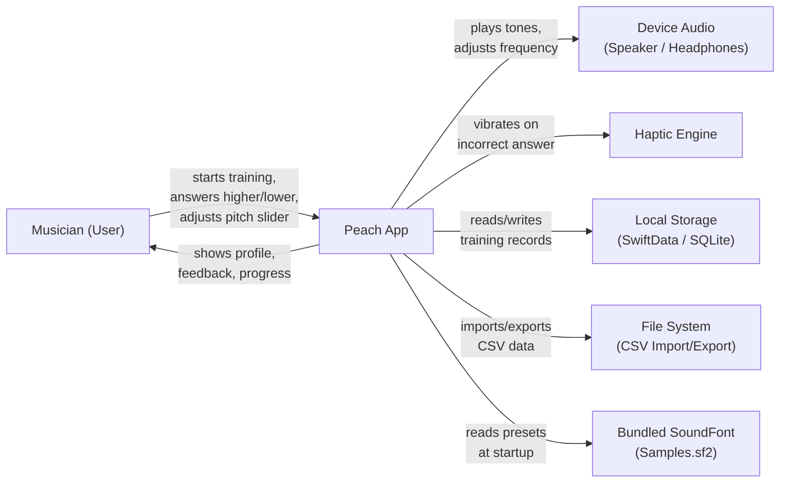

| Neighbor | Data Exchanged | Technology |
|----------|---------------|------------|
| Device Audio | Tone playback at precise frequencies; real-time pitch adjustment | AVAudioEngine + AVAudioUnitSampler |
| Haptic Engine | Double heavy impact on incorrect pitch comparison | UIImpactFeedbackGenerator (via protocol) |
| Local Storage | PitchComparisonRecord, PitchMatchingRecord CRUD | SwiftData (SQLite-backed) |
| File System | CSV export/import of training history | FileDocument / UTType |
| Bundled SoundFont | SF2 preset discovery and instrument selection | SF2PresetParser (RIFF/PHDR metadata) |

### 3.2 Technical Context

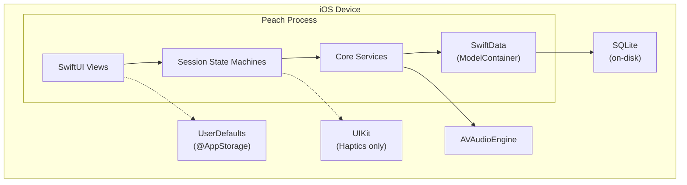

---

## 4. Solution Strategy

| Quality Goal | Approach | Sections |
|-------------|----------|----------|
| **Audio precision** | AVAudioEngine + AVAudioUnitSampler with SoundFont playback; MIDI noteOn + pitch bend for sub-cent accuracy; two-world architecture separating logical (MIDI notes, cents) from physical (Hz) | 5.1 (Audio), 8.1 (Two-World) |
| **Training feel** | State machine sessions with guarded transitions; 400ms feedback phase; observer pattern for fire-and-forget notifications; no session boundaries | 5.1 (Sessions), 6.1, 6.2 |
| **Data integrity** | SwiftData atomic writes; single `TrainingDataStore` accessor; sessions write only completed exercises | 5.1 (Data), 8.3 (Persistence) |
| **Testability** | Protocol-first design for all services; composition root in PeachApp.swift; mock contract with call tracking, error injection, instant playback | 5.1 (all), 8.4 (Testing) |
| **Simplicity** | Feature-based directory structure; zero dependencies; domain types replacing raw primitives; thin views with zero business logic | 5.1, 8.2 (Domain Types) |

**Key technology decisions:**

- **SwiftUI** for declarative UI with `@Observable` (not `ObservableObject`)
- **SwiftData** for persistence (not Core Data directly)
- **AVAudioEngine + AVAudioUnitSampler** for SoundFont playback (not AudioKit, not sine wave generation)
- **Swift Testing** for tests (not XCTest)
- **Composition root pattern** for dependency injection (not a DI framework)
- **Observer pattern** for session result propagation (not Combine, not NotificationCenter)

---

## 5. Building Block View

### 5.1 Level 1 — System Whitebox

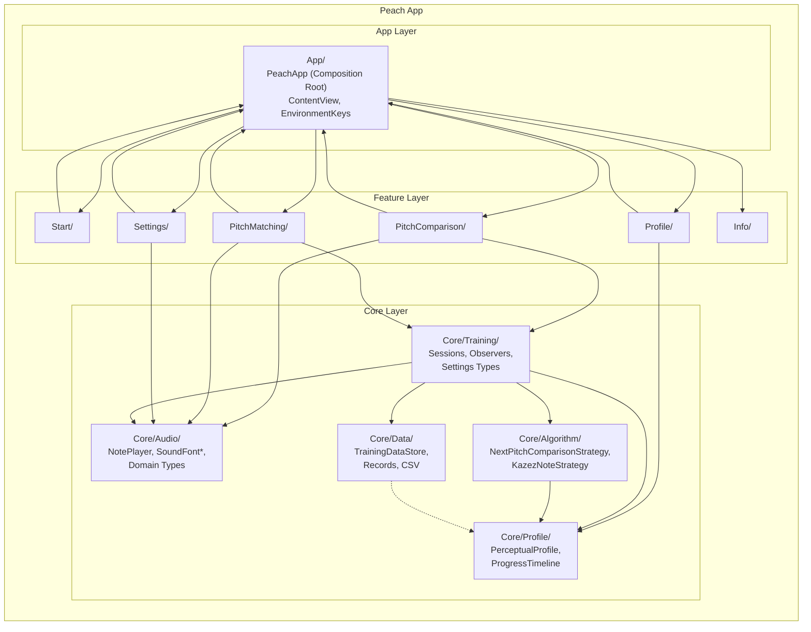

**Dependency rules:**

- Feature directories depend on Core/ — never on each other (no cross-feature coupling)
- Core/ contains no SwiftUI, no UIKit, no Charts imports
- SwiftData imports only in Core/Data/ and App/
- UIKit only in PitchComparison/HapticFeedbackManager.swift (protocol abstraction) and App/

| Building Block | Responsibility |
|---------------|---------------|
| **App/** | Composition root (PeachApp.swift). Instantiates all services, wires dependency graph, injects via SwiftUI `@Environment`. Manages active session tracking. |
| **Start/** | Hub screen with four training mode buttons, progress sparklines, and navigation to Profile/Settings/Info. |
| **PitchComparison/** | Pitch comparison training: session state machine, screen, feedback indicator, haptic manager. |
| **PitchMatching/** | Pitch matching training: session state machine, screen, pitch slider, feedback indicator. |
| **Profile/** | Profile visualization: piano keyboard with per-note thresholds, progress chart with 4-mode timeline, chart export. |
| **Settings/** | User configuration: note range, duration, reference pitch, sound source, interval selection, tuning system, CSV import/export. |
| **Info/** | About screen. |
| **Core/Audio/** | Audio protocols and implementation. NotePlayer/PlaybackHandle protocols. SoundFontNotePlayer (sole NotePlayer). SoundFontLibrary, SF2PresetParser. Domain value types: MIDINote, Frequency, Cents, Interval, DetunedMIDINote, TuningSystem, etc. |
| **Core/Algorithm/** | Pitch comparison selection strategy. NextPitchComparisonStrategy protocol. KazezNoteStrategy: psychoacoustic staircase with asymmetric narrowing/widening. |
| **Core/Training/** | Shared training types. PitchComparison, CompletedPitchComparison, CompletedPitchMatching value types. Observer protocols. Session-specific settings snapshots. TrainingSession protocol. |
| **Core/Data/** | Persistence. TrainingDataStore (sole SwiftData accessor). PitchComparisonRecord, PitchMatchingRecord (@Model). CSV import/export with versioned parser chain. |
| **Core/Profile/** | Perceptual learning model. PerceptualProfile (in-memory, @Observable). ProgressTimeline with EWMA smoothing and adaptive time bucketing. |

### 5.2 Level 2 — Core/Audio Whitebox

The audio subsystem is the most architecturally significant component, implementing the two-world architecture.

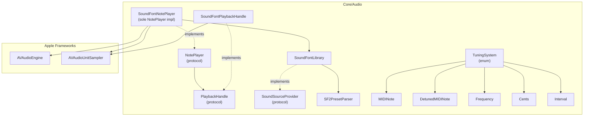

| Component | Responsibility |
|-----------|---------------|
| **NotePlayer** | Protocol: `play(frequency:velocity:amplitudeDB:) -> PlaybackHandle`, `play(frequency:duration:...)`, `stopAll()`. Knows only Hz — no MIDI concepts. |
| **PlaybackHandle** | Protocol: `stop()`, `adjustFrequency(_:)`. Represents ownership of a playing note. |
| **SoundFontNotePlayer** | Sole NotePlayer. Owns one AVAudioEngine + AVAudioUnitSampler. Reads sound source from UserSettings on each `play()`. Decomposes Hz to MIDI note + pitch bend internally. |
| **SoundFontLibrary** | Discovers SF2 files in bundle, parses presets via SF2PresetParser, filters unpitched instruments. Conforms to SoundSourceProvider. |
| **TuningSystem** | Enum (equalTemperament). Bridges logical world to physical world: `frequency(for:referencePitch:)` accepts MIDINote or DetunedMIDINote. |
| **Domain types** | MIDINote (0-127), Frequency (Hz), Cents (microtonal offset), Interval (prime-octave), DetunedMIDINote (MIDI + cents), NoteRange, NoteDuration, AmplitudeDB, MIDIVelocity, SoundSourceID, Direction. |

### 5.3 Level 2 — Session State Machines

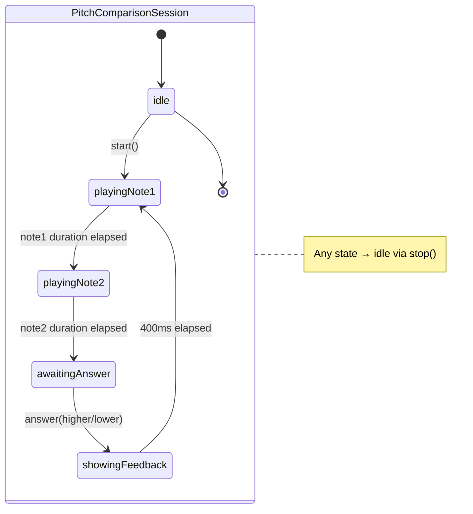

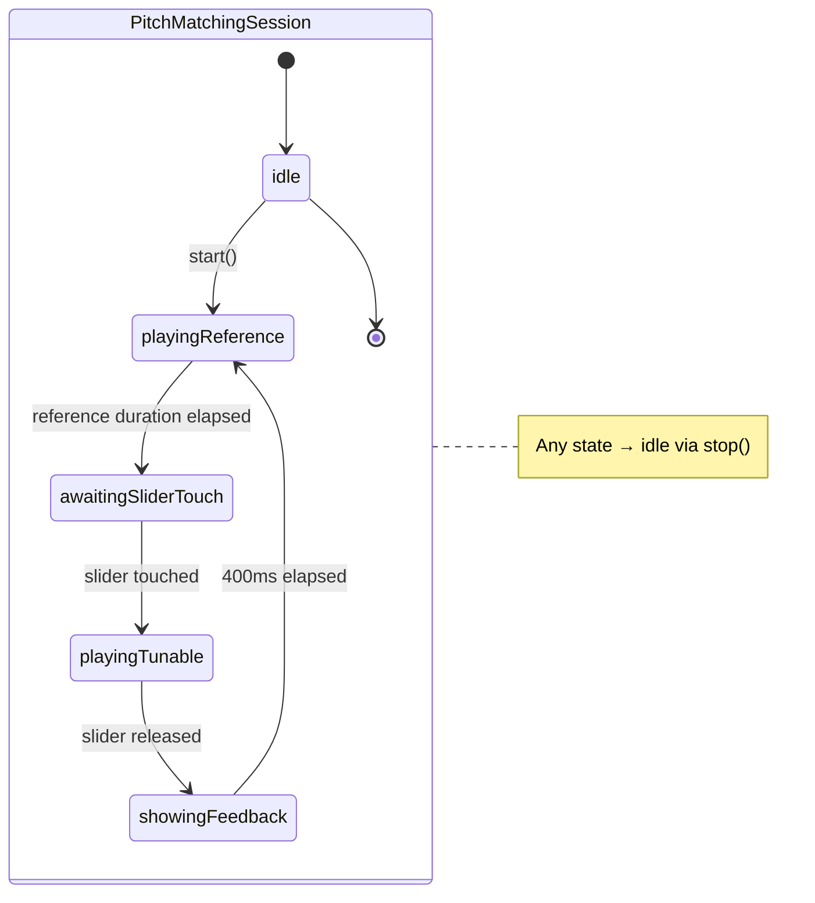

Both sessions:
- Conform to `TrainingSession` protocol (`stop()`, `isIdle`)
- Are `@Observable final class` instances
- Act as error boundaries — catch all service errors, log, continue gracefully
- Notify observers (TrainingDataStore, PerceptualProfile, ProgressTimeline, optionally HapticFeedbackManager) on exercise completion
- Accept session-specific settings snapshots at `start()` time, decoupled from UserSettings
- Are created once in PeachApp.swift; `activeSession` tracking ensures only one runs at a time

---

## 6. Runtime View

### 6.1 Pitch Comparison Training Loop

The most important runtime scenario: a single pitch comparison exercise from note selection through answer recording.

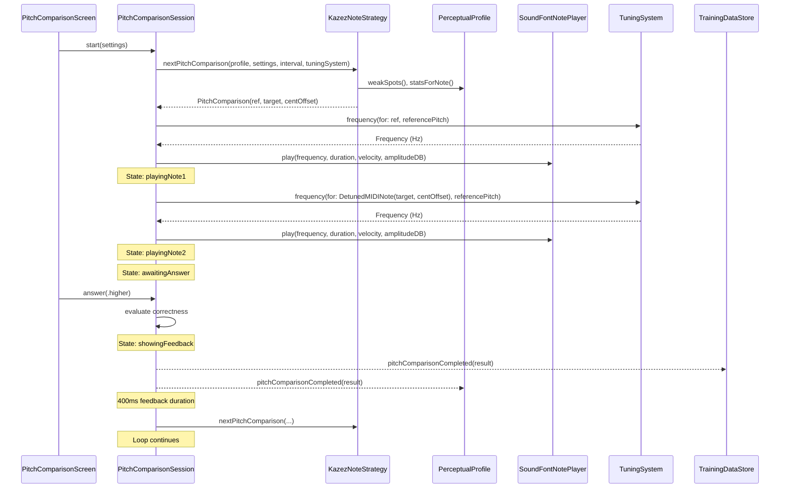

### 6.2 Pitch Matching Exercise

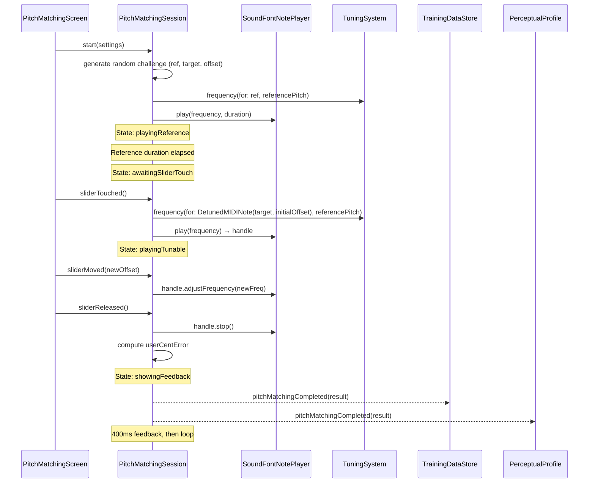

### 6.3 App Startup

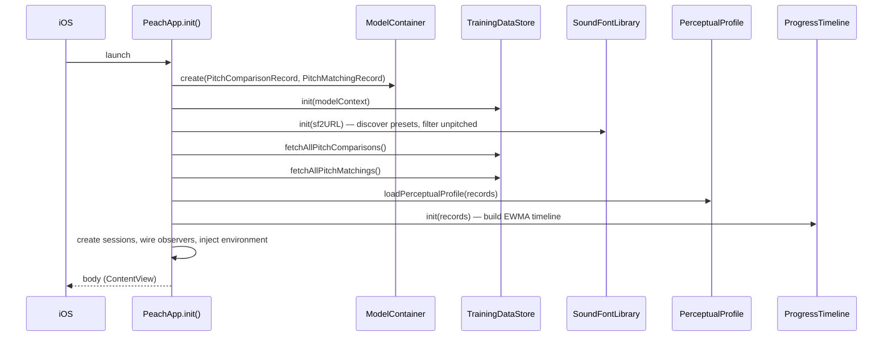

---

## 7. Deployment View

Peach is a standalone iOS app with no server infrastructure.

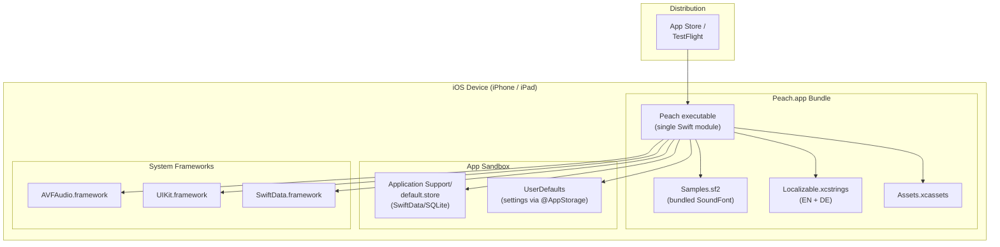

| Node | Specification |
|------|--------------|
| **Target devices** | iPhone + iPad, iOS 26.0+ |
| **Orientation** | Portrait + landscape (responsive layout) |
| **Architecture** | arm64 (Apple Silicon) |
| **Storage** | SwiftData/SQLite in app sandbox; UserDefaults for settings |
| **Audio** | AVAudioEngine with AVAudioUnitSampler; bundled GM SoundFont (Samples.sf2) |
| **Distribution** | App Store / TestFlight (not yet submitted) |
| **CI/CD** | None for MVP — local `xcodebuild test` before each commit |

---

## 8. Crosscutting Concepts

### 8.1 Two-World Architecture

The most fundamental design pattern in Peach: strict separation between the **logical world** (musical concepts) and the **physical world** (audio frequencies). Getting this right was a significant design effort — it determines where each type lives, which components know about music theory, and which know about audio hardware.

#### The Two Worlds

| Logical World | Physical World |
|--------------|---------------|
| `MIDINote` (0-127) — discrete pitch | `Frequency` (Hz) — what the speaker produces |
| `Interval` (prime through octave) — musical distance | |
| `DetunedMIDINote` (MIDI note + cent offset) — a precise pitch identity | |
| `Cents` — microtonal offset, universal across tuning systems | |

`TuningSystem` is the **bridge** between the two worlds. It is the *only* path from logical to physical.

#### Who Lives Where

Sessions, strategies, profiles, data stores, and observers work **exclusively in the logical world**. They reason about `MIDINote`, `Interval`, `Cents`, and `DetunedMIDINote`. They never see or produce a `Frequency`.

Only `SoundFontNotePlayer` touches the physical world — and it does so through two conversions:
1. **Forward (logical → physical):** `TuningSystem.frequency(for:referencePitch:)` — used by sessions before calling `NotePlayer.play()`
2. **Inverse (physical → MIDI hardware):** `SoundFontNotePlayer.decompose(frequency:)` — internal to the audio layer, invisible to the rest of the app

The `NotePlayer` protocol itself sits at the boundary: it accepts `Frequency` (physical world), making it implementation-agnostic. A hypothetical sine-wave player would use the Hz directly; the SoundFont player decomposes it back to MIDI commands.

#### Forward Path: From Musical Intent to Sound

This is the path every training exercise follows.

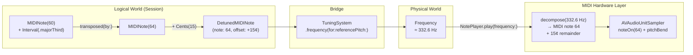

**Step by step:**

1. **Session constructs the logical pitch.** The `KazezNoteStrategy` selects a reference note (e.g., `MIDINote(60)` = C4) and applies the configured interval: `MIDINote(60).transposed(by: .majorThird)` → `MIDINote(64)` (E4). It then adds a cent offset for difficulty: `DetunedMIDINote(note: MIDINote(64), offset: Cents(15))`.

2. **TuningSystem converts to frequency.** The session calls `tuningSystem.frequency(for: detunedNote, referencePitch: Frequency(440))`. Internally, `TuningSystem` computes a total cent offset from A4 (MIDI 69):
   - Distance from A4: 64 - 69 = -5 semitones
   - Decompose into octaves + remainder: -1 octave + 7 semitones (perfect fifth)
   - Look up interval cents: for equal temperament, `perfectFifth` = 700¢; for just intonation, 701.955¢
   - Total cents: (-1 × 1200) + 700 + 15 = -485¢
   - Frequency: `440 × 2^(-485/1200)` ≈ 332.6 Hz

   This is where tuning systems matter: the same `Interval` produces different cent offsets in equal temperament vs. just intonation.

3. **Session calls NotePlayer.** `notePlayer.play(frequency: Frequency(332.6), duration: ..., velocity: ..., amplitudeDB: ...)` — the protocol boundary speaks only Hz.

4. **SoundFontNotePlayer decomposes back to MIDI.** Since AVAudioUnitSampler speaks MIDI, not Hz, the player must reverse-engineer which MIDI note to trigger and how much pitch bend to apply:
   - `decompose(332.6 Hz)`: compute exact MIDI position = `69 + 12 × log₂(332.6/440)` ≈ 64.15
   - Round to nearest MIDI note: 64 (E4)
   - Cent remainder: 0.15 × 100 = +15¢
   - Send pitch bend: `8192 + 15 × (8192/200)` ≈ 8806 (14-bit value, center is 8192)
   - Send MIDI noteOn for note 64 with the computed pitch bend

**Why decompose at all?** AVAudioUnitSampler is a MIDI instrument — it needs a MIDI note number to select the right sample, and a pitch bend to fine-tune it. The decomposition always uses 12-TET at A4=440 Hz, regardless of the active tuning system. This is not a musical choice; it is a MIDI hardware detail. The tuning system's musical intent is already baked into the Hz value by step 2.

#### Pitch Bend Mechanics

The pitch bend range is configured at startup via MIDI RPN (Registered Parameter Number) to ±2 semitones (±200 cents). This gives 14-bit resolution (16,384 positions) over a 400-cent range — roughly 0.024 cents per step, far exceeding the 0.1-cent precision requirement.

| Pitch Bend Value | Meaning |
|-----------------|---------|
| 0 | -200 cents (2 semitones flat) |
| 8192 | Center (no bend) |
| 16383 | +200 cents (2 semitones sharp) |

The ±200 cent range is sufficient because `decompose()` always rounds to the nearest MIDI note, so the remainder never exceeds ±50 cents.

#### Real-Time Frequency Adjustment (Pitch Matching)

During pitch matching, the user adjusts a slider that changes the playing note's frequency in real time. The `PlaybackHandle` makes this possible without restarting the note:

1. Session computes the new target: `TuningSystem.frequency(for: DetunedMIDINote(targetNote, newOffset), referencePitch:)`
2. Calls `handle.adjustFrequency(newFrequency)`
3. `SoundFontPlaybackHandle` decomposes the new frequency, computes the cent difference from the *original* base MIDI note, and sends an updated pitch bend

The constraint: the adjustment must stay within ±200 cents of the base note that was started. For pitch matching with ±50 cent initial offsets and user adjustments within that range, this is always satisfied.

#### Why This Architecture Matters

The two-world separation has concrete consequences:

- **Adding a tuning system** (e.g., just intonation) requires only adding a case to the `TuningSystem` enum with its `centOffset(for:)` table. No changes to sessions, strategies, profiles, data stores, NotePlayer, or SoundFontNotePlayer.
- **Replacing the audio engine** (e.g., a sine-wave generator for testing) requires only a new `NotePlayer` conformance. It would call `pitch.frequency(referencePitch:)` internally instead of decomposing to MIDI. No changes to the logical world.
- **All training data is stored in logical types** (MIDI notes, cent offsets, tuning system label). The data remains meaningful regardless of which audio engine plays it back.

### 8.2 Domain Types

Raw `Double`, `Int`, and `String` are forbidden where domain types exist. This applies everywhere: constants, defaults, parameters, return types, local variables.

| Type | Wraps | Purpose |
|------|-------|---------|
| `MIDINote` | `Int` (0-127) | Discrete pitch in logical world |
| `Cents` | `Double` | Microtonal offset |
| `Frequency` | `Double` | Hz in physical world |
| `Interval` | `Int` (0-12) | Semitone distance |
| `NoteDuration` | `Duration` | User-facing note length |
| `AmplitudeDB` | `Float` | Loudness offset |
| `MIDIVelocity` | `UInt8` (0-127) | MIDI velocity |
| `SoundSourceID` | `String` | `"sf2:{bank}:{program}"` |

**Unwrap to raw value only at:** UserDefaults read/write, SwiftData `@Model` stored properties, arithmetic-heavy internals (Welford's algorithm), display formatting.

### 8.3 Persistence Strategy

- **Single accessor:** `TrainingDataStore` is the sole entry point for all SwiftData operations. No other component touches `ModelContext`.
- **Atomic writes:** SwiftData (SQLite-backed) provides atomic transactions. `replaceAllRecords()` uses `modelContext.transaction{}`.
- **In-memory profile:** `PerceptualProfile` is never persisted directly — it is rebuilt from records on startup and updated incrementally during training.
- **Settings:** `@AppStorage` (UserDefaults) for all user preferences. Keys centralized in `SettingsKeys.swift`.
- **CSV import/export:** Versioned format (`# peach-export-format:1`). `CSVVersionedParser` dispatches to version-specific `CSVImportParser` conformances. New versions are additive — no changes to existing parsers.

### 8.4 Testing Strategy

- **Framework:** Swift Testing (`@Test`, `@Suite`, `#expect()`). No XCTest.
- **Protocol-first:** Every service is behind a protocol. Mocks conform to the same protocol.
- **Mock contract:** Track call counts and parameters; support error injection (`shouldThrowError`); provide sync callbacks (`onPlayCalled`); include `instantPlayback` mode; provide `reset()`.
- **Async tests:** All `@Test` functions are `async`. Use `waitForState` helper for state machine transitions — never raw `#expect` after async actions.
- **In-memory SwiftData:** Tests use `ModelConfiguration(isStoredInMemoryOnly: true)`.
- **Factory methods:** Return tuples `(session:, notePlayer:, strategy:, ...)` so each test accesses specific mocks.

### 8.5 Observer Pattern

Sessions decouple result delivery from result consumers through observer protocols:

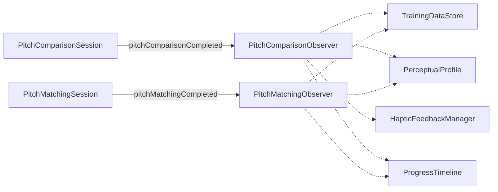

Sessions iterate their injected observer arrays after each completed exercise. Observers are injected in `PeachApp.swift`. Adding a new observer requires zero changes to session code — just add it to the array in the composition root.

### 8.6 Composition Root

All service instantiation happens in `PeachApp.init()`. This is the single dependency graph source of truth. Services are injected into views via SwiftUI `@Environment` with `@Entry` macros on `EnvironmentValues`.

**Rules:**
- Never create service instances outside PeachApp
- New services get wired here and injected via environment
- Views that coordinate multiple services receive closures from the composition root, not direct service references

---

## 9. Architecture Decisions

### ADR-1: SoundFont Playback via AVAudioUnitSampler

**Context:** The app needs tone generation with sub-10ms latency and 0.1-cent frequency precision. The MVP used sine wave generation via AVAudioSourceNode. Rich instrument timbres were requested to make training more engaging.

**Decision:** Replace sine wave generation with SoundFont (SF2) playback using AVAudioEngine + AVAudioUnitSampler. Bundle a General MIDI SoundFont. Use MIDI noteOn + pitch bend for frequency accuracy within ±2 semitones of any MIDI note.

**Status:** Implemented.

**Consequences:**
- (+) Rich instrument timbres from a single bundled SF2 file
- (+) Multiple sound sources selectable by user (piano, cello, sine wave, etc.)
- (+) MIDI pitch bend provides the required sub-cent accuracy
- (-) Bundled SF2 file adds ~25MB to app size
- (-) SF2 preset filtering needed (unpitched percussion must be excluded)

### ADR-2: Protocol-Based Services with Composition Root

**Context:** Test-first development requires injectable dependencies. Need to balance testability with simplicity for a solo developer.

**Decision:** Define protocols for all services (NotePlayer, NextPitchComparisonStrategy, TrainingDataStore, etc.). Wire all dependencies in PeachApp.init(). Inject via SwiftUI @Environment.

**Status:** Implemented.

**Consequences:**
- (+) Every service testable in isolation with mocks
- (+) Single place to understand the full dependency graph
- (+) SwiftUI @Environment is the native injection mechanism
- (-) PeachApp.init() is the largest single method in the codebase

### ADR-3: Observer Pattern Over Combine

**Context:** Completed training exercises need to be delivered to multiple consumers (persistence, profile, haptics, progress). Need a decoupled delivery mechanism.

**Decision:** Use simple observer protocols (`PitchComparisonObserver`, `PitchMatchingObserver`) with arrays of conformers injected into sessions. No Combine, no NotificationCenter.

**Status:** Implemented.

**Consequences:**
- (+) Zero framework dependency for event delivery
- (+) Synchronous, deterministic, testable
- (+) Adding observers requires no session changes
- (-) No built-in backpressure or buffering (unnecessary at current scale)

### ADR-4: Kazez Staircase Algorithm for Adaptive Difficulty

**Context:** The core differentiator of Peach is adaptive targeting of weak spots. Need an algorithm that converges on each note's detection threshold while exploring the full range.

**Decision:** Implement a psychoacoustic staircase algorithm (inspired by Kazez) with asymmetric narrowing (0.95x on correct) and widening (1.3x on incorrect), square-root convergence scaling, and weak-spot prioritization.

**Status:** Implemented.

**Consequences:**
- (+) Converges on perceptual thresholds without frustrating the user
- (+) Parameters (narrowing/widening factors, convergence exponent) are tunable
- (+) Cold start handled gracefully (untrained notes start at 100 cents)
- (-) No adaptive algorithm for pitch matching yet (random selection)

### ADR-5: In-Memory PerceptualProfile Rebuilt on Startup

**Context:** Need per-note statistics for adaptive difficulty. Could persist the profile or recompute from records.

**Decision:** PerceptualProfile is in-memory only. Rebuilt from all PitchComparisonRecord and PitchMatchingRecord instances on app startup using Welford's online algorithm. Updated incrementally during training.

**Status:** Implemented.

**Consequences:**
- (+) Profile is always consistent with the underlying data
- (+) No schema migration for profile changes
- (+) Welford's algorithm makes startup O(n) with minimal memory
- (-) Startup time grows linearly with record count (measured: sub-millisecond for hundreds of records)

### ADR-6: Unison as Prime Case of Interval Training

**Context:** Adding interval training could duplicate sessions, screens, and data models for "interval" and "non-interval" variants.

**Decision:** Unison (prime) is treated as the interval `.prime` — not a separate concept. Existing sessions are parameterized with an interval set. Four training modes map to two session types x interval configuration.

**Status:** Implemented.

**Consequences:**
- (+) No code duplication between unison and interval modes
- (+) Single PitchComparisonSession handles both unison and interval comparisons
- (+) Data model stores interval implicitly (derived from referenceNote and targetNote)
- (-) Session code handles interval edge cases (MIDI range boundary when interval > prime)

### ADR-7: CSV Import/Export with Versioned Parser Chain

**Context:** Users need to back up and restore training data. The export format will evolve over time.

**Decision:** CSV format with a metadata header (`# peach-export-format:1`). Version-specific parsers conform to `CSVImportParser` protocol. `CSVVersionedParser` dispatches to the correct parser. New format versions are additive.

**Status:** Implemented.

**Consequences:**
- (+) Forward-compatible: old exports always importable
- (+) Chain of responsibility: adding a new version requires one new parser + registration
- (+) Human-readable format for debugging
- (-) CSV has no schema enforcement (validation in parser)

---

## 10. Quality Requirements

### 10.1 Quality Tree

```
Quality
├── Audio Quality
│   ├── Precision (0.1-cent frequency accuracy)
│   └── Latency (< 10ms onset)
├── Usability
│   ├── Training Feel (reflexive pace, no UI bottlenecks)
│   ├── Responsiveness (portrait + landscape, iPhone + iPad)
│   └── Accessibility (VoiceOver, 44x44pt tap targets)
├── Reliability
│   ├── Data Integrity (atomic writes, crash resilience)
│   └── Error Resilience (sessions as error boundaries)
├── Maintainability
│   ├── Testability (protocol-first, 100% business logic coverage)
│   └── Simplicity (zero dependencies, approachable architecture)
└── Portability
    └── Localization (English + German)
```

### 10.2 Quality Scenarios

| ID | Quality Attribute | Scenario | Measure |
|----|------------------|----------|---------|
| QS-1 | Audio Precision | User plays a tone targeting 441 Hz | Measured frequency deviates < 0.1 cent from target |
| QS-2 | Audio Latency | User taps "Start Training" | First note onset within 10ms of state transition |
| QS-3 | Training Feel | User completes 15 comparisons | Total elapsed time < 45 seconds (reflexive pace) |
| QS-4 | Data Integrity | Force-quit during showingFeedback | All previously completed exercises persisted; current exercise lost |
| QS-5 | Data Integrity | CSV import with replace mode | Atomic transaction: all old records deleted and new records inserted, or nothing changes |
| QS-6 | Error Resilience | Audio engine fails during playback | Session logs error, stops gracefully, returns to idle; no crash |
| QS-7 | Testability | New developer adds a service | Can write a test with mock dependencies in < 30 minutes |
| QS-8 | Startup Performance | App launch with 10,000 records | Profile loaded and app interactive within 2 seconds |
| QS-9 | Responsiveness | Rotate from portrait to landscape during training | Layout adapts; no data loss; training continues |
| QS-10 | Localization | Switch device language to German | All user-facing strings display in German |

---

## 11. Risks and Technical Debt

### Risks

| Risk | Severity | Mitigation |
|------|---------|-----------|
| **Startup time with large datasets** | Medium | Welford's algorithm is O(n) and currently sub-millisecond for hundreds of records. Monitor as dataset grows; could add background loading or profile caching if needed. |
| **Single SoundFont quality** | Low | Bundled GM SoundFont covers common instruments. User-provided SF2 import is a future feature. |
| **No adaptive algorithm for pitch matching** | Low | Random note selection is acceptable for current usage. Extract to strategy protocol when data shows meaningful patterns. |
| **PeachApp.init() complexity** | Low | The composition root is the largest method but is straightforward wiring. Could extract to a factory if it grows further. |

### Technical Debt

| Item | Severity | Notes |
|------|---------|-------|
| **Architecture document partially outdated** | Low | The original architecture.md predates implementation and uses some names/types that have since evolved (e.g., `Pitch` struct was deleted, replaced by `DetunedMIDINote` + `TuningSystem`). This arc42 document is the current source of truth. |
| **No deinit safety on PlaybackHandle** | Low | All code paths explicitly stop notes. Auto-stop on deallocation deferred until orphaned notes become an issue. |
| **No CI/CD pipeline** | Low | Pre-commit gate is local `xcodebuild test`. Acceptable for solo developer; would need automation before team collaboration. |

---

## 12. Glossary

| Term | Definition |
|------|-----------|
| **Cent** | Unit of pitch difference. 100 cents = 1 semitone, 1200 cents = 1 octave. |
| **Cold Start** | Initial state for a new user or untrained note. Defaults to 100-cent differences. |
| **Composition Root** | `PeachApp.init()` — the single location where all services are created and wired. |
| **DetunedMIDINote** | A MIDI note with a cent offset. Bridges logical and physical worlds through TuningSystem. |
| **EWMA** | Exponentially Weighted Moving Average. Used by ProgressTimeline for trend smoothing. |
| **Interval** | Musical distance from prime (unison, 0 semitones) through octave (12 semitones). |
| **Kazez Note Strategy** | Psychoacoustic staircase algorithm. Narrows on correct (0.95x), widens on incorrect (1.3x). |
| **MIDI Note** | Standardized pitch number (0-127). 60 = middle C, 69 = A4. |
| **Note Player** | Protocol for playing tones at specified frequencies. Implementation-agnostic. |
| **Perceptual Profile** | In-memory model of the user's pitch perception ability, indexed by MIDI note. |
| **Pitch Comparison** | Training mode: two notes in sequence, user judges higher or lower. |
| **Pitch Matching** | Training mode: user tunes a note to match a reference pitch via slider. |
| **Playback Handle** | Protocol representing ownership of a currently playing note. Returned by NotePlayer.play(). |
| **Progress Timeline** | Time-series tracking of training metrics across four modes with EWMA smoothing. |
| **Reference Note** | The anchor note in a training exercise. Always an exact MIDI note. |
| **SoundFont (SF2)** | File format containing sampled instrument sounds. Peach bundles one GM SoundFont. |
| **Target Note** | The note the user judges against or tunes toward. May differ from reference by an interval. |
| **Time Bucket** | Grouping of training records by time proximity for progress tracking. |
| **Training Mode** | One of four activities: unison comparison, interval comparison, unison matching, interval matching. |
| **Training Session** | Protocol shared by PitchComparisonSession and PitchMatchingSession: `stop()`, `isIdle`. |
| **Tuning System** | Defines how intervals map to frequencies. Currently: 12-tone equal temperament. |
| **Two-World Architecture** | Separation of logical types (MIDINote, Interval, Cents) from physical types (Frequency). |
| **Welford's Algorithm** | Incremental method for computing running mean and variance without storing all data. |
