# Peach — arc42 Architecture Documentation

**Version:** 3.1
**Date:** 2026-04-30
**Status:** Current with codebase as of epic 77 (plugin-style disciplines)

---

## 1. Introduction and Goals

### 1.1 Requirements Overview

Peach is a pitch and rhythm ear training app for iOS, iPadOS, and macOS. It trains musicians' perception through three complementary training paradigms — **Pitch Comparison**, **Pitch Matching**, and **Rhythm Training** — each with multiple variants. The app builds a perceptual profile of the user's abilities and adaptively adjusts difficulty.

**Training paradigms:**

| Paradigm | Discipline | Mechanic |
|----------|-----------|----------|
| **Pitch Comparison** | Unison, Interval | Two notes play in sequence; user judges higher or lower |
| **Pitch Matching** | Unison, Interval | A reference note plays; user tunes a second note to match via slider |
| **Rhythm Training** | Offset Detection, Continuous Matching | A rhythmic pattern plays; user judges timing (early/late) or taps into gaps |

**Design philosophy:** "Training, not testing." No scores, no gamification, no sessions. Every exercise makes the user better; no single answer matters.

**Key functional requirements:**

- Adaptive pitch comparison training with immediate feedback
- Psychoacoustic staircase algorithm with adaptive difficulty (pitch and rhythm)
- SoundFont-based audio with sub-10ms latency and 0.1-cent precision for pitch
- Sample-accurate percussion sequencing for rhythm training (±1 sample precision)
- Pitch matching with real-time frequency adjustment via slider
- Interval training generalizing both pitch disciplines to musical intervals
- Rhythm offset detection: judge whether a note is early or late relative to the beat
- Continuous rhythm matching: tap into gaps in a looping rhythmic pattern
- Perceptual profile visualization with progress timeline across every registered discipline
- Local persistence of all training data
- iPhone + iPad + Mac (native SwiftUI, not Catalyst), portrait + landscape on iOS/iPadOS, English + German

### 1.2 Quality Goals

| Priority | Quality Goal | Scenario |
|----------|-------------|----------|
| 1 | **Audio precision** | A generated pitch tone deviates by less than 0.1 cent from the target frequency. Playback onset occurs within 10ms of the trigger. A rhythm pattern's timing offset is accurate to within 1 audio sample (≈23μs at 44.1kHz). |
| 2 | **Training feel** | A user completes 15 pitch comparisons in 40 seconds without perceiving UI delay between exercises. Rhythm patterns play grid-aligned with no perceptible drift. Navigation away discards incomplete exercises silently. |
| 3 | **Data integrity** | A force-quit during a training exercise loses at most the current incomplete exercise. All previously completed exercises are persisted atomically. |
| 4 | **Testability** | Every service is injectable via protocol. A new developer can run the full test suite and see all business logic covered without device-specific setup. |
| 5 | **Simplicity** | The codebase uses zero third-party dependencies. A solo developer learning iOS can understand any component in isolation. |

### 1.3 Stakeholders

| Role | Person | Expectations |
|------|--------|-------------|
| Developer, User, Product Owner | Michael | Functional ear training app; learning vehicle for Apple platform development and AI-assisted workflows |
| AI Development Agents | Claude Code, BMAD agents | Clear architectural boundaries, testable interfaces, documented patterns |

---

## 2. Architecture Constraints

| Constraint | Consequence |
|-----------|-------------|
| **iOS/iPadOS/macOS 26+ only** | Use latest APIs freely; no backward compatibility code |
| **Swift 6.2 with strict concurrency** | Default `@MainActor` isolation; `Sendable` enforced at compile time; `async/await` only |
| **Zero third-party dependencies** | All functionality built on Apple frameworks; no supply chain risk |
| **Entirely on-device** | No network layer, no backend, no authentication; all data local |
| **Solo developer learning iOS** | Architecture must be approachable; favor clarity over abstraction depth |
| **Test-first development** | All services behind protocols; all business logic unit-tested |
| **SwiftUI lifecycle** | No UIKit/AppKit in views; platform APIs only through port protocol abstractions in `Core/Ports/` |
| **Single Xcode module** | No multi-module SPM; access control via `private`/`internal` |

---

## 3. System Scope and Context

### 3.1 Business Context

Peach is a standalone on-device app with no external system integrations at runtime. The user interacts directly with the app; the app interacts with device hardware (audio, haptics, MIDI controllers) and local storage. It runs on iPhone, iPad, and Mac as a single universal binary.

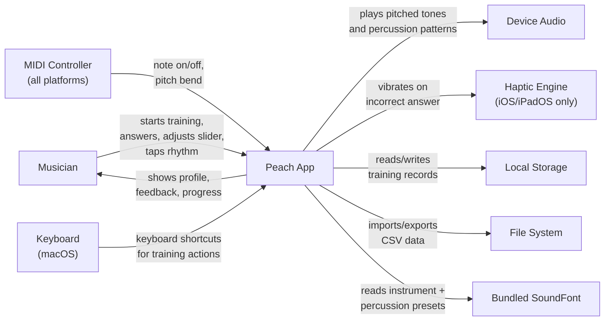
```mermaid
graph LR
    User["Musician"]
    Peach["Peach App"]
    Audio["Device Audio"]
    Haptics["Haptic Engine<br/>(iOS/iPadOS only)"]
    Storage["Local Storage"]
    FS["File System"]
    SF2["Bundled SoundFont"]
    MIDI["MIDI Controller<br/>(all platforms)"]
    KB["Keyboard<br/>(macOS)"]

    User -- "starts training,<br/>answers, adjusts slider,<br/>taps rhythm" --> Peach
    Peach -- "plays pitched tones<br/>and percussion patterns" --> Audio
    Peach -- "vibrates on<br/>incorrect answer" --> Haptics
    Peach -- "reads/writes<br/>training records" --> Storage
    Peach -- "imports/exports<br/>CSV data" --> FS
    Peach -- "reads instrument +<br/>percussion presets" --> SF2
    Peach -- "shows profile,<br/>feedback, progress" --> User
    MIDI -- "note on/off,<br/>pitch bend" --> Peach
    KB -- "keyboard shortcuts<br/>for training actions" --> Peach
```

| Neighbor | Purpose | Technology |
|----------|---------|------------|
| Device Audio | Pitched tone playback at precise frequencies; sample-accurate percussion pattern scheduling | AVAudioEngine + AVAudioUnitSampler (multi-channel) |
| Haptic Engine | Tactile feedback on incorrect pitch comparison and rhythm offset detection answers (iOS/iPadOS only; no-op on macOS) | UIKit via `HapticFeedback` port protocol |
| Local Storage | Persistent training records (every completed exercise across every registered discipline) | SwiftData (SQLite-backed) |
| File System | Backup and restore of training history | CSV with versioned format |
| Bundled SoundFont | Instrument sound samples (piano, cello, etc.) and percussion click sounds | SF2 file with RIFF/PHDR metadata |
| MIDI Controller | External input for training interactions (note on/off, pitch bend for pitch matching) | CoreMIDI via `MIDIInput` port protocol |
| Keyboard | macOS keyboard shortcuts for training actions (higher/lower, early/late, start/stop) | SwiftUI `.keyboardShortcut` via `PeachCommands` |

### 3.2 Technical Context

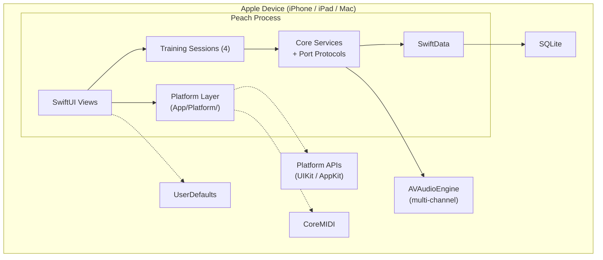
```mermaid
graph TB
    subgraph "Apple Device (iPhone / iPad / Mac)"
        subgraph "Peach Process"
            SwiftUI["SwiftUI Views"]
            Platform["Platform Layer<br/>(App/Platform/)"]
            Sessions["Training Sessions (4)"]
            Core["Core Services<br/>+ Port Protocols"]
            SwiftData["SwiftData"]
        end
        AVAudio["AVAudioEngine<br/>(multi-channel)"]
        PlatformAPIs["Platform APIs<br/>(UIKit / AppKit)"]
        UserDefaults["UserDefaults"]
        SQLite["SQLite"]
        CoreMIDI["CoreMIDI"]
    end

    SwiftUI --> Sessions
    SwiftUI --> Platform
    Sessions --> Core
    Core --> SwiftData
    Core --> AVAudio
    Platform -.-> PlatformAPIs
    Platform -.-> CoreMIDI
    SwiftUI -.-> UserDefaults
    SwiftData --> SQLite
```

---

## 4. Solution Strategy

| Quality Goal | Approach | Details in |
|-------------|----------|-----------|
| **Audio precision (pitch)** | SoundFont playback via MIDI noteOn + pitch bend; two-world architecture separating musical concepts from audio frequencies | Section 8.1 |
| **Audio precision (rhythm)** | Sample-accurate event scheduling via render-thread dispatch in `SoundFontEngine`; pre-allocated buffer with `Atomic<T>` counters for lock-free render-thread reads | Sections 5.2, 8.1 |
| **Training feel** | State machine sessions with guarded transitions; 400ms feedback phase; observer pattern for fire-and-forget result delivery; grid-aligned rhythm pattern sequencing | Sections 5.2, 6 |
| **Data integrity** | SwiftData atomic writes; single data store accessor; only completed exercises are persisted | Section 8.3 |
| **Testability** | Protocol-first design; composition root wires all dependencies; mocks with deterministic timing | Section 8.4 |
| **Simplicity** | Feature-based directory structure; zero dependencies; domain types replacing raw primitives; thin views with zero business logic; plugin-style disciplines (each feature-directory-colocated, registered at compile time) | Sections 5.1, 8.2, 8.7 |
| **Portability** | Platform-agnostic Core with port protocols; platform differences isolated in `App/Platform/`; single universal binary for all three Apple platforms | Sections 8.8, ADR-9 |

**Key technology decisions:**

- **SwiftUI** with `@Observable` for reactive UI (not `ObservableObject`/Combine)
- **SwiftData** for persistence (not Core Data directly)
- **AVAudioEngine + AVAudioUnitSampler** for SoundFont playback (not AudioKit, not raw sine waves)
- **SoundFontEngine** as a shared, multi-channel audio engine for both pitched and percussive playback
- **Swift Testing** for tests (not XCTest)
- **Composition root** for dependency injection (not a DI framework)
- **Observer protocols with adapters** for session result propagation (not Combine, not NotificationCenter)
- **TrainingDiscipline registry** for additive discipline extensibility (not hardcoded switch statements)

---

## 5. Building Block View

### 5.1 Level 1 — Overview

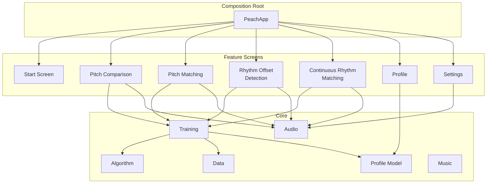
```mermaid
graph TB
    subgraph "Feature Screens"
        Start["Start Screen"]
        PC["Pitch Comparison"]
        PM["Pitch Matching"]
        ROD["Rhythm Offset<br/>Detection"]
        CRM["Continuous Rhythm<br/>Matching"]
        Prof["Profile"]
        Set["Settings"]
    end

    subgraph "Composition Root"
        App["PeachApp"]
    end

    subgraph "Core"
        Audio["Audio"]
        Algorithm["Algorithm"]
        Training["Training"]
        Data["Data"]
        Profile["Profile Model"]
        Music["Music"]
    end

    App --> Start & PC & PM & ROD & CRM & Prof & Set
    PC & PM --> Training
    ROD & CRM --> Training
    PC & PM --> Audio
    ROD & CRM --> Audio
    Training --> Algorithm & Data & Profile
    Prof --> Profile
    Set --> Audio
```

**Dependency rules:**

- Feature screens depend on Core — never on each other
- Core has no UI framework imports (no SwiftUI, no UIKit, no AppKit, no Charts)
- Core defines platform-agnostic port protocols (`Core/Ports/`); platform-specific implementations live in `App/Platform/`
- SwiftData is encapsulated inside the Data component
- `#if os()` conditionals appear only in `App/Platform/` and the composition root — never in Core or feature directories

| Building Block | Responsibility |
|---------------|---------------|
| **Composition Root** | Creates all services, wires the dependency graph, injects everything via SwiftUI environment. The only place that knows the full object graph. Manages four sessions, two audio layers, and their respective adapters. |
| **Pitch Comparison** | Training loop where two notes play in sequence and the user judges higher/lower. Owns the `PitchDiscriminationSession` state machine. Works in both unison and interval disciplines via parameterization. |
| **Pitch Matching** | Training loop where a reference note plays and the user tunes a second note to match. Owns the `PitchMatchingSession` state machine, pitch slider interaction. Works in both unison and interval disciplines. |
| **Timing Offset Detection** | Training loop where a four-sixteenth rhythmic pattern loops gaplessly with one note offset from the beat. User judges whether the offset note is early or late. Owns the `TimingOffsetDetectionSession` state machine. Acts as `BeatProvider` for a `BeatSequencer`. |
| **Continuous Rhythm Matching** | Continuous training loop where a repeating four-subdivision pattern plays with one gap per beat. User taps to fill the gap. Timing accuracy is measured. Owns the `ContinuousRhythmMatchingSession` and acts as `BeatProvider` for a `BeatSequencer`. |
| **Profile** | Visualizes the user's perceptual abilities: piano keyboard heatmap, progress chart across every registered discipline, spectrogram for rhythm, chart export. |
| **Settings** | User configuration: note range, note duration, reference pitch, sound source, interval selection, tuning system, tempo, gap position, data import/export. |
| **Audio** | Tone generation and percussion sequencing. Provides two protocol boundaries: `NotePlayer` (pitched playback) and `BeatSequencer` (gapless looped `Beat` playback, shared by both rhythm disciplines). `SoundFontEngine` is the shared multi-channel audio engine. Implements the two-world architecture (see Section 8.1). |
| **Algorithm** | Decides the next exercise based on the user's profile. `KazezNoteStrategy` implements the staircase for pitch comparison (see ADR-4). `AdaptiveTimingOffsetDetectionStrategy` adapts the same staircase for rhythm timing. Both strategies conform to their respective protocol (`NextPitchDiscriminationStrategy`, `NextTimingOffsetDetectionStrategy`). |
| **Training** | Shared training infrastructure: `TrainingSession` protocol, `TrainingDiscipline` protocol, `TrainingDisciplineRegistry` (see Section 8.7), `TrainingDisciplineConfig`, `TrainingDisciplineID` (slug-wrapping struct with named factories per registered discipline), `StatisticsKey`, observer protocols, session-specific settings snapshots, `Resettable`, `ProfileUpdating`. |
| **Data** | Sole accessor to SwiftData persistence. Stores every completed exercise across four record types. Handles CSV import/export with discipline-driven column ownership. |
| **Profile Model** | In-memory perceptual profile rebuilt from training records on startup. Keyed by `StatisticsKey` — either `.pitch(TrainingDisciplineID)` or `.rhythm(TrainingDisciplineID, TempoRange, TimingDirection)`. Uses Welford's algorithm for running statistics. Builder pattern for initialization. Progress timeline with EWMA smoothing and adaptive time bucketing. |
| **Music** | Domain value types for the logical world: `MIDINote`, `Cents`, `Frequency`, `Interval`, `DetunedMIDINote`, `TuningSystem`, `NoteDuration`, `AmplitudeDB`, `MIDIVelocity`, `SoundSourceID`, `TempoBPM`, `TempoRange`, `TimingOffset`, `TimingDirection`, `RhythmVelocity`, `SampleRate`, `PitchBendValue`. |

### 5.2 Level 2 — Training Sessions

The four training sessions are the central orchestrators. Each is a state machine (or continuous loop) that coordinates audio playback, difficulty selection, result recording, and observer notification.

**Pitch Comparison:**

```
idle → playingReferenceNote → playingTargetNote → awaitingAnswer → showingFeedback → (loop)
```

**Pitch Matching:**

```
idle → playingReference → awaitingSliderTouch → playingTunable → showingFeedback → (loop)
```

**Timing Offset Detection:**

```
idle → playingPatternLoop → showingFeedback → waitingForGrid → playingPatternLoop
                  │
                  └─.repetitionCapReached─→ awaitingAnswer ─.answerReceived─→ showingFeedback
```

The session runs the 4-sixteenth test pattern as a gapless loop on a `BeatSequencer`, with the session itself acting as `BeatProvider`. Each `.answerReceived` event is accepted from both `playingPatternLoop` and `awaitingAnswer` (a case-pattern union), so a user answer is always valid while a trial is open. `awaitingAnswer` is the cap-as-state introduced by the `maxRepetitions` setting: when the per-trial cycle count reaches the configured cap, the reducer transitions out of `playingPatternLoop` and stops the audio, but the trial stays open until the user submits. The `waitingForGrid` state ensures the next pattern loop resumes on the next quarter-note grid point, keeping the pulse phase-locked across feedback gaps.

**Continuous Rhythm Matching:**

Unlike the discrete state machines above, this session runs as a continuous loop. A `BeatSequencer` plays an endless stream of four-subdivision beats (three notes + one gap). The session acts as `BeatProvider`, deciding where the gap falls in each cycle. The user taps during gap windows; after 16 cycles, a trial completes and observers are notified. There is no state enum — the session uses an `isRunning` flag and real-time position tracking at ~120Hz.

All sessions share these architectural properties:

- **Error boundaries** — they catch all service errors, log them, and continue gracefully. The user never sees an error screen during training.
- **Observer notification** — after each completed exercise or trial, the session notifies all injected observers via adapter types. Adding an observer requires zero session changes.
- **Settings snapshots** — settings are captured at `start()` time as immutable value types, decoupling the session from live user preferences.
- **Exclusive activation** — the composition root ensures only one session runs at a time via `activeSession` tracking.
- **Graceful interruption** — navigation away, app backgrounding, or audio interruption stops the active session and discards the current exercise.

### 5.3 Level 2 — Audio Layer

The audio subsystem has been refactored around a shared engine:

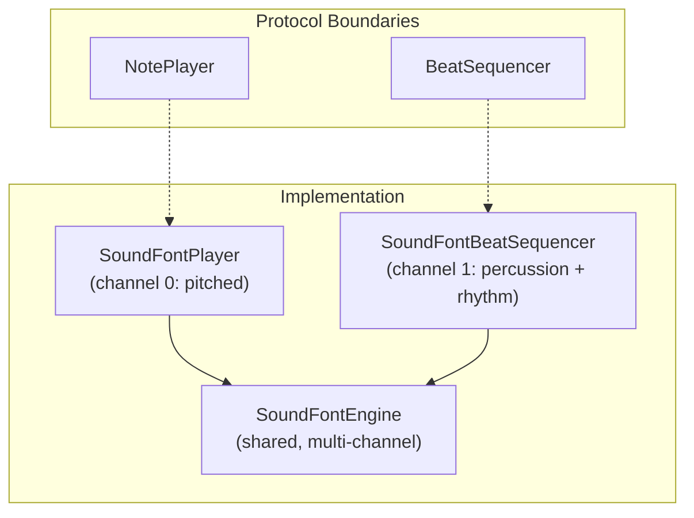
```mermaid
graph TB
    subgraph "Protocol Boundaries"
        NP["NotePlayer"]
        BS["BeatSequencer"]
    end

    subgraph "Implementation"
        SFE["SoundFontEngine<br/>(shared, multi-channel)"]
        SFP_Pitch["SoundFontPlayer<br/>(channel 0: pitched)"]
        SFBS["SoundFontBeatSequencer<br/>(channel 1: percussion + rhythm)"]
    end

    NP -.-> SFP_Pitch
    BS -.-> SFBS
    SFP_Pitch --> SFE
    SFBS --> SFE
```

- **`SoundFontEngine`** owns the single `AVAudioEngine` and manages multiple MIDI channels via `AVAudioUnitSampler` nodes. It provides sample-accurate event scheduling through a render-thread callback with a pre-allocated event buffer; coordination between the main thread and the render thread uses `Atomic<T>` counters (generation, dispatched-event count, sample position) so render-thread reads stay lock-free.
- **`SoundFontPlayer`** is the `NotePlayer` implementation — pitched playback with pitch bend. A single instance runs on channel 0.
- **`SoundFontBeatSequencer`** is the `BeatSequencer` implementation — gapless looped playback of `Beat` cycles (arrays of `Subdivision` cases — note with velocity + signed offset, or rest). Used by both Timing Offset Detection (4-sixteenth test pattern with one offset note) and Continuous Rhythm Matching (4-subdivision pattern with one gap). Runs on channel 1, pre-schedules batches of 500 beats, and tracks playback position via sample-position polling at ~120Hz. The session supplies the next `Beat` through a `BeatProvider` conformance whenever the sequencer refills its scheduling batch.

---

## 6. Runtime View

### 6.1 Pitch Comparison Training Loop

The most important pitch training scenario: a single pitch comparison exercise.

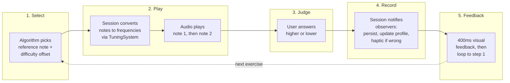
```mermaid
graph LR
    subgraph "1. Select"
        A["Algorithm picks<br/>reference note +<br/>difficulty offset"]
    end
    subgraph "2. Play"
        B["Session converts<br/>notes to frequencies<br/>via TuningSystem"]
        C["Audio plays<br/>note 1, then note 2"]
    end
    subgraph "3. Judge"
        D["User answers<br/>higher or lower"]
    end
    subgraph "4. Record"
        E["Session notifies<br/>observers:<br/>persist, update profile,<br/>haptic if wrong"]
    end
    subgraph "5. Feedback"
        F["400ms visual<br/>feedback, then<br/>loop to step 1"]
    end

    A --> B --> C --> D --> E --> F
    F -.->|next exercise| A
```

The algorithm adjusts difficulty based on the answer: narrowing the cent offset on correct, widening on incorrect. The loop runs continuously until the user navigates away.

### 6.2 Pitch Matching Exercise

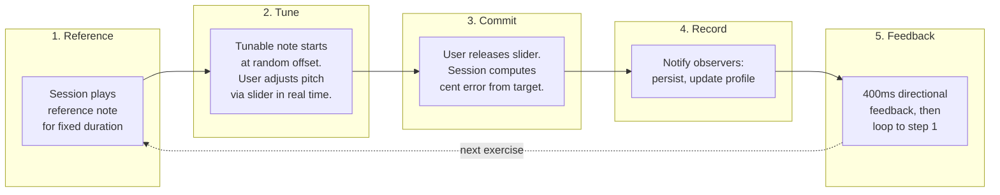
```mermaid
graph LR
    subgraph "1. Reference"
        A["Session plays<br/>reference note<br/>for fixed duration"]
    end
    subgraph "2. Tune"
        B["Tunable note starts<br/>at random offset.<br/>User adjusts pitch<br/>via slider in real time."]
    end
    subgraph "3. Commit"
        C["User releases slider.<br/>Session computes<br/>cent error from target."]
    end
    subgraph "4. Record"
        D["Notify observers:<br/>persist, update profile"]
    end
    subgraph "5. Feedback"
        E["400ms directional<br/>feedback, then<br/>loop to step 1"]
    end

    A --> B --> C --> D --> E
    E -.->|next exercise| A
```

Real-time frequency adjustment during step 2 is the key technical challenge — see Section 8.1 for how the audio layer handles this.

### 6.3 Timing Offset Detection Exercise

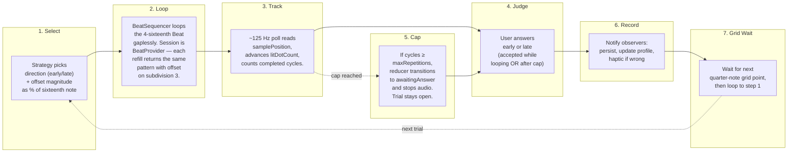
```mermaid
graph LR
    subgraph "1. Select"
        A["Strategy picks<br/>direction (early/late)<br/>+ offset magnitude<br/>as % of sixteenth note"]
    end
    subgraph "2. Loop"
        B["BeatSequencer loops<br/>the 4-sixteenth Beat<br/>gaplessly. Session is<br/>BeatProvider — each<br/>refill returns the same<br/>pattern with offset<br/>on subdivision 3."]
    end
    subgraph "3. Track"
        C["~125 Hz poll reads<br/>samplePosition,<br/>advances litDotCount,<br/>counts completed cycles."]
    end
    subgraph "4. Judge"
        D["User answers<br/>early or late<br/>(accepted while<br/>looping OR after cap)"]
    end
    subgraph "5. Cap"
        E["If cycles ≥<br/>maxRepetitions,<br/>reducer transitions<br/>to awaitingAnswer<br/>and stops audio.<br/>Trial stays open."]
    end
    subgraph "6. Record"
        F["Notify observers:<br/>persist, update profile,<br/>haptic if wrong"]
    end
    subgraph "7. Grid Wait"
        G["Wait for next<br/>quarter-note grid point,<br/>then loop to step 1"]
    end

    A --> B --> C --> D --> F --> G
    C -.->|cap reached| E
    E --> D
    G -.->|next trial| A
```

The offset magnitude is expressed as a percentage of one sixteenth note at the current tempo, then carried as a signed `TimingOffset` on the third subdivision of every looped beat. Looping uses `SoundFontBeatSequencer`'s pre-scheduled batch of 500 beats, so the pattern repeats without seams. The `maxRepetitions` cap is enforced as a first-class state transition (`playingPatternLoop → awaitingAnswer`) rather than a flag — the state guard at the top of the tracking poll is the idempotence latch that prevents re-entry. The grid-wait keeps trials phase-locked to a quarter-note grid established on the first trial.

### 6.4 Continuous Rhythm Matching Loop

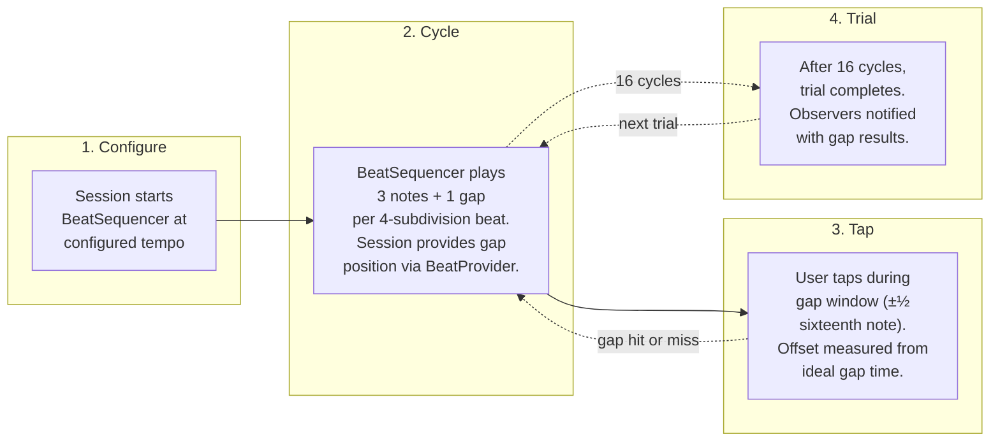
```mermaid
graph LR
    subgraph "1. Configure"
        A["Session starts<br/>BeatSequencer at<br/>configured tempo"]
    end
    subgraph "2. Cycle"
        B["BeatSequencer plays<br/>3 notes + 1 gap<br/>per 4-subdivision beat.<br/>Session provides gap<br/>position via BeatProvider."]
    end
    subgraph "3. Tap"
        C["User taps during<br/>gap window (±½<br/>sixteenth note).<br/>Offset measured from<br/>ideal gap time."]
    end
    subgraph "4. Trial"
        D["After 16 cycles,<br/>trial completes.<br/>Observers notified<br/>with gap results."]
    end

    A --> B --> C
    C -.->|gap hit or miss| B
    B -.->|16 cycles| D
    D -.->|next trial| B
```

The beat sequencer pre-schedules batches of 500 beats for seamless audio. The session tracks playback position at ~120Hz, evaluating missed gaps and advancing the trial counter. Gap hits produce immediate audible feedback (the gap note plays) and a 200ms visual indicator.

---

## 7. Deployment View

Peach is a standalone multiplatform app with no server infrastructure. A single universal binary runs on all three Apple platforms.

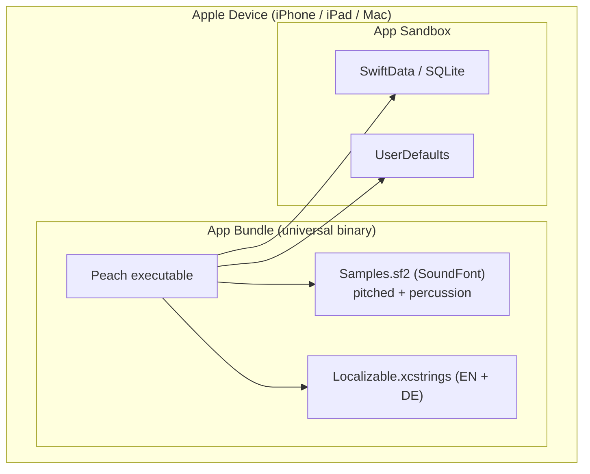
```mermaid
graph TB
    subgraph "Apple Device (iPhone / iPad / Mac)"
        subgraph "App Bundle (universal binary)"
            Binary["Peach executable"]
            SF2["Samples.sf2 (SoundFont)<br/>pitched + percussion"]
            Strings["Localizable.xcstrings (EN + DE)"]
        end

        subgraph "App Sandbox"
            DB["SwiftData / SQLite"]
            Prefs["UserDefaults"]
        end
    end

    Binary --> SF2 & Strings
    Binary --> DB & Prefs
```

| Aspect | Detail |
|--------|--------|
| **Platforms** | iPhone (iOS 26+), iPad (iPadOS 26+), Mac (macOS 26+) — single universal binary, native SwiftUI (not Catalyst) |
| **Layout** | Portrait + landscape on iOS/iPadOS; macOS uses platform-split `ContentView` (`ContentView+iOS.swift`, `ContentView+macOS.swift`) |
| **Storage** | SwiftData/SQLite for training records (4 record types); UserDefaults for settings |
| **Audio** | AVAudioEngine with bundled GM SoundFont (~25MB); channel 0 for pitched instruments, channel 1 for percussion |
| **macOS features** | Keyboard shortcuts for all training interactions, native Settings scene (Cmd+,), full menu bar (Training, Profile, Help, File menus) |
| **Distribution** | App Store / TestFlight for all three platforms (not yet submitted) |
| **CI/CD** | Local `bin/test.sh` (iOS + macOS) before each commit; no pipeline yet |

---

## 8. Crosscutting Concepts

### 8.1 Two-World Architecture

The most fundamental design pattern in Peach: strict separation between the **logical world** (musical concepts) and the **physical world** (audio frequencies and sample offsets). Getting this right was a significant design effort — it determines where each type lives, which components know about music theory, and which know about audio hardware.

#### The Two Worlds

| Logical World | Physical World |
|--------------|---------------|
| `MIDINote` (0-127) — discrete pitch | `Frequency` (Hz) — what the speaker produces |
| `Interval` (prime through octave) — musical distance | |
| `DetunedMIDINote` (MIDI note + cent offset) — a precise pitch identity | |
| `Cents` — microtonal offset, universal across tuning systems | |
| `TempoBPM` — musical tempo | `SampleRate` — audio samples per second |
| `TimingOffset` — signed timing deviation from a grid point | Sample offsets — integer positions in the audio buffer |

`TuningSystem` is the **pitch bridge** between the two worlds. It is the *only* path from logical pitch to physical frequency. It offers two forward conversions: an **absolute** one (a single note's pitch, measured from A4) and a **root-relative** one (a target frequency for a detuned directed interval reckoned from a root note — the tuning system's interval sizes derive from an implicit scale built on that root, which interval trials re-root at each trial's reference note). Interval-trial playback uses the reference-relative form so that the in-tune point depends only on the interval the listener actually hears — under just intonation the absolute form would tie it to the note's position relative to A, an inaudible root. The absolute form remains for single-note conversion (previews, reference tones) and for a future discipline where a fixed tonal root is the point.

For rhythm, the bridge is simpler: `TempoBPM.sixteenthNoteDuration` converts musical time to `Duration`, which is then multiplied by `SampleRate` to yield sample-accurate offsets for the audio engine.

#### Who Lives Where

Sessions, the algorithm, profiles, data stores, and observers work **exclusively in the logical world**. They reason about MIDI notes, intervals, cents, tempos, and rhythm offsets. They never see or produce a frequency or sample offset.

Only the audio layer touches the physical world — and it does so through explicit conversions:
1. **Pitch (logical → physical):** `TuningSystem.frequency(for:referencePitch:)` for a single note, `TuningSystem.frequency(for:from:referencePitch:)` for a `DetunedDirectedInterval` reckoned from a root `MIDINote` — both take logical inputs plus exactly one physical parameter (the concert reference pitch) and are used by sessions and trials before calling the audio layer
2. **Pitch (physical → MIDI hardware):** internal to the SoundFont player, invisible to the rest of the app
3. **Rhythm (logical → physical):** `SampleRate × Duration` — used inside `SoundFontBeatSequencer` when scheduling each `Beat` against the engine's sample clock

The `NotePlayer` protocol sits at the pitch boundary: it accepts frequencies. The `BeatSequencer` protocol sits at the rhythm boundary: it accepts a `TempoBPM` and a `BeatProvider`, looping each `Beat` (an array of `Subdivision` cases — note with velocity + signed `Duration` offset, or rest) gaplessly until stopped.

#### Forward Path: From Musical Intent to Sound (Pitch)

This is the path every pitch training exercise follows.

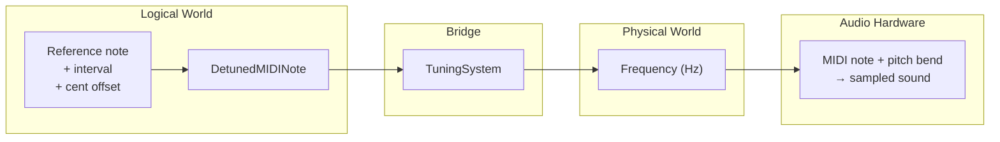
```mermaid
graph LR
    subgraph "Logical World"
        A["Reference note<br/>+ interval<br/>+ cent offset"]
        B["DetunedMIDINote"]
    end

    subgraph "Bridge"
        C["TuningSystem"]
    end

    subgraph "Physical World"
        D["Frequency (Hz)"]
    end

    subgraph "Audio Hardware"
        E["MIDI note + pitch bend<br/>→ sampled sound"]
    end

    A --> B --> C --> D --> E
```

**Worked example** — playing E4 detuned by +15 cents (as part of a major-third interval from C4):

1. **Session constructs the logical pitch.** The algorithm selects C4 as the reference note and applies the configured interval (major third = 4 semitones up) to get E4. It then adds a 15-cent offset for difficulty, producing a `DetunedMIDINote` — and the trial records the directed interval itself.

2. **TuningSystem converts to frequency.** The reference tone converts absolutely at its equal-tempered pitch: C4 ≈ 261.6 Hz. The target converts reference-relatively: reference frequency × the directed interval's size in the active tuning system, detune on top. This is where equal temperament and just intonation diverge — an equal-tempered major third is 400¢, a pure one 386.3¢. For E4+15¢ in equal temperament: `261.6 × 2^(415/1200)` ≈ 332.6 Hz; in just intonation the in-tune point sits 13.7¢ lower, regardless of which reference note the trial happened to pick.

3. **Session calls the audio layer** with the computed frequency. The NotePlayer protocol speaks only Hz — it knows nothing about music theory.

4. **The SoundFont player decomposes Hz back to MIDI.** Since AVAudioUnitSampler is a MIDI instrument, it needs a MIDI note number (to select the right sample) and a pitch bend (to fine-tune it). The player computes: `69 + 12 × log₂(332.6/440)` ≈ 64.15, rounds to MIDI note 64, and applies +15 cents of pitch bend. This decomposition always uses 12-TET at A4=440 Hz regardless of the active tuning system — it's a MIDI hardware detail, not a musical choice. The tuning system's intent is already baked into the Hz value from step 2.

#### Pitch Bend Mechanics

The pitch bend range is ±2 semitones (±200 cents), configured at startup via MIDI RPN. This gives 14-bit resolution (16,384 positions) over a 400-cent range — roughly 0.024 cents per step, far exceeding the 0.1-cent precision requirement. The ±200 cent range is always sufficient because the decomposition rounds to the nearest MIDI note, so the remainder never exceeds ±50 cents.

#### Real-Time Frequency Adjustment (Pitch Matching)

During pitch matching, the user adjusts a slider that changes the playing note's frequency in real time. The audio layer's `PlaybackHandle` concept makes this possible without restarting the note: the session computes a new frequency via `TuningSystem`, and the handle sends an updated pitch bend to the already-playing MIDI note. The constraint is that adjustments must stay within ±200 cents of the original note — which is always satisfied for the pitch offsets used in training.

#### Sample-Accurate Rhythm Scheduling

For rhythm training, timing precision is achieved at the audio engine level. `SoundFontEngine` uses a render-thread tap on the audio output node. MIDI events are pre-scheduled into a fixed-capacity buffer (`ScheduledMIDIEvent`) with sample-accurate offsets. The render callback dispatches events when the running sample position crosses their scheduled offset. Coordination between the main thread (which writes events) and the render thread (which reads and dispatches them) uses `Atomic<T>` counters — a generation counter, a dispatched-event count, and the running sample position — so render-thread reads stay lock-free.

The `SoundFontBeatSequencer` builds on this by pre-scheduling batches of 500 beats (≈8+ minutes at 60 BPM). Each beat produces up to ~8 MIDI events — 6 for Continuous Rhythm Matching (3 note-on + 3 note-off) or 8 for Timing Offset Detection (4 note-on + 4 note-off). This batch approach avoids per-beat scheduling overhead while staying well within the engine's 4096-event buffer capacity.

#### Why This Architecture Matters

The two-world separation has concrete consequences:

- **Adding a tuning system** (e.g., just intonation) requires only adding its interval-to-cents table. No changes to sessions, the algorithm, profiles, data stores, or the audio layer.
- **Replacing the audio engine** requires only new `NotePlayer`/`BeatSequencer` conformances. No changes to the logical world.
- **All training data is stored in logical types** (MIDI notes, cent offsets, tuning system label, tempo BPM, offset milliseconds). The data remains meaningful regardless of which audio engine plays it back.

### 8.2 Domain Types

Raw `Double`, `Int`, and `String` are forbidden where a domain type exists. A constant like `36` is meaningless; `MIDINote(36)` communicates intent. This applies everywhere: constants, defaults, parameters, return types, local variables.

**Pitch domain types:** `MIDINote`, `Cents`, `Frequency`, `Interval`, `DirectedInterval`, `Direction`, `DetunedMIDINote`, `TuningSystem`, `NoteDuration`, `AmplitudeDB`, `MIDIVelocity`, `SoundSourceID`, `PitchBendValue`.

**Rhythm domain types:** `TempoBPM`, `TempoRange`, `TimingOffset`, `TimingDirection`, `RhythmVelocity`, `SampleRate`, `Beat`, `Subdivision`.

**Shared types:** `Duration` (Swift standard library) for all timing values.

Raw values are unwrapped only at system boundaries: UserDefaults, SwiftData `@Model` properties, and display formatting.

### 8.3 Persistence Strategy

- **Single accessor:** One `TrainingDataStore` component is the sole entry point for all database operations. No other component touches the persistence context.
- **Four record types:** `PitchDiscriminationRecord` (reference/target notes, cent offset, isCorrect, interval, tuning system), `PitchMatchingRecord` (reference/target notes, initial offset, user cent error, interval, tuning system), `TimingOffsetDetectionRecord` (tempo BPM, signed offset ms, isCorrect), `ContinuousRhythmMatchingRecord` (tempo BPM, mean offset ms, per-position offset ms).
- **Atomic writes:** SwiftData (SQLite-backed) provides atomic transactions. Bulk operations (e.g., CSV import with replace) use explicit transactions.
- **In-memory profile:** The perceptual profile is never persisted directly — it is rebuilt from training records on startup and updated incrementally during training. This means the profile is always consistent with the underlying data and requires no schema migration when profile logic changes.
- **CSV import/export:** Discipline-driven column ownership. Each `TrainingDiscipline` declares its `csvColumns`, `csvKeyValuePairs(for:)`, and `parseCSVRow(...)`. The `TrainingDisciplineRegistry` aggregates all columns and dispatches row parsing by training type string. A chain-of-responsibility parser handles version compatibility. New format versions are additive — existing parsers are never modified.

### 8.4 Testing Strategy

- **Protocol-first:** Every service is behind a protocol. Tests inject mocks that conform to the same protocol, with deterministic timing and call tracking.
- **Async-native:** All tests are async. State machine transitions are verified through a dedicated helper that awaits the expected state, avoiding race conditions.
- **In-memory persistence:** Tests use an in-memory SwiftData container — no file system, no cleanup.
- **Framework:** Swift Testing exclusively. No XCTest.

### 8.5 Observer Pattern with Adapters

Sessions decouple result delivery from result consumers. After each completed exercise, the session iterates its injected observer array and notifies each one.

Each training paradigm defines its own observer protocol (`PitchDiscriminationObserver`, `PitchMatchingObserver`, `TimingOffsetDetectionObserver`, `ContinuousRhythmMatchingObserver`). Shared infrastructure (`PerceptualProfile`, `TrainingDataStore`) does not conform to these protocols directly. Instead, dedicated **adapter types** bridge discipline-specific observers to shared infrastructure:

- `PitchDiscriminationProfileAdapter` / `PitchDiscriminationStoreAdapter`
- `PitchMatchingProfileAdapter` / `PitchMatchingStoreAdapter`
- `TimingOffsetDetectionProfileAdapter` / `TimingOffsetDetectionStoreAdapter`
- `ContinuousRhythmMatchingProfileAdapter` / `ContinuousRhythmMatchingStoreAdapter`

This adapter layer keeps the shared infrastructure free of discipline-specific knowledge while allowing each discipline's observer protocol to use discipline-appropriate types (e.g., `CompletedTimingOffsetDetectionTrial` rather than a generic result).

Adding a new observer (e.g., analytics, achievements) requires zero session changes — just add the new conformer to the observer array in the composition root.

### 8.6 Composition Root

All service instantiation happens in one place: the app entry point. This is the single dependency graph source of truth. Services are injected into views via SwiftUI environment.

**Rules:**
- Never create service instances outside the composition root
- Views that need to coordinate multiple services receive a closure from the root, not direct service references — this keeps each view's dependency surface minimal

The composition root wires:
- Four training sessions (pitch comparison, pitch matching, rhythm offset detection, continuous rhythm matching)
- One `SoundFontPlayer` instance (pitched on channel 0) and one `SoundFontBeatSequencer` (channel 1, percussion preset) sharing one `SoundFontEngine`
- Adapter-based observer arrays for each session
- Profile, progress timeline, data store, and transfer service

### 8.7 Training Discipline Registry

**Disciplines are plugins.** The unit of extension is `Peach/Training/<Feature>/` — a self-contained directory contributing the discipline's session, screen, persistence payload, CSV history, observer protocol, adapters, lifecycle contribution, and help bodies. Central screens iterate `TrainingDisciplineRegistry.shared.allUI`; they never name disciplines individually. New disciplines are additive — existing files are not modified.

The mechanism is a two-protocol seam. `TrainingDiscipline` (in `Core/Training/Discipline/`) is the Foundation-only data protocol — it carries identifier, category, statistics keys, profile feeding, CSV column ownership, and the payload-typed parsing/export primitives. `TrainingDisciplineUI: TrainingDiscipline` (in `App/Training/`) refines that protocol in the App layer with four defaulted SwiftUI-aware requirements: `profileCard`, `settingsSections`, `settingsHelp`, `profileHelp`. The split exists because the Core/Data services (`TrainingDataExporter`, `CSVImportParser`, `TrainingDataStore`) consume the registry and must stay SwiftUI-free.

Persistence collapses to a single SwiftData `@Model` envelope (`TrainingRecord`) shared by every discipline; each discipline's `Codable` payload is encoded into `payloadData`. Aggregating screens (`SettingsScreen`, `ProfileScreen`, `HelpContent`) invoke the four `TrainingDisciplineUI` properties directly — no central kind enum, no central category switch, no central dispatcher.

#### Worked example: a hypothetical `Example` discipline

The contents below are illustrative only — `Example` is not a real or planned discipline. The shape is what matters: every file belongs to one feature directory, and the contributor adds nothing outside it except a bootstrap line, a `NavigationDestination` case, and the localization strings.

```
Peach/Training/Example/
    Discipline/
        ExampleDiscipline.swift
        ExamplePayload.swift
        ExampleCSVHistory.swift
    Help/
        ExampleHelp.swift
    Profile/
        ExampleProfileCardView.swift
    ExampleSession.swift
    ExampleScreen.swift
    ExampleObserver.swift
    ExampleTrial.swift
    ExampleProfileAdapter.swift
    ExampleStoreAdapter.swift
    ExampleLifecycleContribution.swift
```

Each file's responsibility and collaborations:

- **`ExampleDiscipline.swift`** — Conforms to `TrainingDisciplineUI`; declares identifier, category, statistics keys; the type the registry holds.
- **`ExamplePayload.swift`** — `Codable, Sendable` struct conforming to `TrainingDisciplinePayload`; per-record schema; JSON-encoded into `TrainingRecord.payloadData` by `ExampleStoreAdapter`.
- **`ExampleCSVHistory.swift`** — `CSVHistory` snapshots for this discipline; consumed by `CSVMigrationChain` for per-version derivation and by the registry for column aggregation.
- **`ExampleHelp.swift`** — Discipline-scoped help bodies surfaced through `TrainingDisciplineUI.settingsHelp` and `profileHelp`.
- **`ExampleProfileCardView.swift`** — SwiftUI view returned by `TrainingDisciplineUI.profileCard`; renders this discipline's progress on `ProfileScreen`.
- **`ExampleSession.swift`** — State machine driving the training cycle; collaborates with `NotePlayer`/`RhythmPlayer` and the algorithm strategy; fires trials to `ExampleObserver` conformers.
- **`ExampleScreen.swift`** — SwiftUI screen for the training loop; renders session state and routes user input back into the session.
- **`ExampleObserver.swift`** — Trial-result observer protocol typed in `ExampleTrial`; the session keeps an array of conformers and calls `didCompleteTrial(_:)` after each trial.
- **`ExampleTrial.swift`** — Value type for one completed trial; carried to observers and reduced into `ExamplePayload`.
- **`ExampleProfileAdapter.swift`** — Bridges `ExampleObserver` to `ProfileUpdating`, mapping each `ExampleTrial` to `(StatisticsKey, Date, Double)` for `PerceptualProfile`.
- **`ExampleStoreAdapter.swift`** — Bridges `ExampleObserver` to `TrainingDataStore`, encoding the payload via `JSONEnvelope` and persisting a `TrainingRecord`.
- **`ExampleLifecycleContribution.swift`** — Extension on `ExampleSession` providing `contribute(to:userSettings:)`; `TrainingLifecycleCoordinator` delivers app-lifecycle events through it.

Outside this directory, the contributor edits exactly three places: one factory line in `App/Training/DisciplineBootstrap.allDisciplines`, one entry in `allCSVHistories`, and one `NavigationDestination` case — plus the localization strings.

No central enum case. No edit to a central screen. No edit to `Core/Ports/UserSettings.swift`. No SwiftData schema edit. No central CSV migration file. The surface area collapsed from "edit five central files" to "create one directory."

The plugin contract — which protocols a feature directory must satisfy, and where adapters bridge to shared infrastructure:

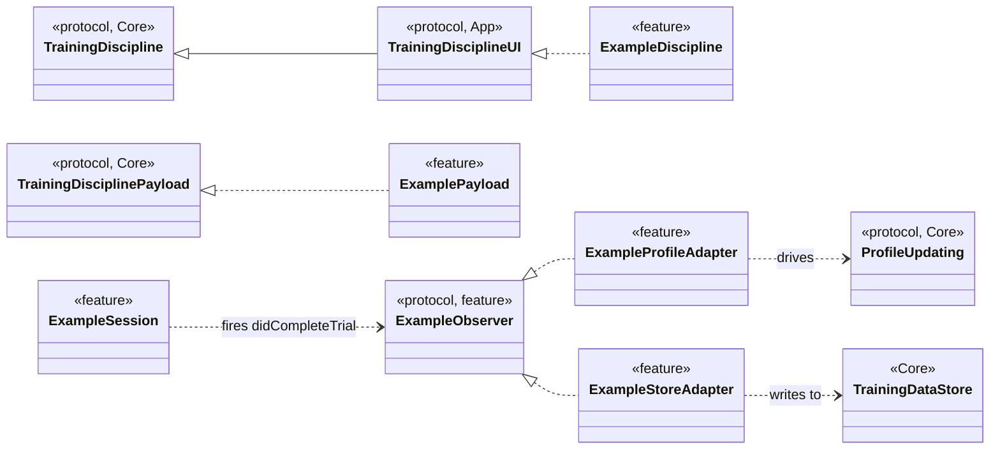
```mermaid
classDiagram
    direction LR

    class TrainingDiscipline {
        <<protocol, Core>>
    }
    class TrainingDisciplineUI {
        <<protocol, App>>
    }
    class TrainingDisciplinePayload {
        <<protocol, Core>>
    }
    class ProfileUpdating {
        <<protocol, Core>>
    }
    class TrainingDataStore {
        <<Core>>
    }

    class ExampleDiscipline {
        <<feature>>
    }
    class ExamplePayload {
        <<feature>>
    }
    class ExampleObserver {
        <<protocol, feature>>
    }
    class ExampleSession {
        <<feature>>
    }
    class ExampleProfileAdapter {
        <<feature>>
    }
    class ExampleStoreAdapter {
        <<feature>>
    }

    TrainingDiscipline <|-- TrainingDisciplineUI
    TrainingDisciplineUI <|.. ExampleDiscipline
    TrainingDisciplinePayload <|.. ExamplePayload

    ExampleObserver <|.. ExampleProfileAdapter
    ExampleObserver <|.. ExampleStoreAdapter

    ExampleProfileAdapter ..> ProfileUpdating : drives
    ExampleStoreAdapter ..> TrainingDataStore : writes to
    ExampleSession ..> ExampleObserver : fires didCompleteTrial
```

Three things to notice. **First**, the two-protocol seam (`TrainingDiscipline` ← `TrainingDisciplineUI`) crosses the Core/App boundary; the discipline's single conformance to `TrainingDisciplineUI` satisfies both surfaces. **Second**, each adapter implements *two* protocols — the discipline's own `ExampleObserver` (so it receives trials from the session) *and* a shared-infrastructure protocol (so it drives the profile or the store). That double conformance is the adapter pattern made structural. **Third**, the payload contract (`TrainingDisciplinePayload`) is separate from the discipline contract; it travels through the JSON envelope independently.

Activation is per-discipline and compile-time only. `App/Training/DisciplineBootstrap.swift` is the single source of truth: it lists the active discipline factories. The four pitch disciplines and `TimingOffsetDetectionDiscipline` are unconditional; `ContinuousRhythmMatchingDiscipline` is wrapped in `#if PEACH_RESEARCH`. The `Debug (Research)` and `Release (Research)` build configurations define that flag; the App Store cut is built without it, so Continuous Rhythm Matching is not registered there. Toggling a discipline is always a rebuild — there is no runtime UI, no `UserDefaults` flag, no debug menu. ADR-10 records the explicit rejection of runtime activation and the rationale for moving from category-grained gating to per-discipline gating; story 82.8 narrowed the gate from "both timing disciplines" to "Continuous Rhythm Matching only," since the Timing Offset Detection pattern and slot work of epic 82 made TOD self-contained enough to ship.

Continuous Rhythm Matching still requires sub-20 ms input latency to be musically useful — iOS touch input adds 50–80 ms; BLE MIDI typically adds 30–50 ms with jitter; only wired USB MIDI is reliable enough — so it reaches a small group of TestFlight participants via the `Research` configurations only. Timing Offset Detection is judgment-driven rather than input-driven (the user answers "early or late?" after listening), so it is not bound by the same latency constraint and ships in the App Store cut.

### 8.8 Platform Abstraction (Ports/Adapters)

Peach runs on three Apple platforms from a single codebase. Platform differences are isolated behind port protocols in `Core/Ports/`, with platform-specific implementations in `App/Platform/`. This pattern was established in Epic 67 to eliminate scattered `#if os()` conditionals from Core and feature code.

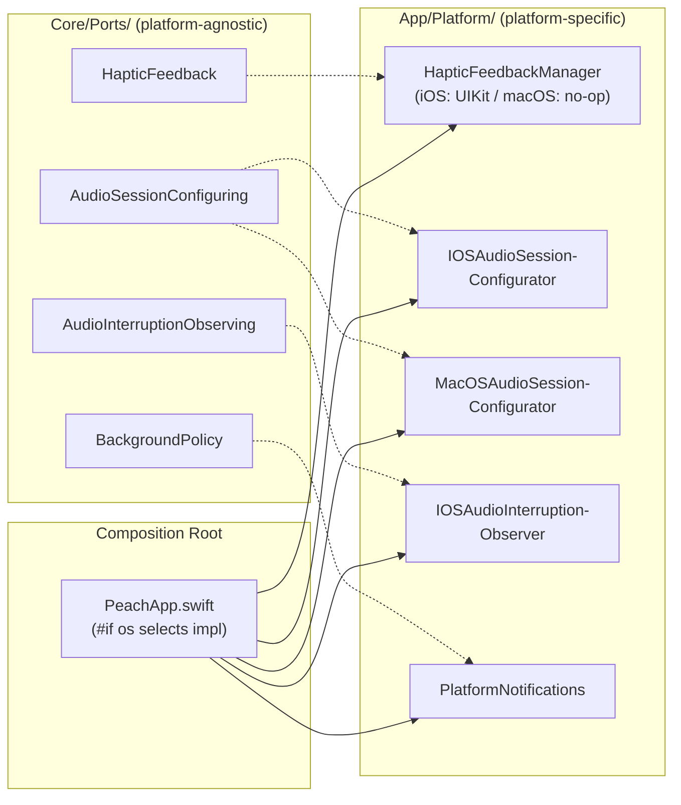
```mermaid
graph LR
    subgraph "Core/Ports/ (platform-agnostic)"
        HF["HapticFeedback"]
        ASC["AudioSessionConfiguring"]
        AIO["AudioInterruptionObserving"]
        BP["BackgroundPolicy"]
    end

    subgraph "App/Platform/ (platform-specific)"
        HFM["HapticFeedbackManager<br/>(iOS: UIKit / macOS: no-op)"]
        IOSC["IOSAudioSession-<br/>Configurator"]
        MOSC["MacOSAudioSession-<br/>Configurator"]
        IOAIO["IOSAudioInterruption-<br/>Observer"]
        PN["PlatformNotifications"]
    end

    subgraph "Composition Root"
        CR["PeachApp.swift<br/>(#if os selects impl)"]
    end

    HF -.-> HFM
    ASC -.-> IOSC & MOSC
    AIO -.-> IOAIO
    BP -.-> PN
    CR --> HFM & IOSC & MOSC & IOAIO & PN
```

**Port protocols and their platform implementations:**

| Port Protocol | Purpose | iOS/iPadOS | macOS |
|--------------|---------|-----------|-------|
| `HapticFeedback` | Tactile feedback on incorrect answers | UIKit impact feedback | No-op |
| `AudioSessionConfiguring` | Audio session category and activation | `AVAudioSession` configuration | Minimal (no `AVAudioSession`) |
| `AudioInterruptionObserving` | Audio interruption notifications (phone call, etc.) | `AVAudioSession.interruptionNotification` | Not applicable |
| `BackgroundPolicy` | App lifecycle transition handling | `UIApplication` notifications | `NSApplication` notifications |

**`#if os()` policy:**

- Port abstractions are the preferred mechanism for platform differences
- `#if os()` conditionals are permitted only in `App/Platform/` implementations and the composition root (`PeachApp.swift`)
- Test files for platform-specific implementations may use file-level `#if os()` guards
- Never use `#if os()` in `Core/` or feature directories

**macOS-specific features (beyond port implementations):**

- `PeachCommands` — keyboard shortcuts for all training interactions (higher/lower, early/late, start/stop)
- Native `Settings` scene accessible via Cmd+, (standard macOS convention)
- Full menu bar: Training, Profile, Help, File menus
- Platform-split `ContentView` — `ContentView+iOS.swift` and `ContentView+macOS.swift` provide platform-appropriate navigation and layout

**Adding new platform-conditional behavior:**

1. Define a port protocol in `Core/Ports/`
2. Implement platform-specific variants in `App/Platform/`
3. Select the correct implementation in `PeachApp.swift` using `#if os()`
4. Inject via SwiftUI environment

---

## 9. Architecture Decisions

### ADR-1: SoundFont Playback via AVAudioUnitSampler

**Context:** The app needs tone generation with sub-10ms latency and 0.1-cent frequency precision. The MVP used sine wave generation. Rich instrument timbres were requested to make training more engaging.

**Decision:** Replace sine wave generation with SoundFont (SF2) playback using AVAudioEngine + AVAudioUnitSampler. Bundle a General MIDI SoundFont. Use MIDI noteOn + pitch bend for frequency accuracy.

**Status:** Implemented.

**Consequences:**
- (+) Rich instrument timbres from a single bundled file
- (+) Multiple sound sources selectable by user
- (+) MIDI pitch bend provides the required sub-cent accuracy
- (+) The same SF2 file serves both pitched instruments (channel 0) and percussion (channel 1)
- (-) Bundled SF2 file adds ~25MB to app size
- (-) Unpitched percussion presets must be filtered out for pitched playback

### ADR-2: Protocol-Based Services with Composition Root

**Context:** Test-first development requires injectable dependencies. Need to balance testability with simplicity for a solo developer.

**Decision:** Define protocols for all services. Wire all dependencies in the composition root. Inject via SwiftUI environment.

**Status:** Implemented.

**Consequences:**
- (+) Every service testable in isolation with mocks
- (+) Single place to understand the full dependency graph
- (+) SwiftUI environment is the native injection mechanism
- (-) The composition root is the largest single method in the codebase (now wiring four sessions and their adapter stacks)

### ADR-3: Observer Pattern Over Combine

**Context:** Completed training exercises need to be delivered to multiple consumers (persistence, profile, haptics, progress). Need a decoupled delivery mechanism.

**Decision:** Use simple observer protocols with arrays of conformers injected into sessions. Adapter types bridge discipline-specific protocols to shared infrastructure. No Combine, no NotificationCenter.

**Status:** Implemented.

**Consequences:**
- (+) Zero framework dependency for event delivery
- (+) Synchronous, deterministic, testable
- (+) Adding observers requires no session changes
- (+) Adapters keep shared infrastructure free of discipline-specific knowledge
- (-) No built-in backpressure or buffering (unnecessary at current scale)

### ADR-4: Kazez Staircase Algorithm for Adaptive Difficulty

**Context:** The core differentiator of Peach is adaptive difficulty adjustment. Need an algorithm that converges on each note's detection threshold.

**Decision:** Implement an adaptive difficulty adjustment algorithm based on:

> Kazez, D., Kazez, B., Zembar, M. J., & Andrews, D. (2001). *A Computer Program for Testing (and Improving?) Pitch Perception.* College Music Society National Conference.

The algorithm uses the formula `p * (1 ± k * sqrt(p))`, where `p` is the current cent difference and `k` is a coefficient. The square root produces larger absolute changes at high difficulty (wide intervals) and gentler changes near the perceptual threshold. Asymmetric coefficients: narrowing 0.05 on correct, widening 0.09 on incorrect.

**Status:** Implemented for pitch comparison; adapted for rhythm offset detection.

**Consequences:**
- (+) Converges on perceptual thresholds without frustrating the user
- (+) Coefficients are tunable
- (+) Cold start handled gracefully (untrained notes start at maximum difficulty)
- (+) Algorithm generalized to rhythm: `AdaptiveTimingOffsetDetectionStrategy` uses the same formula with offset percentage as the difficulty parameter
- (-) No adaptive algorithm for pitch matching yet (random note selection)

### ADR-5: In-Memory Profile Rebuilt on Startup

**Context:** Need per-note and per-tempo-range statistics for adaptive difficulty. Could persist the profile or recompute from records.

**Decision:** The perceptual profile is in-memory only. Rebuilt from all training records on app startup using Welford's online algorithm. Updated incrementally during training. Keyed by `StatisticsKey` to support both pitch and rhythm dimensions.

**Status:** Implemented.

**Consequences:**
- (+) Profile is always consistent with the underlying data
- (+) No schema migration when profile logic changes
- (+) Welford's algorithm makes startup O(n) with minimal memory
- (+) `StatisticsKey` enum scales cleanly to new discipline × context permutations
- (-) Startup time grows linearly with record count (currently sub-millisecond for hundreds of records)

### ADR-6: Unison as Prime Case of Interval Training

**Context:** Adding interval training could duplicate sessions, screens, and data models for "interval" and "non-interval" variants.

**Decision:** Unison (prime) is treated as the interval "prime" — not a separate concept. Existing sessions are parameterized with an interval set. Four pitch disciplines map to two session types × interval configuration.

**Status:** Implemented.

**Consequences:**
- (+) No code duplication between unison and interval disciplines
- (+) Data model stores interval implicitly (derived from reference and target notes)
- (-) Session code must handle MIDI range edge cases when interval > prime

### ADR-7: CSV Import/Export with Discipline-Driven Column Ownership

**Context:** Users need to back up and restore training data. The export format will evolve over time as new disciplines are added.

**Decision:** CSV format with a metadata header identifying the version. Each `TrainingDiscipline` owns its CSV column definitions, key-value pair generation, and row parsing. The `TrainingDisciplineRegistry` aggregates columns and dispatches parsing by training type. New disciplines are additive — existing disciplines are never modified.

**Status:** Implemented.

**Consequences:**
- (+) Forward-compatible: old exports are always importable
- (+) New disciplines are purely additive (add columns, register parser)
- (+) Human-readable format for debugging
- (-) CSV has no schema enforcement (validation in parser)

### ADR-8: Shared Audio Engine with Multi-Channel MIDI

**Context:** Rhythm training requires percussion playback alongside existing pitched playback. Running two `AVAudioEngine` instances is unreliable and resource-wasteful.

**Decision:** Extract `SoundFontEngine` as a shared multi-channel audio engine. It manages a single `AVAudioEngine` with multiple `AVAudioUnitSampler` nodes (one per MIDI channel). `SoundFontPlayer` and `SoundFontBeatSequencer` share the same engine, each operating on their assigned channel.

**Status:** Implemented.

**Consequences:**
- (+) Single audio engine — no resource contention or configuration conflicts
- (+) Sample-accurate event scheduling via render-thread dispatch
- (+) Channels are isolated — pitched and percussion playback don't interfere
- (-) `SoundFontEngine` is the most complex low-level component in the codebase; the render-thread callback with pre-allocated buffer and lock-free synchronization is difficult to debug

### ADR-9: Platform Abstraction via Port Protocols

**Context:** Adding macOS support (Epic 66) introduced platform-conditional code (`#if os(iOS)`, `#if os(macOS)`) for haptic feedback, audio session management, lifecycle notifications, and UI layout. Initially these conditionals were scattered across multiple layers. Epic 67 consolidated them behind port protocols.

**Decision:** Define platform-agnostic port protocols in `Core/Ports/`. Implement platform-specific behavior in `App/Platform/`. Select implementations at the composition root using `#if os()`. Core and feature code programs against port protocols only — never importing UIKit, AppKit, or using `#if os()` directly.

**Status:** Implemented.

**Consequences:**
- (+) Core and feature code is completely platform-agnostic — no `#if os()` outside `App/Platform/`
- (+) Adding a new platform (visionOS, watchOS) requires only new port implementations and composition root wiring
- (+) Each port is independently testable via mocks
- (+) macOS-specific features (keyboard shortcuts, menu bar, Settings scene) are cleanly isolated in their own files
- (-) Four port protocols and their implementations add indirection for what are currently simple platform differences
- (-) Some ports have trivial macOS implementations (e.g., haptic feedback is a no-op)

### ADR-10: Per-Discipline Compile-Time Activation

**Context:** Before epic 77, the `PEACH_RESEARCH` Swift compilation flag introduced in story 76.4 gated whole training categories — the rhythm category was either present or absent as a unit. Per-discipline experimentation required hunting through gates inside central screens. Once the architecture allowed one rhythm discipline to be excluded while another remained registered, category-grained gating became misleading: the category was no longer the meaningful unit of activation.

**Decision:** Per-discipline activation lives in a single file, `App/Training/DisciplineBootstrap.swift`, as a list of factory expressions (`UnisonPitchDiscriminationDiscipline()`, `IntervalPitchDiscriminationDiscipline()`, …). The four pitch disciplines and `TimingOffsetDetectionDiscipline` are unconditionally listed; `ContinuousRhythmMatchingDiscipline` is wrapped in `#if PEACH_RESEARCH` so it is not registered in the App Store binary. To disable a discipline locally during development, the developer comments out its factory line. Story 77.1 introduced the bootstrap file; subsequent stories (77.2 / 77.3 / 77.4 / 77.5 / 77.6) refined the surrounding plugin-style architecture so that the bootstrap list is the only place activation is expressed. Story 82.8 narrowed the gate from "both timing disciplines" to "Continuous Rhythm Matching only" after epic 82 made the TOD pattern and slot model robust enough to ship.

**Status:** Implemented (epic 77.1, refined by 77.2 / 77.3 / 77.4 / 77.5 / 77.6 and 82.8).

**Consequences:**
- (+) Activation is additive: adding a discipline is a one-line edit to `DisciplineBootstrap.swift`
- (+) Honest binary: the App Store cut contains no dormant Continuous Rhythm Matching code
- (+) Preserves the existing `Debug` / `Debug (Research)` / `Release` / `Release (Research)` build-configuration matrix from ADR-7 / story 76.4
- (+) Per-discipline granularity replaces the misleading per-category gate
- (-) Toggling a discipline requires a rebuild — no live experimentation
- (-) Local one-off discipline disabling is per-developer state that must not be committed

---

## 10. Quality Requirements

### 10.1 Quality Tree

```
Quality
├── Audio Quality
│   ├── Pitch Precision (0.1-cent frequency accuracy)
│   ├── Pitch Latency (< 10ms onset)
│   └── Rhythm Precision (±1 sample timing accuracy)
├── Usability
│   ├── Training Feel (reflexive pace, no UI bottlenecks, grid-aligned rhythm)
│   ├── Responsiveness (portrait + landscape on iOS/iPadOS; native layout on macOS)
│   ├── Accessibility (VoiceOver, Dynamic Type, keyboard navigation)
│   └── Platform consistency (same training experience across iPhone, iPad, Mac)
├── Reliability
│   ├── Data Integrity (atomic writes, crash resilience)
│   └── Error Resilience (sessions as error boundaries)
├── Maintainability
│   ├── Testability (protocol-first, comprehensive coverage)
│   ├── Simplicity (zero dependencies, approachable architecture)
│   └── Extensibility (discipline registry for additive growth)
└── Portability
    ├── Localization (English + German)
    └── Multiplatform (iOS, iPadOS, macOS from single codebase)
```

### 10.2 Quality Scenarios

| ID | Quality Attribute | Scenario | Measure |
|----|------------------|----------|---------|
| QS-1 | Audio Precision (Pitch) | A tone targeting 441 Hz is played | Measured frequency deviates < 0.1 cent from target |
| QS-2 | Audio Latency | User taps "Start Training" | First note onset within 10ms of state transition |
| QS-3 | Audio Precision (Rhythm) | A rhythm pattern with 15ms early offset is scheduled | Offset accurate to within 1 audio sample (≈23μs at 44.1kHz) |
| QS-4 | Training Feel | User completes 15 comparisons | Total elapsed < 45 seconds (reflexive pace) |
| QS-5 | Data Integrity | Force-quit during feedback phase | All previously completed exercises persisted; current exercise lost |
| QS-6 | Data Integrity | CSV import with replace mode | Atomic: all replaced or nothing changes |
| QS-7 | Error Resilience | Audio engine fails during playback | Session stops gracefully, returns to idle; no crash |
| QS-8 | Testability | New developer adds a service | Can write a test with mock dependencies in < 30 minutes |
| QS-9 | Startup Performance | App launch with 10,000 records | Profile loaded and app interactive within 2 seconds |
| QS-10 | Responsiveness | Rotate device during training | Layout adapts; no data loss; training continues |
| QS-11 | Localization | Switch device language to German | All user-facing strings display in German |
| QS-12 | Extensibility | Developer adds a new training discipline | Only new files created; no changes to existing disciplines, profile, or data store |
| QS-13 | Platform Consistency | Same training exercise on iPhone, iPad, and Mac | Identical training behavior; Mac uses keyboard shortcuts instead of tap targets |
| QS-14 | Portability | Developer adds a new platform-conditional behavior | New port protocol + implementation; no changes to Core or feature code |

---

## 11. Risks and Technical Debt

### Risks

| Risk | Severity | Mitigation |
|------|---------|-----------|
| **Startup time with large datasets** | Medium | Welford's algorithm is O(n), currently sub-millisecond for hundreds of records. Monitor as dataset grows; could add background loading or profile caching. |
| **Sample-accurate scheduling complexity** | Medium | `SoundFontEngine` uses a render-thread callback with a pre-allocated buffer and `OSAllocatedUnfairLock` for lock-free event dispatch. This is the most complex low-level code in the app and is difficult to debug. Mitigation: comprehensive unit tests with deterministic mock engines. |
| **Composition root complexity** | Medium | The `PeachApp.init()` method wires four sessions, one `SoundFontPlayer` instance, one `SoundFontBeatSequencer`, and their respective adapter stacks. Could extract to a factory if it grows further. |
| **Single SoundFont quality** | Low | Bundled GM SoundFont covers common instruments and percussion. User-provided SF2 import is a future feature. |
| **No adaptive algorithm for pitch matching** | Low | Random note selection is acceptable for current usage. Extract to a strategy when data shows meaningful patterns. |

### Technical Debt

| Item | Severity | Notes |
|------|---------|-------|
| **Original architecture document partially outdated** | Low | `docs/planning-artifacts/architecture.md` predates implementation; arc42 plus the v0.5 / v0.9 amendments at the end of that document are the current source of truth. |
| **No CI/CD pipeline** | Low | Pre-commit gate is local `bin/test.sh` on both iOS and macOS. Acceptable for solo developer; would need automation before team collaboration. |

---

## 12. Glossary

| Term | Definition |
|------|-----------|
| **Adapter** | A lightweight struct that bridges a discipline-specific observer protocol to shared infrastructure (profile or data store), keeping the shared code free of discipline-specific knowledge. |
| **Cent** | Unit of pitch difference. 100 cents = 1 semitone, 1200 cents = 1 octave. |
| **Cold Start** | Initial state when no training data exists for a note or tempo range. The algorithm starts at maximum difficulty. |
| **Composition Root** | The single location (app entry point) where all services are created and wired. |
| **Beat** | One cycle of a looped rhythmic pattern, represented as an array of `Subdivision` cases (note with velocity + signed `Duration` offset, or rest). The unit `BeatSequencer` loops gaplessly. |
| **BeatProvider** | Protocol the session conforms to; supplies the next `Beat` whenever `BeatSequencer` refills its scheduling batch. |
| **BeatSequencer** | Protocol for gapless looped audio playback of `Beat` cycles. The session provides beats via `BeatProvider`; the sequencer handles batch scheduling and exposes a `SequencerTiming` view (sample position, samples per beat). Used by both Timing Offset Detection and Continuous Rhythm Matching. |
| **Continuous Rhythm Matching** | A repeating rhythmic pattern plays with one gap per cycle; user taps to fill the gap. Timing accuracy is measured. |
| **DetunedMIDINote** | A MIDI note with a cent offset — a precise pitch identity in the logical world. |
| **DisciplineBootstrap** | Single file (`App/Training/DisciplineBootstrap.swift`) listing the active discipline factories. Pitch disciplines and Timing Offset Detection always; Continuous Rhythm Matching inside `#if PEACH_RESEARCH`. |
| **EWMA** | Exponentially Weighted Moving Average. Used for smoothing progress trends over time. |
| **Interval** | Musical distance from prime (unison, 0 semitones) through octave (12 semitones). |
| **Kazez Algorithm** | Psychoacoustic staircase that adjusts difficulty via `p * (1 ± k * sqrt(p))`. Coefficients: narrowing 0.05, widening 0.09. Used for both pitch comparison and timing offset detection. |
| **MIDI Note** | Standardized pitch number (0-127). 60 = middle C, 69 = A4. |
| **PeachCommands** | SwiftUI `Commands` type providing macOS menu bar entries and keyboard shortcuts for training interactions. |
| **PEACH_RESEARCH** | Swift compilation flag defined by the `(Research)` build configurations. Gates `ContinuousRhythmMatchingDiscipline` so it is not registered in App Store binaries. Story 82.8 narrowed this gate from "both timing disciplines" to "CRM only" after epic 82 made Timing Offset Detection ship-ready. |
| **Perceptual Profile** | In-memory model of the user's pitch and rhythm perception, rebuilt from training records on startup. Keyed by `StatisticsKey`. |
| **Pitch Bend** | MIDI mechanism for fine-tuning pitch. Peach uses a ±200 cent range with 14-bit resolution (~0.024 cents per step). |
| **Pitch Comparison** | Two notes in sequence, user judges higher or lower. |
| **Pitch Matching** | User tunes a note to match a reference pitch via slider. |
| **Platform Implementation** | A concrete type in `App/Platform/` that conforms to a port protocol with platform-specific behavior (e.g., `IOSAudioSessionConfigurator`, `MacOSAudioSessionConfigurator`). |
| **Port** | A platform-agnostic protocol in `Core/Ports/` that abstracts a platform-specific capability (e.g., `HapticFeedback`, `AudioSessionConfiguring`). See Section 8.8. |
| **Reference Note** | The anchor note in a training exercise. Always an exact MIDI note. |
| **SampleRate** | Audio samples per second (e.g., 44,100 Hz or 48,000 Hz). Used for sample-accurate scheduling. |
| **SoundFont (SF2)** | File format containing sampled instrument sounds. Peach bundles one GM SoundFont for both pitched and percussion playback. |
| **SoundFontEngine** | Shared multi-channel audio engine managing a single `AVAudioEngine` with multiple `AVAudioUnitSampler` nodes. Provides sample-accurate event scheduling via render-thread dispatch. |
| **StatisticsKey** | Uniform key for profile lookups. Either `.pitch(TrainingDisciplineID)` or `.rhythm(TrainingDisciplineID, TempoRange, TimingDirection)`. |
| **Subdivision** | One position inside a `Beat`. Either `.rest`, `.note(velocity:offset:)` (a struck note with a `MIDIVelocity` and a signed `Duration` offset from its grid point), or `.nested(Beat)` for irregular phrasing. |
| **Timing Offset Detection** | A four-sixteenth pattern loops with one note offset from the beat; user judges early or late. Loops until the user answers or a `maxRepetitions` cap is reached. |
| **TimingDirection** | Whether a timing offset is early (before the beat) or late (after the beat). |
| **TimingOffset** | A signed duration representing the timing deviation from a grid point. Negative = early, positive = late. |
| **Target Note** | The note the user judges against or tunes toward. May differ from reference by an interval and a cent offset. |
| **TempoBPM** | Musical tempo in beats per minute. Derives sixteenth note and quarter note durations. |
| **TempoRange** | A band of tempos (slow: 40-79, medium: 80-119, fast: 120-200 BPM) used to group rhythm statistics. |
| **Training Discipline** | A self-describing unit of training functionality. Six disciplines exist: unison/interval pitch comparison and unison/interval pitch matching (always), plus timing offset detection and continuous rhythm matching (in the `(Research)` configurations only). |
| **TrainingDisciplinePayload** | Protocol (`Codable, Sendable`) for a discipline's record payload struct. Declares `disciplineIdentifier` and `currentPayloadVersion`. The payload is JSON-encoded into `TrainingRecord.payloadData`. |
| **TrainingDisciplineRegistry** | Singleton (in `Core/Training/Discipline/`) that holds the disciplines registered by `App/Training/DisciplineBootstrap.swift` at startup. The App-layer extension `allUI` exposes the registry through `TrainingDisciplineUI` for view-producing iteration. Provides aggregate operations (profile feeding, CSV column aggregation, parser dispatch). |
| **TrainingDisciplineUI** | App-layer refinement of `TrainingDiscipline` adding view-producing requirements (profile card, settings sections, help bodies) so Core/Data can stay SwiftUI-free. Lives in `App/Training/`. |
| **TrainingRecord** | Single SwiftData `@Model` envelope (`disciplineIdentifier`, `timestamp`, `payloadVersion`, `payloadData`) shared by every discipline. Replaces per-discipline `@Model` types. |
| **Tuning System** | Defines how intervals map to cent offsets (and thus frequencies). Currently: 12-TET and just intonation. |
| **Two-World Architecture** | Separation of logical types (MIDI notes, intervals, cents, tempos) from physical types (frequencies, sample offsets). Bridged by TuningSystem (pitch) and SampleRate × Duration (rhythm). |
| **Welford's Algorithm** | Incremental method for computing running mean and variance without storing all historical data. |
