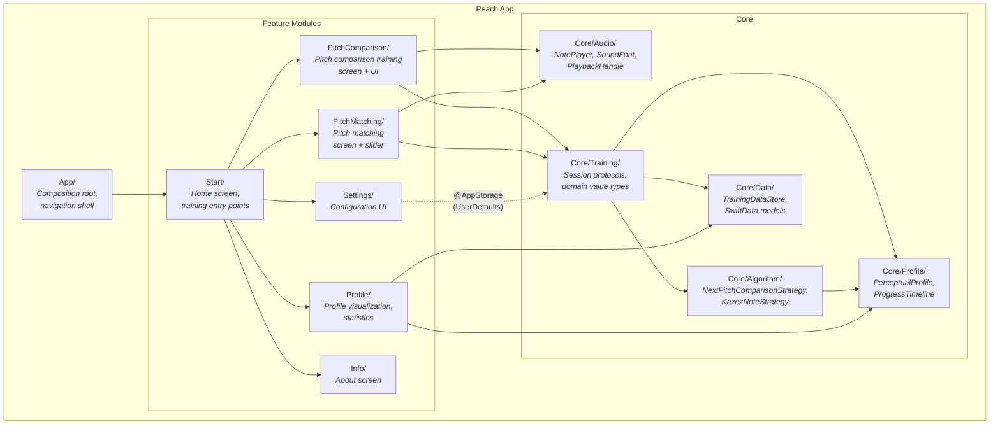
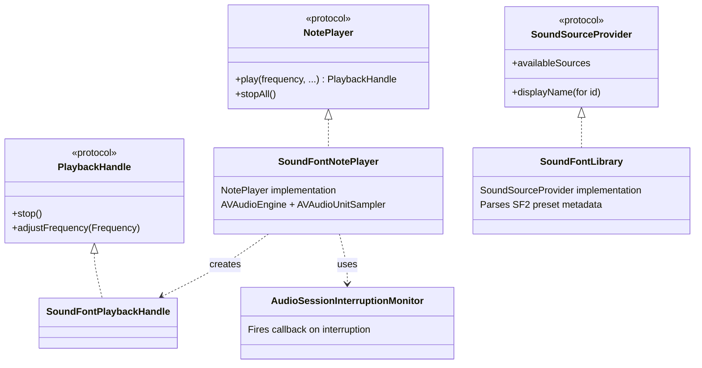
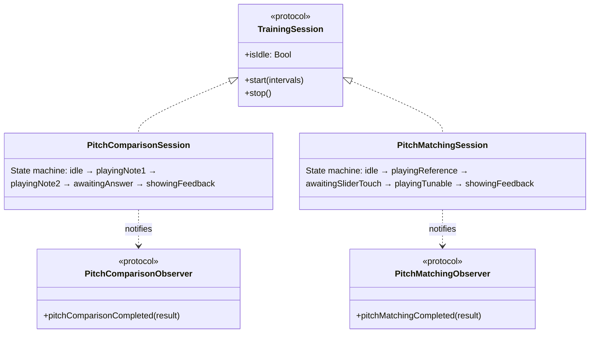
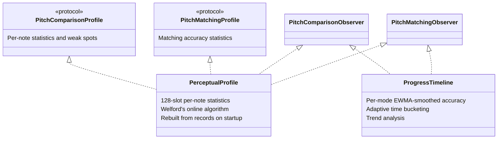

# 5. Building Block View

## Level 1 — Overall System

### Contained Building Blocks

| Building Block | Responsibility |
|---|---|
| **App/** | Composition root (`PeachApp.swift`): wires all dependencies, injects services into SwiftUI environment. Navigation shell (`ContentView.swift`): hub-and-spoke `NavigationStack`. |
| **Start/** | Home screen with four training entry points (Pitch Comparison, Pitch Matching, Interval Pitch Comparison, Interval Pitch Matching), profile preview sparkline, and navigation to Settings/Profile/Info. |
| **PitchComparison/** | Pitch comparison training UI: Higher/Lower buttons, feedback indicator, difficulty display. Reads `PitchComparisonSession` from environment. |
| **PitchMatching/** | Pitch matching UI: vertical pitch slider, feedback indicator. Reads `PitchMatchingSession` from environment. |
| **Profile/** | Perceptual profile visualization: progress charts with EWMA-smoothed accuracy over time (Swift Charts, multi-granularity zones), summary statistics with trend indicators, contextual help via TipKit, and chart image sharing via ShareLink. |
| **Settings/** | Configuration interface: interval selector, note range, duration, reference pitch, loudness variation, tuning system, sound source picker, reset button. All backed by `@AppStorage`. Training data export via ShareLink. |
| **Info/** | Static about screen: app name, developer, copyright, version. |
| **Core/Audio/** | Audio playback: `NotePlayer` protocol, `SoundFontNotePlayer` (AVAudioEngine + AVAudioUnitSampler), `PlaybackHandle` for note lifecycle, `SoundFontLibrary` for preset discovery, `AudioSessionInterruptionMonitor`. |
| **Core/Algorithm/** | Pitch comparison selection: `NextPitchComparisonStrategy` protocol, `KazezNoteStrategy` (psychoacoustic staircase algorithm). |
| **Core/Data/** | Persistence: `TrainingDataStore` (SwiftData CRUD), `PitchComparisonRecord` and `PitchMatchingRecord` models, `TrainingDataTransferService` (CSV export/import with merge and replace modes, versioned format with protocol-based parser dispatch). |
| **Core/Profile/** | User model: `PerceptualProfile` (per-note statistics via Welford's algorithm), `ProgressTimeline` (per-mode EWMA progress tracking with trend analysis), `TrainingModeConfig` (per-mode display and baseline configuration), `ChartLayoutCalculator` (chart geometry and zone boundaries). |
| **Core/Training/** | Domain types and session protocols: `PitchComparison`, `CompletedPitchComparison`, `CompletedPitchMatching`, observer protocols, `TrainingSession` protocol, `Resettable`. |

---

## Level 2 — Core/Audio

The audio layer knows only frequencies (Hz), velocities, and amplitudes. It has no concept of MIDI notes, musical intervals, or training context. Internally, `SoundFontNotePlayer` decomposes a frequency into the nearest MIDI note + pitch bend for the sampler, but this is invisible to callers.

**Key interface — `PlaybackHandle`:** Every `play()` call returns a handle that owns the playing note. The caller controls the note's lifecycle — `stop()` to end, `adjustFrequency()` for real-time pitch changes. This supports both fixed-duration playback (pitch comparison) and indefinite playback with live adjustment (pitch matching).

---

## Level 2 — Core/Training (Sessions)

Both sessions are `@Observable` state machines with the same structural patterns: protocol-based dependency injection, observer fan-out for side effects (persistence, profile updates, haptics, progress tracking), and error boundary behavior — audio or persistence failures never crash the training loop.

---

## Level 2 — Core/Profile

**PerceptualProfile** is the central user model — a 128-slot array indexed by MIDI note, each holding online statistics via Welford's algorithm. It is never persisted; it is rebuilt from raw training records on every app launch and updated incrementally during training.

**ProgressTimeline** tracks training progress across all four modes independently (unison/interval × comparison/matching). It uses EWMA smoothing with adaptive time bucketing (session → day → month granularity) and provides trend analysis (improving / stable / declining).
