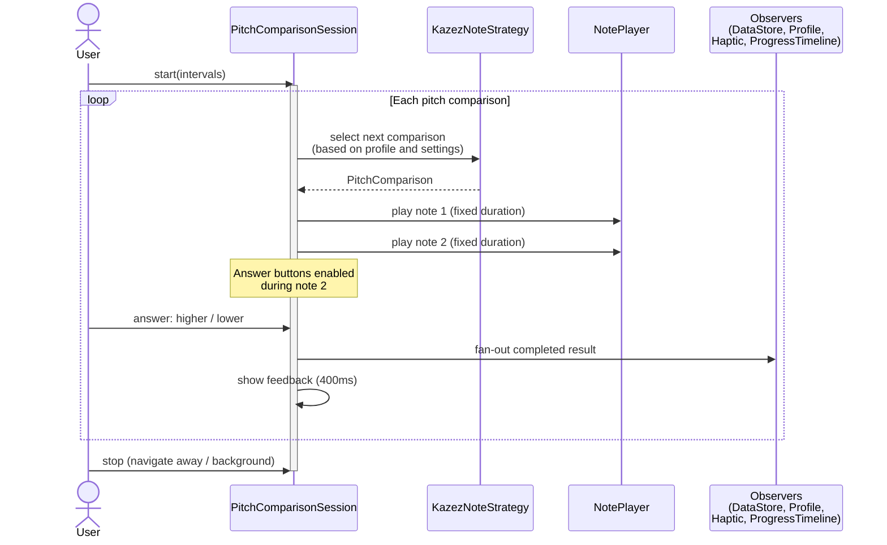
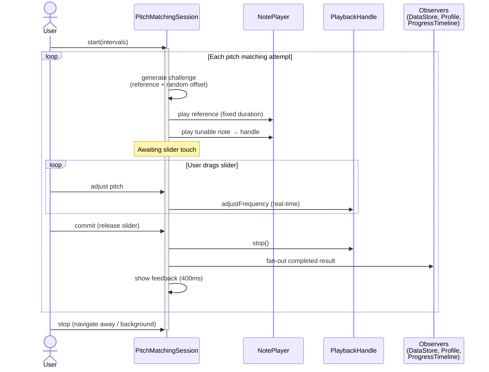
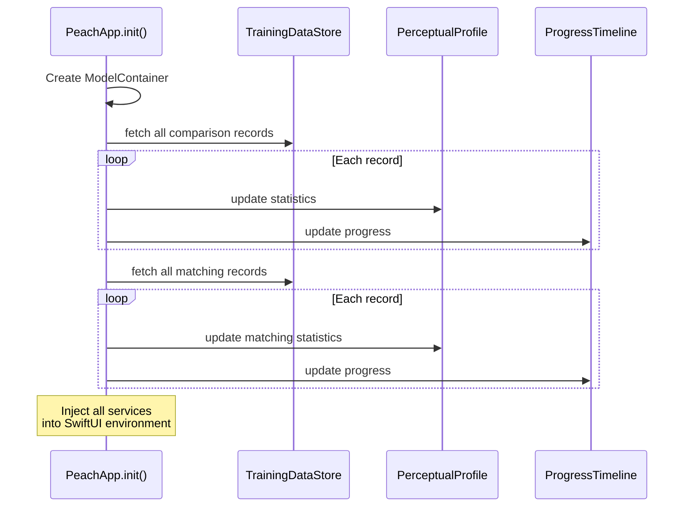
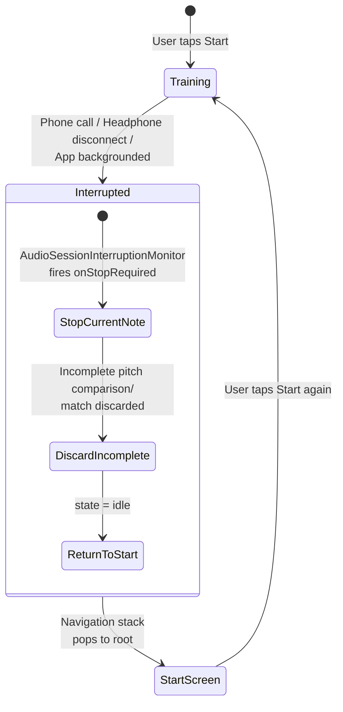

# 6. Runtime View

## Pitch Comparison Training Loop

The core training interaction — the user answers a stream of pitch comparisons.

**Key behavior:**
- The user can answer while note 2 is still playing — no need to wait
- The 400ms feedback phase is skippable by navigating away
- Audio interruptions (phone call, headphone disconnect) trigger automatic stop via `AudioSessionInterruptionMonitor`

## Pitch Matching Loop

The user tunes a note to match a target pitch.

**Key behavior:**
- After the reference plays, the tunable note starts but the slider waits for user touch before the session advances
- Real-time pitch adjustment via `PlaybackHandle.adjustFrequency()` — the user hears the change as they drag
- No visual feedback during active tuning — only after the slider is released

## App Startup and Profile Rebuild

The perceptual profile and progress timeline are never persisted — they are always rebuilt from raw records. This ensures consistency with stored data and simplifies the data model.

## Audio Interruption Handling

Interruption handling is identical for both training modes. The session discards any incomplete attempt — no partial data is ever persisted.
