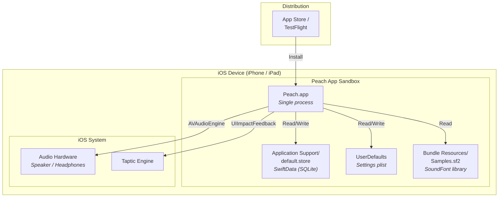

# 7. Deployment View

Peach is a single-process iOS application with no backend, no network services, and no multi-device deployment. The deployment view is correspondingly simple.

## Infrastructure Elements

| Element | Description |
|---|---|
| **Peach.app** | Single iOS application binary. No extensions, no widgets, no background processes. |
| **SwiftData store** | SQLite database in the app's Application Support directory. Contains `PitchComparisonRecord` and `PitchMatchingRecord` tables. Automatically created on first launch. |
| **UserDefaults** | Standard preferences plist. Stores all user settings (note range, duration, reference pitch, sound source, intervals, tuning system, loudness variation). |
| **Samples.sf2** | Custom SoundFont file bundled in the app. Assembled from FluidR3_GM (piano) and GeneralUser GS (other instruments). Contains instrument presets parsed at startup by `SoundFontLibrary`. |
| **Distribution** | App Store or TestFlight. Standard iOS distribution. No CI/CD pipeline for MVP. |

There is no staging environment, no development server, and no cloud infrastructure.
