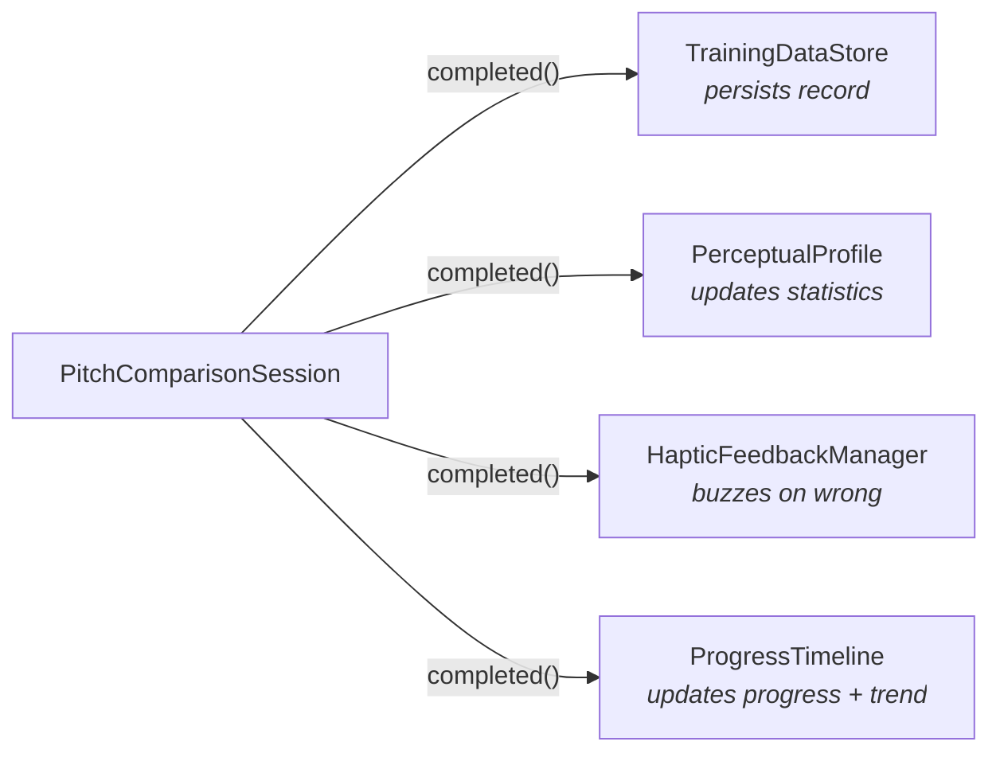

# 8. Cross-cutting Concepts

## Two-World Architecture

The codebase maintains a strict boundary between the **logical world** (musical abstractions) and the **physical world** (audio frequencies):

| World | Types | Knowledge |
|---|---|---|
| **Logical** | `MIDINote`, `DetunedMIDINote`, `Interval`, `DirectedInterval`, `Cents` | Musical structure. No frequency knowledge. Pure math on semitones and cent offsets. |
| **Physical** | `Frequency` (Hz) | Acoustic reality. No MIDI knowledge. |

The bridge between worlds is `TuningSystem`:

```swift
func frequency(for note: DetunedMIDINote, referencePitch: Frequency) -> Frequency
```

`TuningSystem` is an enum (`.equalTemperament`, `.justIntonation`) that maps logical intervals to physical cent offsets. This separation allows the app to support multiple tuning systems without changing any training logic, UI code, or audio playback code.

**Consequence:** `NotePlayer` never sees a `MIDINote`. Sessions compute frequencies via `TuningSystem` and pass Hz values to the audio layer. The `SoundFontNotePlayer` internally decomposes Hz back to the nearest MIDI note + pitch bend for the sampler, but this is an implementation detail invisible to the rest of the system.

## Observer Fan-Out Pattern

Both training sessions use a **synchronous observer fan-out** for side effects after each completed exercise:



Observers are injected at construction time via `[PitchComparisonObserver]` and `[PitchMatchingObserver]` arrays. Each observer handles its own errors internally — a persistence failure does not break the training loop. The session is a clean orchestrator that delegates all side effects.

`PitchMatchingSession` uses the same pattern with `DataStore`, `PerceptualProfile`, and `ProgressTimeline` as observers (no haptic feedback for matching).

## Protocol-First Design and Dependency Injection

Every service boundary is defined as a protocol before implementation:

| Protocol | Implementation | Test Mock |
|---|---|---|
| `NotePlayer` | `SoundFontNotePlayer` | `MockNotePlayer` |
| `PlaybackHandle` | `SoundFontPlaybackHandle` | `MockPlaybackHandle` |
| `NextPitchComparisonStrategy` | `KazezNoteStrategy` | Inline closures |
| `PitchComparisonProfile` | `PerceptualProfile` | `MockPitchComparisonProfile` |
| `PitchMatchingProfile` | `PerceptualProfile` | `MockPitchMatchingProfile` |
| `UserSettings` | `AppUserSettings` | `PreviewUserSettings` |
| `SoundSourceProvider` | `SoundFontLibrary` | `PreviewSoundSourceProvider` |
| `PitchComparisonRecordStoring` | `TrainingDataStore` | `MockTrainingDataStore` |
| `Resettable` | Various | `MockResettable` |

**Composition root:** All wiring happens in `PeachApp.init()`. No service instantiates its own dependencies. Views receive services exclusively through the SwiftUI `@Environment`.

**Environment keys:** The `@Entry` macro defines typed environment keys with preview-safe defaults. Every screen works in Xcode previews with rich preview stubs — no real audio, persistence, or settings needed.

## Settings Propagation

Settings are stored in `UserDefaults` via `@AppStorage` in the `SettingsScreen`. The propagation path is intentionally indirect:

```
SettingsScreen (@AppStorage) → UserDefaults → AppUserSettings (reads live) → Session (reads per pitch comparison)
```

`AppUserSettings` reads `UserDefaults` on every property access — it never caches. Sessions read `userSettings` at the start of each pitch comparison or pitch matching challenge. This means settings changes take effect on the **next** exercise automatically, with no explicit notification or refresh mechanism.

## Error Handling

**Typed error enums per service:**

Each service defines its own error type (`DataStoreError`, etc.) enabling exhaustive `catch` patterns in tests.

**Session as error boundary:**

Both `PitchComparisonSession` and `PitchMatchingSession` catch all service errors and handle them gracefully:
- Audio failure → stop training silently
- Data write failure → log internally, continue training (loss of one record is acceptable)
- The user never sees an error screen during training

**Observers swallow errors:**

`TrainingDataStore`, when acting as an observer, catches its own write errors and logs a warning rather than propagating them. The training loop is resilient — individual side-effect failures don't break the experience.

## State Management

The app uses a consistent state management approach throughout:

| Mechanism | Usage |
|---|---|
| `@Observable` | All service objects: sessions, profile, trend analyzer, timeline. Views observe automatically via SwiftUI. |
| `@State` | Root ownership of services in `PeachApp`. Local view state. |
| `@Environment` | Dependency injection from composition root to views. Typed via `@Entry` keys. |
| `@AppStorage` | User preferences in `SettingsScreen`. Read by `AppUserSettings` for live settings access. |

No `ObservableObject`, no `@Published`, no Combine. The `@Observable` macro (iOS 17+) provides automatic, granular change tracking.

## Contextual User Education (TipKit)

The Profile screen uses Apple's TipKit framework to provide contextual help for chart elements. Tips explain EWMA smoothing, standard deviation bands, baselines, and granularity zones. A help button opens a sheet presenting all chart tips at once.

Tips are managed as a `TipGroup` at the ProfileScreen level, ensuring coordinated display and dismissal. This is the app's only onboarding mechanism — consistent with the "training, not testing" philosophy of minimal friction.

## Sharing

Users can share two kinds of artifacts via the iOS share sheet (`ShareLink`):

- **Training data (CSV)** — exported from the Settings screen. The CSV includes a format version metadata line for forward compatibility.
- **Progress chart snapshots (PNG)** — exported from each progress chart card. Charts are pre-rendered as @2x images using a dedicated static chart view optimized for image export (no scrolling, fixed layout).

## Localization

English and German via Xcode String Catalogs (`.xcstrings`). All user-facing strings use SwiftUI's `LocalizedStringKey` through the standard `Text("key")` pattern. The `bin/add-localization.swift` script manages translations programmatically.
