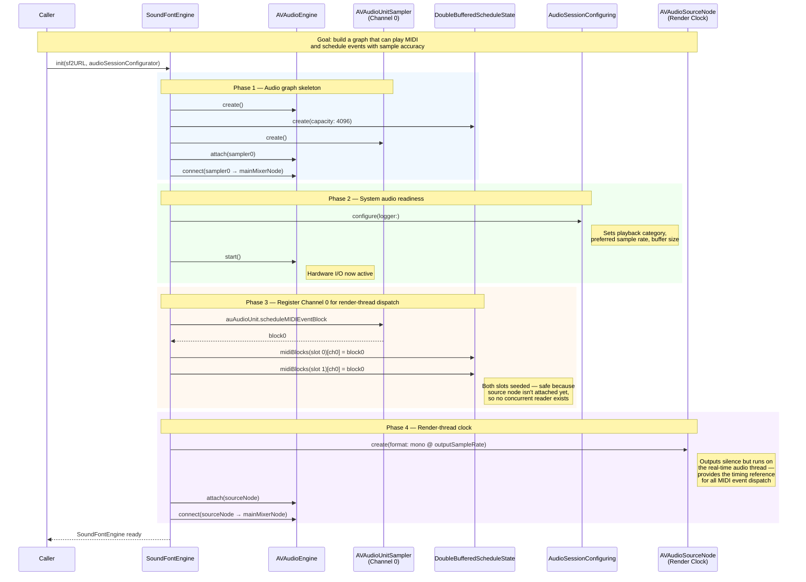
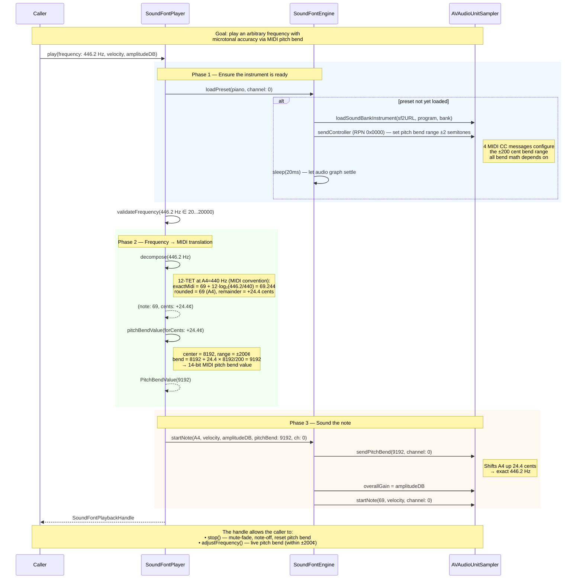
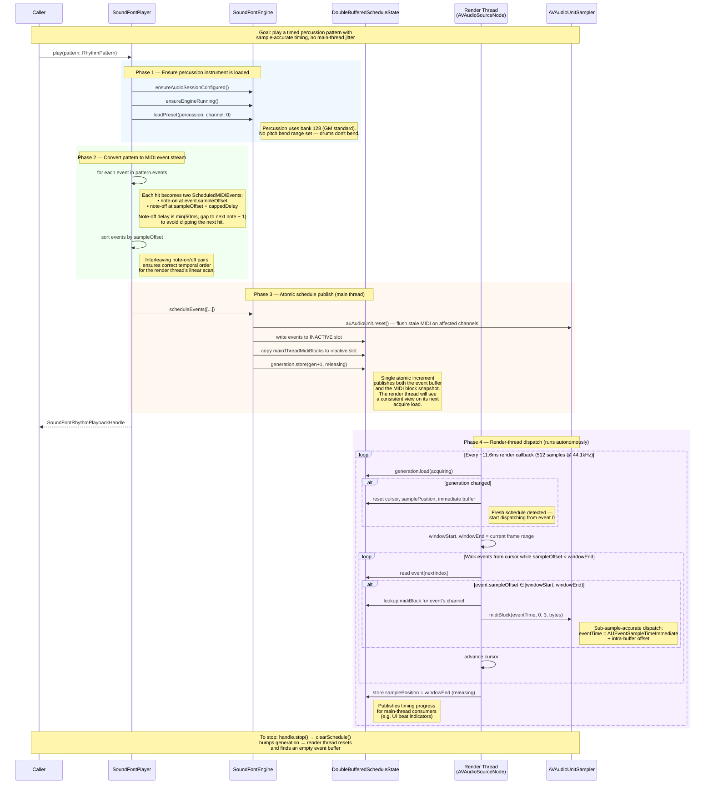

# SoundFontEngine Sequence Diagrams

Three diagrams covering the core operations of the audio engine.
These are intended for inclusion in the arc42 runtime view (section 6).

---

## 1. Engine Initialization

**Purpose:** Stand up a real-time audio pipeline capable of sample-accurate MIDI dispatch,
with a render-thread clock that drives event timing even when outputting silence.

---

## 2. Playing a Single Note

**Purpose:** Convert a musical frequency (e.g. 446.2 Hz — an A4 tuned 24 cents sharp)
into a MIDI note + pitch bend pair that reproduces the exact pitch through the SoundFont sampler.

---

## 3. Playing a RhythmPattern

**Purpose:** Schedule an entire percussion sequence for lock-free, sample-accurate playback.
Events are dispatched by the real-time render thread — no main-thread involvement after scheduling.

---

## Key Design Decisions Illustrated

| Concern | Solution | Diagram |
|---------|----------|---------|
| Real-time safety | No locks, no allocations on render thread — all via pre-allocated buffers and atomic generation counter | #3 Phase 4 |
| Microtonal accuracy | Frequency → MIDI note + pitch bend decomposition | #2 Phase 2 |
| Thread communication | Double-buffered slots with release/acquire ordering on a single generation counter | #3 Phases 3–4 |
| Immediate events (tap sounds) | SPSC ring buffer bypasses the double-buffer schedule | Not shown (separate path via `immediateNoteOn/Off`) |
| Audio session resilience | Lazy configure + ensure-running pattern before every play | All three Phase 1 |
